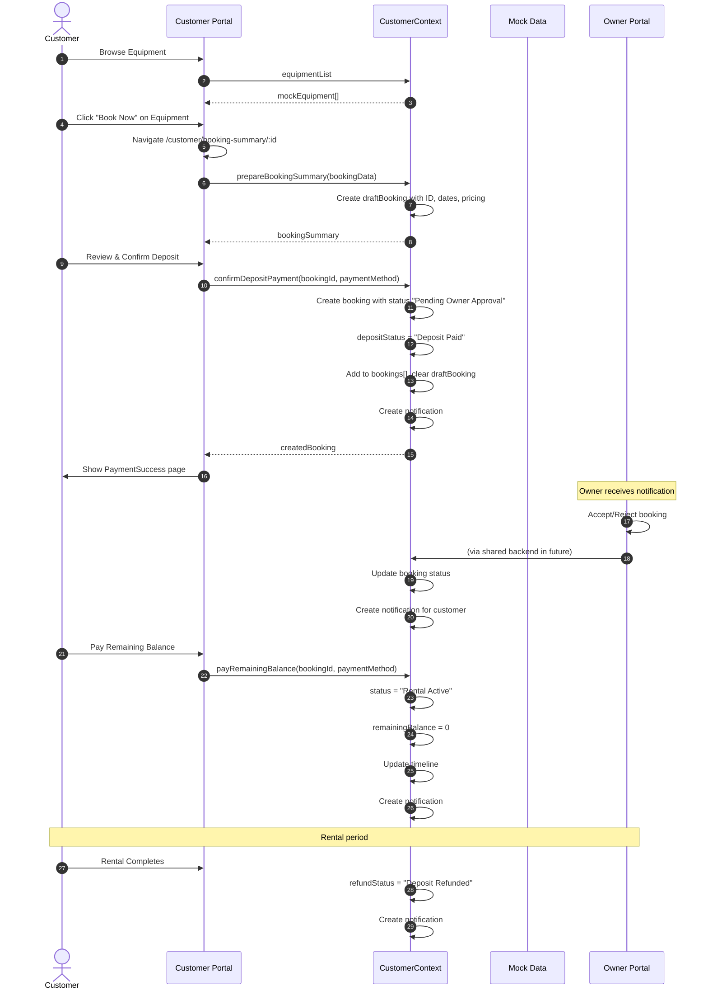
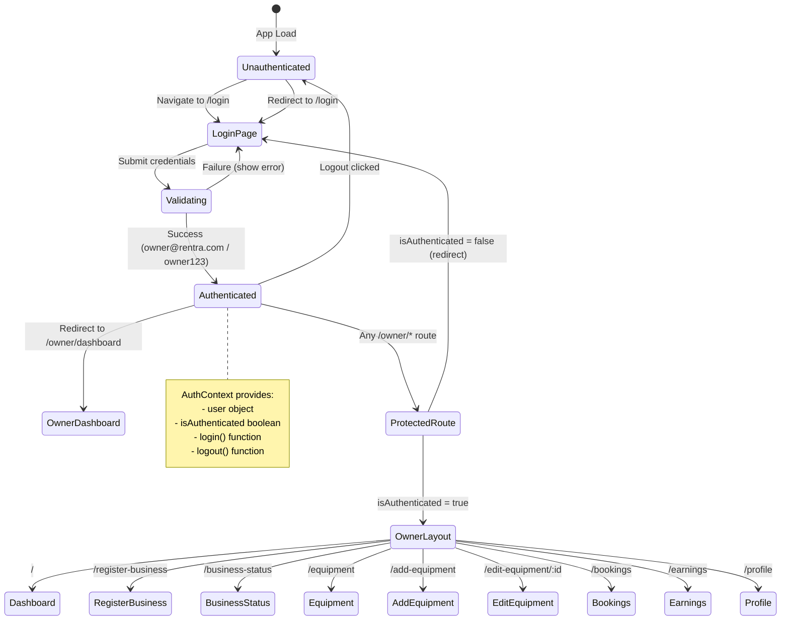
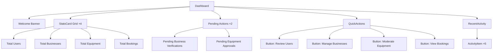
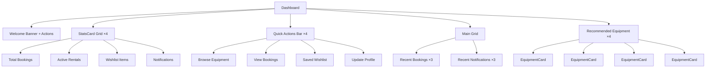
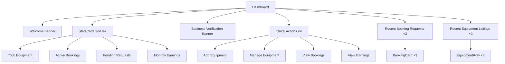
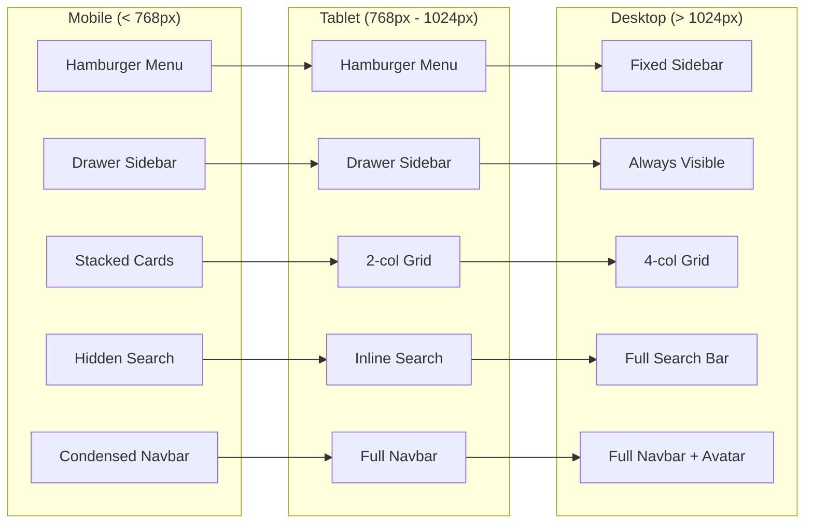
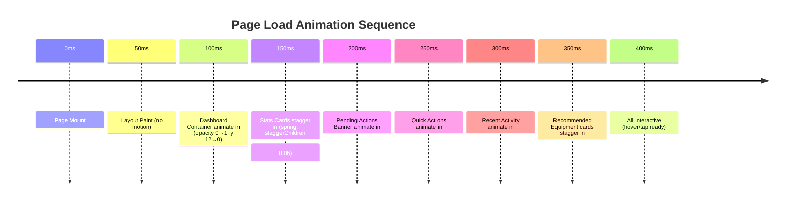
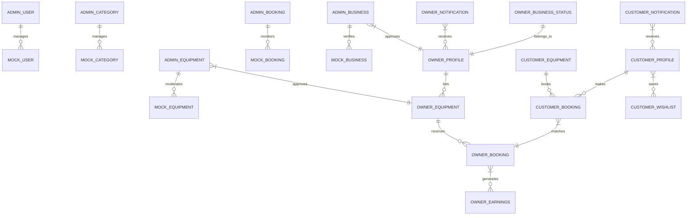
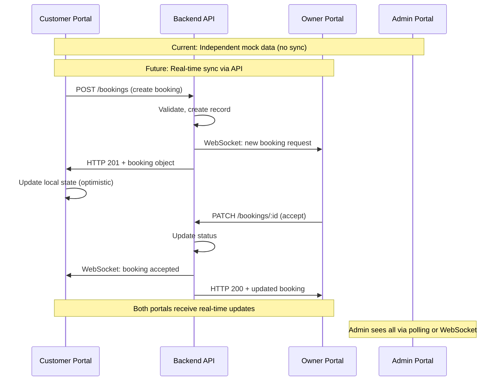
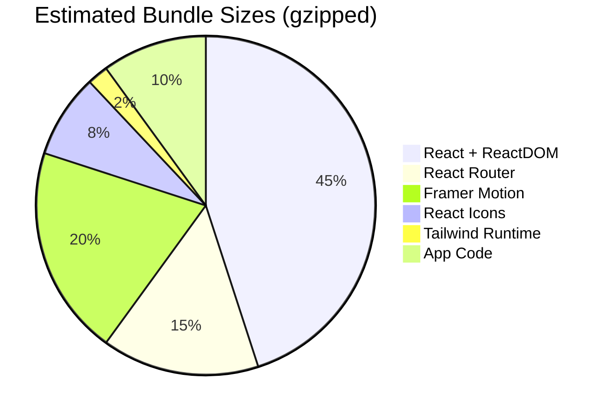

# Rentra Client Architecture — Visual Diagrams

> Supplementary visual documentation for the client-side architecture

---

## 🏗️ Complete System Architecture

```mermaid
flowchart TB
    subgraph "Client Layer (Browser)"
        direction TB
        
        subgraph "Admin Portal [:3000]"
            A1[main.jsx] --> A2[App.jsx]
            A2 --> A3[BrowserRouter]
            A3 --> A4[AdminRoutes]
            A4 --> A5[AdminLayout]
            A5 --> A6[AdminSidebar]
            A5 --> A7[AdminNavbar]
            A5 --> A8[Outlet → Pages]
            A8 --> A9[Dashboard]
            A8 --> A10[Users]
            A8 --> A11[Businesses]
            A8 --> A12[Equipment]
            A8 --> A13[Categories]
            A8 --> A14[Bookings]
            A8 --> A15[Profile]
            
            A9 --> AC[AdminContext]
            A10 --> AC
            A11 --> AC
            A12 --> AC
            A13 --> AC
            A14 --> AC
            A15 --> AC
            
            AC --> AD[mockData.js]
        end
        
        subgraph "Customer Portal [:3001]"
            B1[main.jsx] --> B2[App.jsx]
            B2 --> B3[BrowserRouter + Routes]
            B3 --> B4[CustomerLayout]
            B4 --> B5[CustomerSidebar]
            B4 --> B6[CustomerNavbar]
            B4 --> B7[Outlet → Pages]
            
            B7 --> B8[Dashboard]
            B7 --> B9[BrowseEquipment]
            B7 --> B10[EquipmentDetails]
            B7 --> B11[BookingSummary]
            B7 --> B12[DepositPayment]
            B7 --> B13[PaymentSuccess]
            B7 --> B14[Wishlist]
            B7 --> B15[Bookings]
            B7 --> B16[BookingDetails]
            B7 --> B17[Profile]
            B7 --> B18[Notifications]
            
            B4 --> CC[CustomerContext]
            CC --> CD[customerMockData.js]
        end
        
        subgraph "Owner Portal [:3002]"
            C1[main.jsx] --> C2[App.jsx]
            C2 --> C3[BrowserRouter]
            C3 --> C4[AuthProvider]
            C4 --> C5[Routes]
            
            C5 --> C6[/login → GuestRoute → LoginPage]
            C5 --> C7[/owner/* → ProtectedRoute → OwnerLayout]
            
            C7 --> C8[OwnerSidebar]
            C7 --> C9[OwnerNavbar]
            C7 --> C10[Outlet → Pages]
            
            C10 --> C11[Dashboard]
            C10 --> C12[RegisterBusiness]
            C10 --> C13[BusinessStatus]
            C10 --> C14[Equipment]
            C10 --> C15[AddEquipment]
            C10 --> C16[EditEquipment]
            C10 --> C17[Bookings]
            C10 --> C18[Earnings]
            C10 --> C19[Profile]
            
            C4 --> CO[AuthContext]
            CO --> CP[ownerMockData.js]
        end
    end
    
    subgraph "Shared Design System"
        DS1[Tailwind CSS 4]
        DS2[Framer Motion 12]
        DS3[React Icons - Feather]
        DS4[CSS Variables]
        DS5[Component Patterns]
    end
    
    A5 --> DS1
    A5 --> DS2
    A5 --> DS3
    A5 --> DS4
    B4 --> DS1
    B4 --> DS2
    B4 --> DS3
    B4 --> DS4
    C7 --> DS1
    C7 --> DS2
    C7 --> DS3
    C7 --> DS4
```

---

## 🔄 Booking Flow — Customer Portal



---

## 🔐 Owner Authentication Flow



---

## 🧩 Component Composition — Dashboard Pages

### Admin Dashboard Component Tree



### Customer Dashboard Component Tree



### Owner Dashboard Component Tree



---

## 📱 Responsive Breakpoint Behavior



### Breakpoint Implementation (Tailwind)

```css
/* Sidebar */
.hidden.md:block        /* Desktop: visible */
.md:hidden              /* Mobile/Tablet: hidden */

/* Grid Layouts */
grid-cols-1             /* Mobile: 1 column */
sm:grid-cols-2          /* Small: 2 columns */
lg:grid-cols-4          /* Large: 4 columns */

/* Search Bar */
.hidden.lg:block        /* Desktop only */

/* Navbar Text */
.hidden.sm:block        /* Tablet+ */
.hidden.xl:block        /* XL+ */

/* Padding */
p-4.md:p-8              /* Mobile 16px, Desktop 32px */
```

---

## 🎬 Animation Choreography



### Framer Motion Variants Used

```javascript
// Page container
const pageVariants = {
  initial: { opacity: 0, y: 12 },
  animate: { opacity: 1, y: 0 },
  transition: { duration: 0.3 }
};

// Staggered children
const containerVariants = {
  animate: {
    transition: { staggerChildren: 0.05 }
  }
};

// Card hover
const cardHover = {
  whileHover: { y: -3 },
  transition: { type: 'spring', stiffness: 300, damping: 20 }
};

// Button press
const buttonTap = {
  whileHover: { y: -1 },
  whileTap: { scale: 0.98 }
};

// Modal/drawer
const drawerVariants = {
  initial: { x: '-100%' },
  animate: { x: 0 },
  exit: { x: '-100%' },
  transition: { type: 'spring', damping: 25, stiffness: 200 }
};

const backdropVariants = {
  initial: { opacity: 0 },
  animate: { opacity: 1 },
  exit: { opacity: 0 }
};
```

---

## 📊 Data Relationships



---

## 🔀 State Synchronization (Future)



---

## 📦 Bundle Analysis (Estimated)



### Optimization Opportunities

| Technique | Impact | Status |
|-----------|--------|--------|
| Code Splitting (React.lazy) | -30% initial JS | ⏳ Planned |
| Tree Shaking Icons | -50% icon bundle | ✅ Auto (ESM) |
| Dynamic Import Routes | -40% route chunks | ⏳ Planned |
| Compression (gzip/brotli) | -70% transfer | ✅ Server config |
| Cache Headers | Repeat visits ~0 | ✅ Nginx/Vercel |
| Preload Critical CSS | Faster FCP | ⏳ Planned |

---

*Visual documentation generated from codebase analysis*