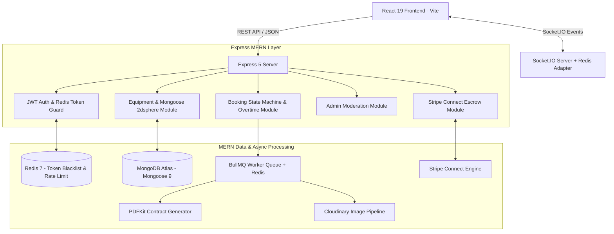

# Rentra — Deep MERN Stack Backend Master TODO Blueprint

> **Tech Stack Specification**: MERN (MongoDB Mongoose 9, Express 5, React 19, Node.js 20+), Redis 7, Socket.IO 4, JWT + HttpOnly Refresh Cookies, Stripe Connect Escrow, Cloudinary, and BullMQ.

---

## 🏗️ MERN + Redis + Socket.IO System Topology



---

## 📋 Section 1: Server Core, Express 5 & Security Infrastructure

- [x] **1.1 Express 5 Application Foundation (COMPLETED & VERIFIED)**
  - [x] Initialize Node.js environment with `server/index.js` or `server/src/app.js`.
  - [x] Dependencies: `express`, `mongoose`, `cors`, `dotenv`, `jsonwebtoken`, `bcryptjs`, `helmet`.
  - [x] Healthcheck route: `GET /` ➔ `{ service: 'Rentra MERN API', status: 'ONLINE' }`.

- [ ] **1.2 Enterprise Security Middlewares**
  - [x] Configure `helmet` HTTP security headers.
  - [x] Configure `cors` with `origin: 'http://localhost:5173'`, `credentials: true`.
  - [ ] Implement Redis-backed `rate-limiter-flexible` middleware for API endpoint protection.
  - [x] Enable `express.json({ limit: '10mb' })` for base64 E-Signature strings and high-res image data.
  - [ ] Centralized error handler (`errorMiddleware.js`) handling Mongoose validation errors & MongoDB duplicate key error code `11000`.

- [ ] **1.3 Structured Logging & Health Check**
  - [ ] Setup `pino` or `morgan` HTTP logger.
  - [ ] Healthcheck route: `GET /` ➔ `{ service: 'Rentra MERN API', status: 'ONLINE', mongo: 'CONNECTED', redis: 'READY' }`.

---

## 🗄️ Section 2: MongoDB Mongoose Schemas (`src/modules/*/*.model.js`)

- [ ] **2.1 MongoDB Connection Pool (`src/config/db.js`)**
  - [ ] `mongoose.connect(process.env.MONGO_URI)` with auto-reconnect and error event listeners.

- [ ] **2.2 User Model (`user.model.js`)**
  - [ ] Fields: `name`, `email` (unique index), `passwordHash` (bcryptjs), `role` (`'CUSTOMER'` | `'OWNER'` | `'ADMIN'`).
  - [ ] Auth & Security: `isVerified`, `passwordResetToken`, `passwordResetExpires`.
  - [ ] Stripe Connect: `stripeCustomerId`, `stripeConnectAccountId`, `stripeConnectOnboardingComplete`.

- [ ] **2.3 Business Model (`business.model.js`)**
  - [ ] Fields: `ownerId` (ref: User), `companyName`, `registrationNumber`, `taxId`, `insurancePolicyNumber`, `insuranceCertificateUrl`.
  - [ ] Moderation Status: `status` (`'PENDING'` | `'VERIFIED'` | `'REJECTED'`), `rejectionReason`.

- [ ] **2.4 Equipment Model (`equipment.model.js`)**
  - [ ] Fields: `ownerId` (ref: User), `businessId` (ref: Business), `title`, `description`, `category`, `dailyRate`.
  - [ ] **Certified Operator Option**: `operatorAvailable` (boolean), `operatorDailyRate` (number, default: 150).
  - [ ] **Lowboy Transport Specs**: `weightTons` (number), `locationAddress` (string).
  - [ ] **MongoDB 2dsphere Geospatial Index**:
    ```javascript
    location: {
      type: { type: String, enum: ['Point'], default: 'Point' },
      coordinates: { type: [Number], index: '2dsphere' } // [longitude, latitude]
    }
    ```
  - [ ] Media & Status: `images` (array of Cloudinary URLs), `status` (`'AVAILABLE'` | `'RENTED'` | `'MAINTENANCE'`).

- [ ] **2.5 Booking Model (`booking.model.js`)**
  - [ ] Fields: `equipmentId` (ref: Equipment), `customerId` (ref: User), `startDate`, `endDate`, `durationDays`.
  - [ ] Financial Breakdown: `baseRentalCost`, `operatorTotalCost`, `haulingFee`, `depositAmount`, `platformFee`, `gstTax`, `grandTotal`.
  - [ ] **Engine Hour Overtime**: `allowedEngineHours`, `loggedEngineHours`, `overtimeHours`, `overtimeSurcharge`.
  - [ ] **Digital E-Signature Inspection**: `signatureDataUrl`, `inspectionPhotos` (array), `inspectionChecklist` (Object), `inspectedAt`.
  - [ ] Stripe IDs: `paymentIntentId`, `depositHoldId`.
  - [ ] Status Pipeline: `'PENDING_DEPOSIT'` ➔ `'PENDING_OWNER_APPROVAL'` ➔ `'APPROVED'` ➔ `'ACTIVE'` ➔ `'RETURNED_INSPECTED'` ➔ `'COMPLETED'` ➔ `'CANCELLED'`.

---

## 🔐 Section 3: JWT, Redis & Authentication APIs

- [x] **3.1 JWT Dual-Token Authentication System (COMPLETED & VERIFIED)**
  - [x] `POST /api/auth/register`: Validate inputs ➔ Hash password (bcryptjs) ➔ Save user ➔ Return user token.
  - [x] `POST /api/auth/login`: Validate credentials ➔ Generate Access Token (JWT bearer).
  - [x] `GET /api/auth/me`: Profile retrieval with Bearer token guard.

- [ ] **3.2 Role-Based Access Control (RBAC) Middleware**
  - [ ] `authMiddleware.js`: Verify Bearer JWT token from header ➔ Attach `req.user` object.
  - [ ] `rbacMiddleware.js`: Higher-order function enforcing allowed roles (`requireRole('ADMIN')`, `requireRole('OWNER')`).

---

## 🚜 Section 4: Equipment Catalog & Mongoose 2dsphere Search APIs

- [x] **4.1 Equipment Catalog Search (`GET /api/equipment`) (COMPLETED & VERIFIED)**
  - [x] Category filtering & Certified Operator filtering (`?hasOperator=true`).

- [x] **4.2 Owner Listing Management (`POST /api/equipment`) (COMPLETED & VERIFIED)**
  - [x] Create equipment listing with Owner Bearer Token authentication.

- [x] **4.3 Project Fleet Bundles API (`GET /api/equipment/bundles`) (COMPLETED & VERIFIED)**
  - [x] Return preset multi-machine fleet packages (*Building Foundation Package*, *Road Construction Package*) with bundle discounts.

---

## 🚚 Section 5: Bookings, Financial Calculations & Overtime APIs

- [x] **5.1 Booking Creation & Lowboy Hauling (`POST /api/bookings`) (COMPLETED & VERIFIED)**
  - [x] Computes base rental, Certified Operator surcharge, Lowboy Hauling fee (`150 + km * 3.50`), and 20% Security Deposit.

- [x] **5.2 Owner Approval Controller (`PUT /api/bookings/:id/status`) (COMPLETED & VERIFIED)**
  - [x] Updates status to `'APPROVED'`, `'REJECTED'`, or `'ACTIVE'`.

- [x] **5.3 Digital E-Signature & Engine Hour Overtime (`POST /api/bookings/:id/inspection`) (COMPLETED & VERIFIED)**
  - [x] Stores HTML5 canvas E-Signature string, calculates overtime run-time surcharge (`+$45/hr`), and advances status to `'Returned & Inspected'`.

---

## 💬 Section 6: Socket.IO Server & Real-Time Communications

- [ ] **6.1 Socket.IO Server Setup (`src/config/socket.js`)**
  - [ ] Attach Socket.IO to Express server.
  - [ ] Install `@socket.io/redis-adapter` for multi-node horizontal scaling.
  - [ ] Authenticate socket connection handshakes with JWT token verification.

- [ ] **6.2 Real-Time Event Handlers**
  - [ ] Room joining: `socket.join("user_" + socket.userId)`.
  - [ ] Event `booking:status_changed`: Notify customer when owner approves/rejects booking.
  - [ ] Event `chat:send_message`: Direct real-time messaging between Customer and Owner.
  - [ ] Event `telematics:geofence_alert`: Push simulated GPS geofence breach alert to Owner Dashboard.

---

## ⚙️ Section 7: BullMQ Workers & Cloudinary Media Pipeline

- [ ] **7.1 Cloudinary Multer Storage Middleware**
  - [ ] Setup `multer-storage-cloudinary` for handling photo uploads for equipment listings and return inspection photos.

- [ ] **7.2 BullMQ Background Worker Queue (`src/jobs/worker.js`)**
  - [ ] **Worker Queue 1 (Email Notifications)**: Dispatch transactional emails for booking confirmations and receipts.
  - [ ] **Worker Queue 2 (PDFKit Contract Generator)**: Generate downloadable PDF rental contract and stream to S3/Cloudinary.
  - [ ] **Worker Queue 3 (Cron Cleaner)**: Auto-cancel pending bookings if deposit is not paid within 24 hours.

---

## 🛡️ Section 8: Admin Moderation & Aggregation Pipelines

- [x] **8.1 Platform Analytics (`GET /api/admin/stats`) (COMPLETED & VERIFIED)**
  - [x] Aggregate metrics: total users, total equipment, total bookings, total revenue, pending KYBs.

- [x] **8.2 Owner Business KYB Approval (`GET/PUT /api/admin/businesses/:id/verify`) (COMPLETED & VERIFIED)**
  - [x] List business KYB registrations and update verification status (`Approved` or `Rejected`).

---

## 🔌 Section 9: React 19 Client Integration

- [ ] **9.1 Environment Config (`client/.env.local`)**
  - [ ] Set `VITE_API_BASE_URL=http://localhost:3000/api`
  - [ ] Set `VITE_SOCKET_URL=http://localhost:3000`

- [ ] **9.2 Connect Contexts (`AuthContext.jsx` & `CustomerContext.jsx`)**
  - [ ] Update `login` and `register` functions in `AuthContext.jsx` to call `POST http://localhost:3000/api/auth/login`.
  - [ ] Update `equipmentList` fetch in `CustomerContext.jsx` to call `GET http://localhost:3000/api/equipment`.
