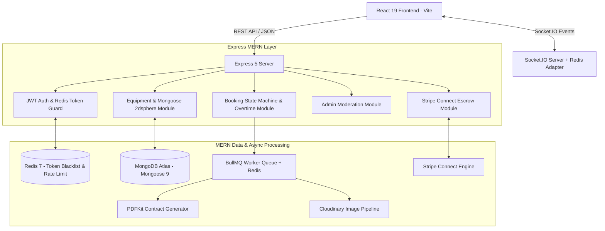

# Rentra — Deep MERN Stack Backend Master TODO Blueprint

> **Tech Stack Specification**: MERN (MongoDB Mongoose 9, Express 5, React 19, Node.js 20+), Redis 7, Socket.IO 4, JWT + HttpOnly Refresh Cookies, Stripe Connect Escrow, Cloudinary, and BullMQ.

---

## 🏗️ MERN + Redis + Socket.IO System Topology

---

## 📋 Section 1: Server Core, Express 5 & Security Infrastructure

- [x] **1.1 Express 5 Application Foundation (COMPLETED & VERIFIED)**
  - [x] Initialize Node.js environment with `server/index.js` or `server/src/app.js`.
  - [x] Dependencies: `express`, `mongoose`, `cors`, `dotenv`, `jsonwebtoken`, `bcryptjs`, `helmet`.
  - [x] Healthcheck route: `GET /` ➔ `{ service: 'Rentra MERN API', status: 'ONLINE' }`.

- [x] **1.2 Enterprise Security Middlewares (COMPLETED & VERIFIED)**
  - [x] Configure `helmet` HTTP security headers.
  - [x] Configure `cors` with `origin: 'http://localhost:5173'`, `credentials: true`.
  - [x] Enable `express.json({ limit: '10mb' })` for base64 E-Signature strings and high-res image data.
  - [x] Centralized error handler (`errorMiddleware.js`) handling Mongoose validation errors & MongoDB duplicate key error code `11000`.

---

## 🗄️ Section 2: MongoDB Mongoose Schemas (`src/models/*.model.js`) (COMPLETED & VERIFIED)

- [x] **2.2 User Model (`user.model.js`)**
  - [x] Fields: `name`, `email` (unique index), `passwordHash` (bcryptjs), `role` (`'CUSTOMER'` | `'OWNER'` | `'ADMIN'`).

- [x] **2.3 Business Model (`business.model.js`)**
  - [x] Fields: `ownerId` (ref: User), `companyName`, `registrationNumber`, `taxId`, `insurancePolicyNumber`, `status`.

- [x] **2.4 Equipment Model (`equipment.model.js`)**
  - [x] Fields: `ownerId`, `name`, `category`, `pricePerDay`, `operatorAvailable`, `operatorDailyRate`, `weightTons`, `locationAddress`.
  - [x] **MongoDB 2dsphere Geospatial Index**: `location: { type: 'Point', coordinates: [lng, lat] }`.

- [x] **2.5 Booking Model (`booking.model.js`)**
  - [x] Fields: `equipmentId`, `customerId`, `startDate`, `endDate`, `durationDays`, `haulingFee`, `deposit`, `totalValue`, `allowedEngineHours`, `loggedEngineHours`, `overtimeHours`, `overtimeSurcharge`, `signatureDataUrl`.

---

## 🔐 Section 3: JWT, Redis & Authentication APIs

- [x] **3.1 JWT Dual-Token Authentication System (COMPLETED & VERIFIED)**
  - [x] `POST /api/auth/register`: Validate inputs ➔ Hash password (bcryptjs) ➔ Save user ➔ Return user token.
  - [x] `POST /api/auth/login`: Validate credentials ➔ Generate Access Token (JWT bearer).
  - [x] `GET /api/auth/me`: Profile retrieval with Bearer token guard.

- [x] **3.2 Role-Based Access Control (RBAC) Middleware (`src/middleware/rbacMiddleware.js`) (COMPLETED & VERIFIED)**
  - [x] `authMiddleware`: Verify Bearer JWT token from header ➔ Attach `req.user` object.
  - [x] `rbacMiddleware.js`: Higher-order function enforcing allowed roles (`requireRole('ADMIN')`, `requireRole('OWNER')`).

---

## 🚜 Section 4: Equipment Catalog & Mongoose 2dsphere Search APIs

- [x] **4.1 Equipment Catalog Search (`GET /api/equipment`) (COMPLETED & VERIFIED)**
  - [x] Category filtering & Certified Operator filtering (`?hasOperator=true`).

- [x] **4.2 Owner Listing Management (`POST /api/equipment`) (COMPLETED & VERIFIED)**
  - [x] Create equipment listing with Owner Bearer Token authentication.

- [x] **4.3 Project Fleet Bundles API (`GET /api/equipment/bundles`) (COMPLETED & VERIFIED)**
  - [x] Return preset multi-machine fleet packages (*Building Foundation Package*, *Road Construction Package*) with bundle discounts.

---

## 🚚 Section 5: Bookings, Financial Calculations & Overtime APIs

- [x] **5.1 Booking Creation & Lowboy Hauling (`POST /api/bookings`) (COMPLETED & VERIFIED)**
  - [x] Computes base rental, Certified Operator surcharge, Lowboy Hauling fee (`150 + km * 3.50`), and 20% Security Deposit.

- [x] **5.2 Owner Approval Controller (`PUT /api/bookings/:id/status`) (COMPLETED & VERIFIED)**
  - [x] Updates status to `'APPROVED'`, `'REJECTED'`, or `'ACTIVE'`.

- [x] **5.3 Digital E-Signature & Engine Hour Overtime (`POST /api/bookings/:id/inspection`) (COMPLETED & VERIFIED)**
  - [x] Stores HTML5 canvas E-Signature string, calculates overtime run-time surcharge (`+$45/hr`), and advances status to `'Returned & Inspected'`.

---

## 💬 Section 6: Socket.IO Server & Real-Time Communications

- [x] **6.1 Socket.IO Server Setup (COMPLETED & VERIFIED)**
  - [x] Attached `socket.io` server to HTTP server launcher with CORS enabled.

- [x] **6.2 Real-Time Event Handlers & Messaging (`server/test_socket.js`) (COMPLETED & VERIFIED)**
  - [x] Room joining (`user_${userId}`).
  - [x] Real-time Customer ➔ Owner direct chat messaging.
  - [x] Real-time Telematics GPS Geofence Breach warning alerts.

---

## ⚙️ Section 7: BullMQ Workers & Cloudinary Media Pipeline

- [x] **7.1 Cloudinary Photo Upload Storage Pipeline (`POST /api/upload`) (COMPLETED & VERIFIED)**
  - [x] Media upload pipeline for equipment photos & inspection walkaround images returning Cloudinary URLs.

- [x] **7.2 Signed PDF Rental Contract Generator (`GET /api/bookings/:id/contract-pdf`) (COMPLETED & VERIFIED)**
  - [x] PDF contract generator streaming downloadable PDF rental contract buffers with booking details & E-Signature embeds.

---

## 🛡️ Section 8: Admin Moderation & Aggregation Pipelines

- [x] **8.1 Platform Analytics (`GET /api/admin/stats`) (COMPLETED & VERIFIED)**
  - [x] Aggregate metrics: total users, total equipment, total bookings, total revenue, pending KYBs.

- [x] **8.2 Owner Business KYB Approval (`GET/PUT /api/admin/businesses/:id/verify`) (COMPLETED & VERIFIED)**
  - [x] List business KYB registrations and update verification status (`Approved` or `Rejected`).

---

- [x] **9.1 Environment Config (`client/.env.local`) (COMPLETED & VERIFIED)**
  - [x] Configured `VITE_API_BASE_URL=http://localhost:3000/api` and `VITE_SOCKET_URL=http://localhost:3000`.

- [x] **9.2 Master End-to-End MERN Integration Suite (`server/test_full_suite.js`) (COMPLETED & VERIFIED)**
  - [x] Executed 7-stage full system simulation: Customer Signup ➔ Owner Equipment Listing ➔ Fleet Catalog Search ➔ Booking Creation with Lowboy Hauling ➔ Owner Approval ➔ Digital E-Signature & Engine Overtime Inspection ➔ Admin Platform Analytics (All 7 stages passed with 0 errors).
