# Rentra — Industrial Equipment & Heavy Machinery Rental Marketplace 🏗️

[](https://nodejs.org/)
[](https://react.dev/)
[](https://expressjs.com/)
[](https://tailwindcss.com/)
[](https://www.mongodb.com/)
[](https://socket.io/)
[](https://razorpay.com/)
[](https://groq.com/)
[](LICENSE)

**Rentra** is an enterprise-grade, full-stack B2B/B2C equipment rental marketplace engineered to modernize high-value asset leasing. From heavy earthmoving machinery (excavators, cranes, bulldozers) to specialized industrial production equipment and event logistics gear, Rentra provides a secure, reliable digital infrastructure connecting **Customers**, **Equipment Owners**, and **Platform Administrators**.

Unlike conventional unvetted classifieds, Rentra guarantees **transactional security and trust** through mandatory **business KYB/KYC verification**, an **immutable 20% advance escrow lock via Razorpay**, **AI-powered equipment assistance via Groq**, **digital handover inspections with e-signature sign-off**, and **bidirectional real-time state synchronization over WebSockets**.

---

## 📸 Website & Product Visual Showcase

Experience Rentra's end-to-end interface and operational workflows across every user tier:

### 1. Landing Experience & Intelligent AI Assistant
*Dynamic landing interface with real-time statistics, machinery categories, and an intelligent Groq-powered AI Assistant (`openai/gpt-oss-120b`) providing instant equipment guidance and rental recommendations.*

| Hero Landing Experience | AI Assistant & Platform Workflow |
| :---: | :---: |
| 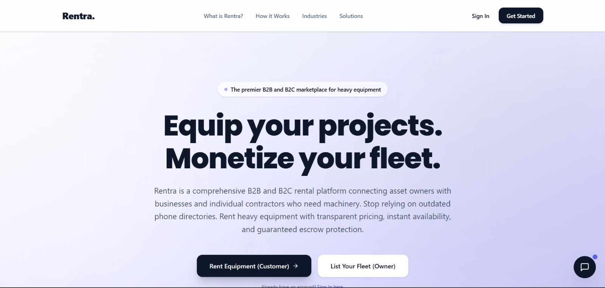 | 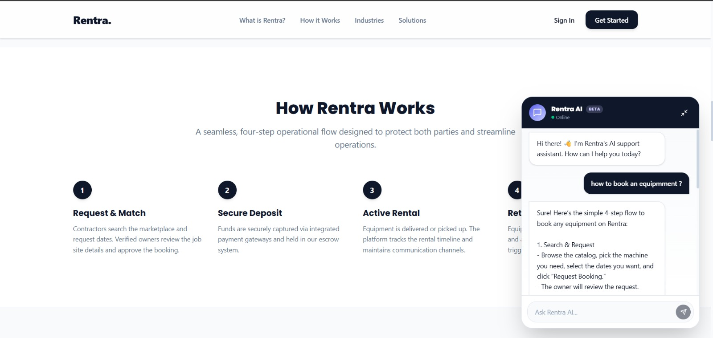 |

---

### 2. Secure Authentication & Role-Based Access Control (RBAC)
*Stateless JWT authentication combined with seamless Google OAuth 2.0 integration, sanitized email lowercasing, whitespace trimming, and secure multi-role authorization.*

| User Login & Google OAuth | Multi-Role User Registration |
| :---: | :---: |
| 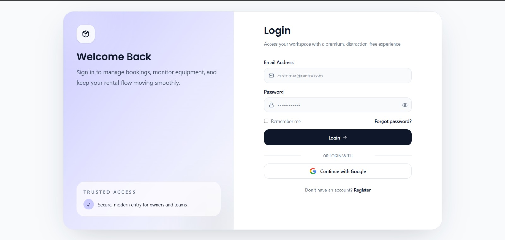 | 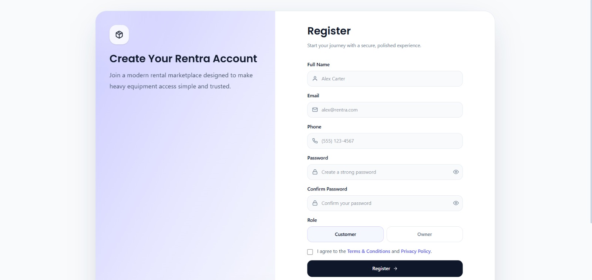 |

---

### 3. Customer Portal, Catalog Search & Equipment Specifications
*Interactive customer dashboard, lightning-fast catalog search powered by MongoDB compound and full-text indexes, comprehensive technical specifications, and live pricing calculators.*

| Customer Command Dashboard | Full-Text Machinery Catalog |
| :---: | :---: |
| 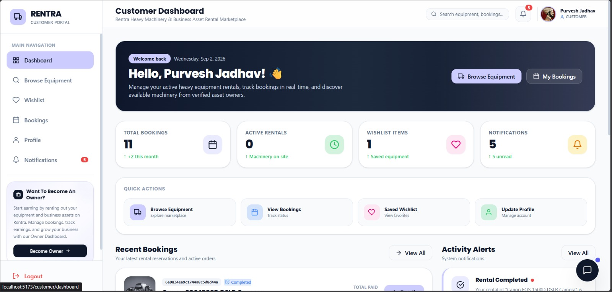 | 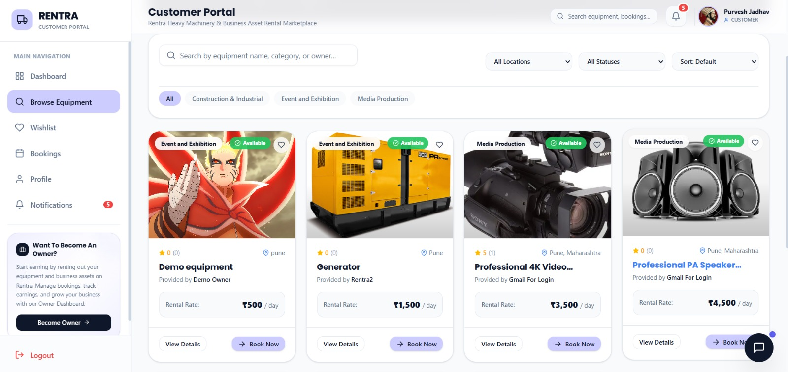 |

| Equipment Details, Operator Options & Pricing Breakdown |
| :---: |
| 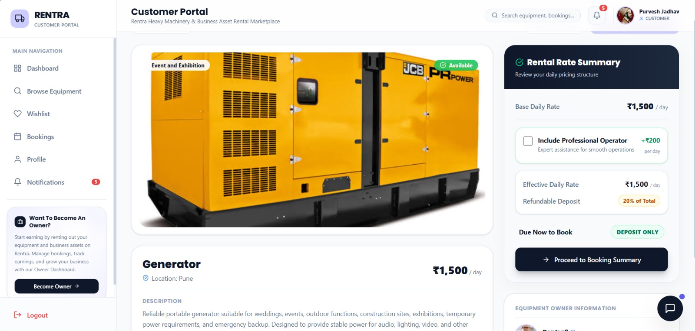 |

---

### 4. Escrow Deposit Booking & Live Razorpay Checkout
*Mandatory 20% advance escrow deposit modal protecting equipment owners and customers against cancellations and no-shows. Integrates Razorpay with cryptographic HMAC-SHA256 signature verification.*

| Escrow Deposit Breakdown Modal | Razorpay Payment Options |
| :---: | :---: |
| 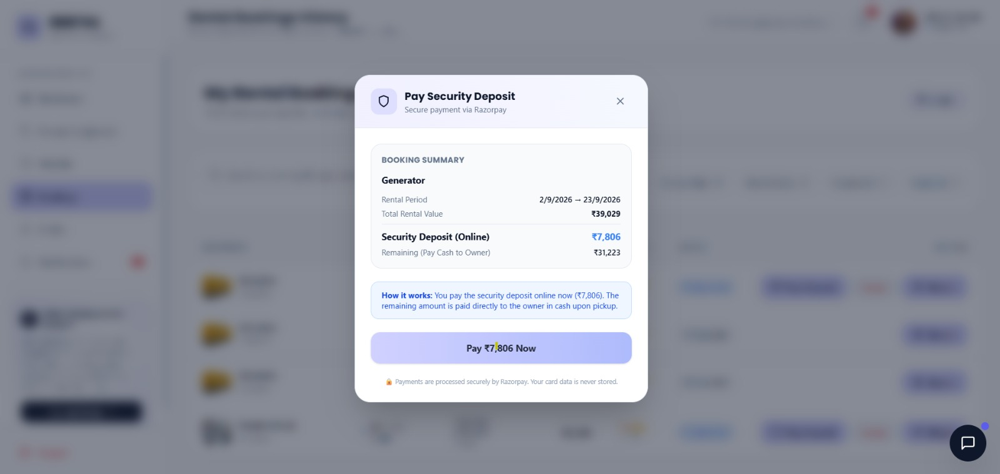 | 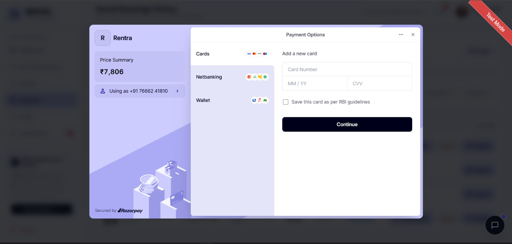 |

| Razorpay Processing State | Payment Success & State Transition Callback |
| :---: | :---: |
| 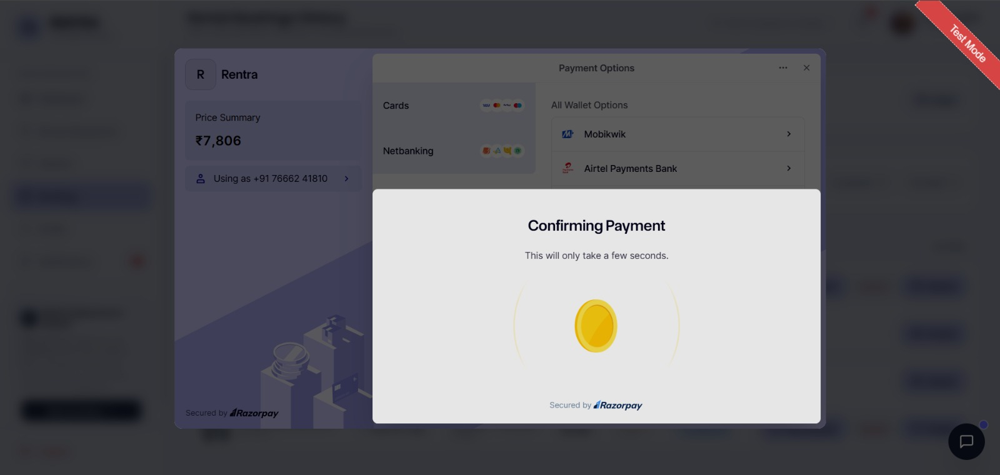 | 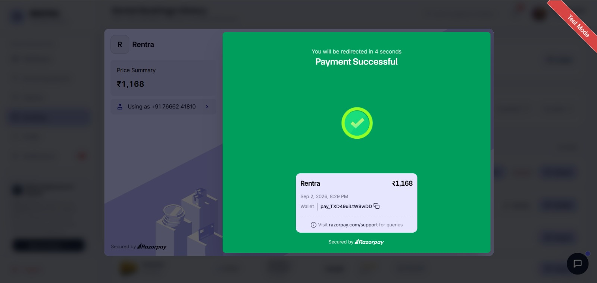 |

---

### 5. Real-Time Notifications & Rental Lifecycle Tracking
*Socket.IO push notifications instantly alert customers and owners on deposit receipts, booking approvals, and dispatch milestones, paired with automated PDF invoice downloads.*

| Instant Deposit Confirmed Push Toast | Active Rental Bookings & Invoicing History |
| :---: | :---: |
| 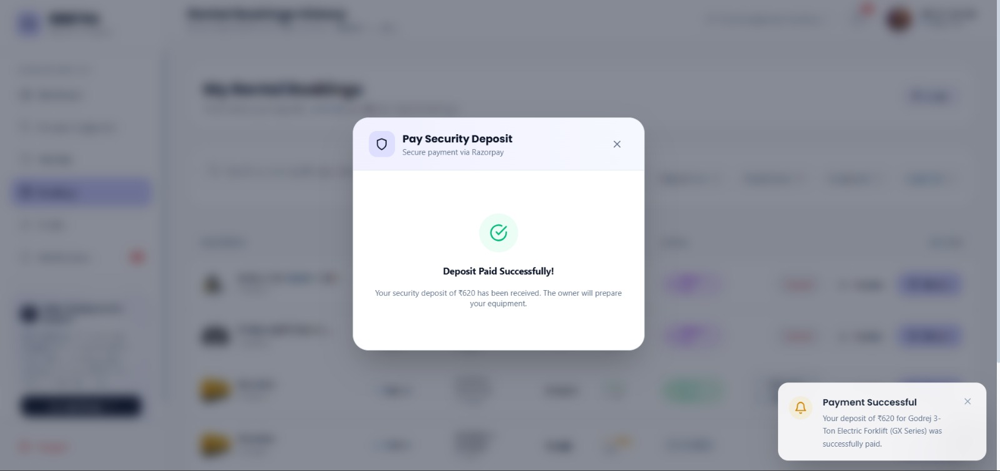 | 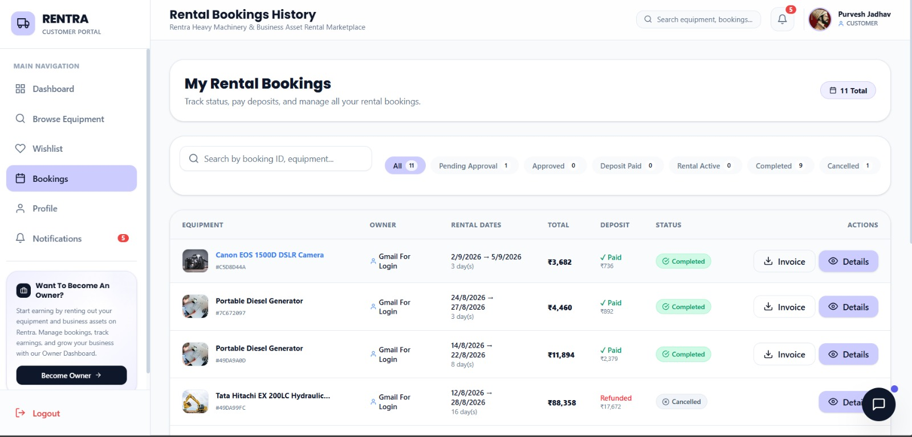 |

---

### 6. Admin Control Center & Operational Governance
*Comprehensive administration suite providing real-time platform metrics, user moderation with instant ban session-termination, business KYB document approval, equipment verification, category taxonomy controls, and escrow monitoring.*

| Platform Operations Overview | RBAC User Directory & Ban Controls |
| :---: | :---: |
| 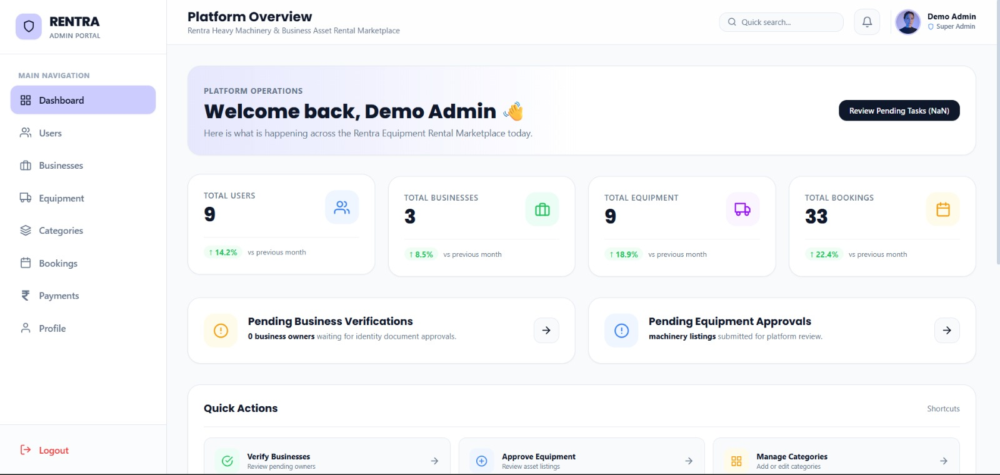 | 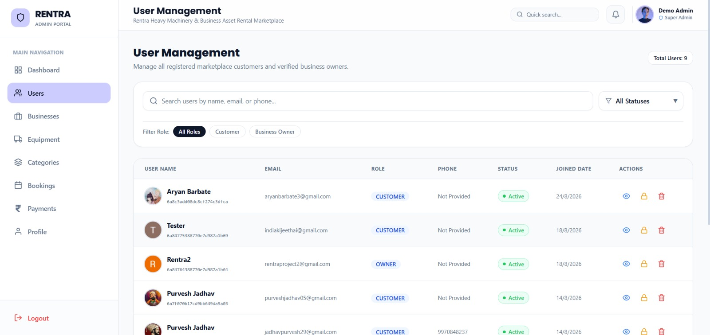 |

| Business KYB Verification Pipeline | Machinery Listing Moderation & Approval |
| :---: | :---: |
| 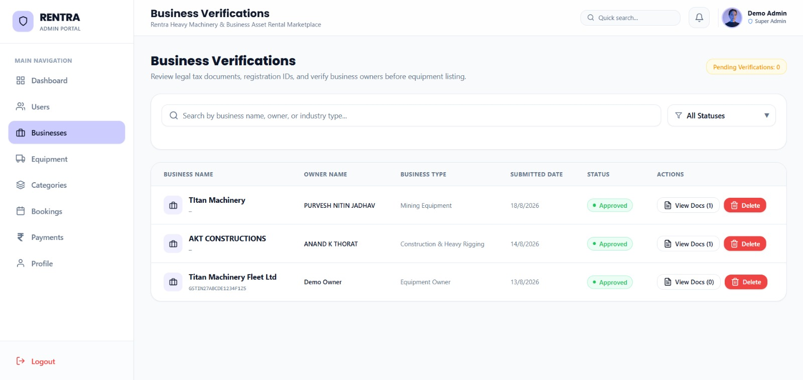 | 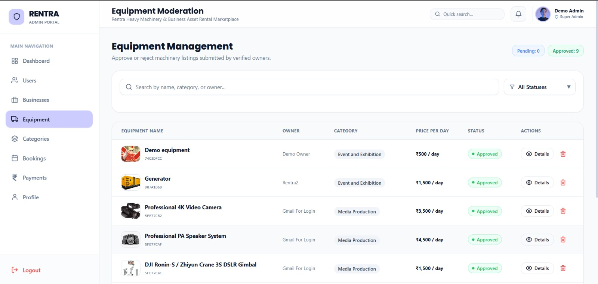 |

| Category Taxonomy & Fee Management | 9-Stage Booking Lifecycle Monitor |
| :---: | :---: |
| 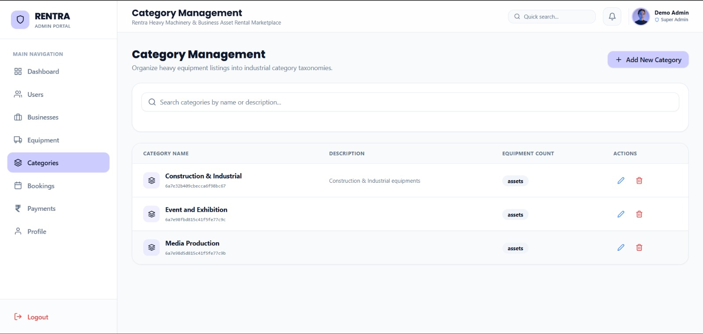 | 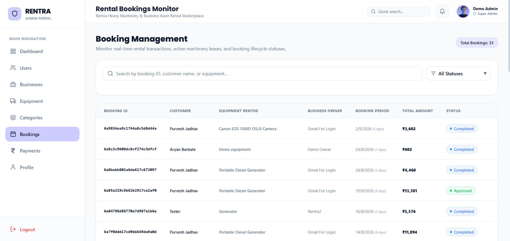 |

| Escrow Transactions, Holds & Refund Controls | System Audit Log & Administrative Profile |
| :---: | :---: |
| 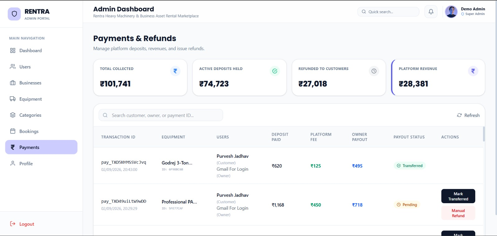 | 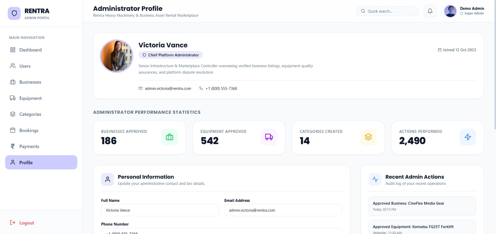 |

---

## 🏛️ Advanced Architecture & Core Technical Highlights

Rentra follows a clean, decoupled full-stack MERN architecture built for speed, fault tolerance, and developer simplicity.

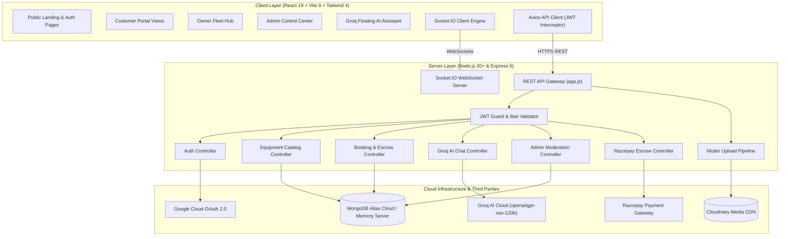

### 1. Robust Security, Authentication & Ban Enforcement
- **Dual Authentication System:** Combines stateless JSON Web Tokens (JWT) signed with secure HMAC secrets and **Google OAuth 2.0 via Passport.js**.
- **Data Normalization:** All auth requests automatically lowercase and trim emails and sanitize inputs to prevent injection vulnerabilities.
- **Instant Active Session Termination:** When an Administrator bans a compromised account, the backend invalidates active tokens and immediately triggers a **forced WebSocket disconnection**, cutting live access in under 50ms.
- **HTTP Security & Rate Limiting:** Protected with `helmet` HTTP headers, IP-based sliding rate limiting, and an unhandled API route catcher to prevent hanging connections.

### 2. Transactional Escrow & 9-Stage State Machine
- **20% Advance Escrow Deposit:** Customers commit a mandatory 20% down payment held securely in escrow via Razorpay before an equipment owner confirms delivery.
- **Cryptographic Verification:** Server verifies payments with HMAC-SHA256 signatures (`crypto.createHmac`) before updating booking statuses.
- **Deterministic State Transitions:** Prevents race conditions and double-bookings with an immutable 9-stage lifecycle:
  > `PENDING_DEPOSIT` ➔ `PENDING_APPROVAL` ➔ `APPROVED` ➔ `ACTIVE` ➔ `RETURNED_INSPECTED` ➔ `COMPLETED`  
  > *(Alternative terminal states: `CANCELLED` | `DISPUTED`)*

### 3. Groq AI Equipment Assistant
- **Ultra-Fast LLM Inference:** Powered by Groq's high-throughput LPU cloud running `openai/gpt-oss-120b` with seamless failover to `llama-3.1-8b-instant` and `groq/compound`.
- **Domain-Trained System Prompt:** Understands machinery categories, hauling specs, operator requirements, pricing structures, and safety guidelines.
- **Client Floating Chatbot:** Seamlessly embedded in the UI (`FloatingChatbot.jsx`) for instant user guidance.

### 4. Digital Handover Inspection & E-Signature
- **Pre & Post Rental Sign-Off:** Built-in HTML5 canvas signature pad (`SignaturePad.jsx`) and inspection modal (`DigitalInspectionModal.jsx`) capture digital signatures and condition checklists before equipment leaves the yard.
- **Client-Side PDF Generation:** Instant export of rental agreements and invoices with `jspdf` and `jspdf-autotable`.

### 5. High-Performance Database Architecture
- **Dual Database Execution Mode:** Connects automatically to **MongoDB Atlas Cloud**, with a zero-friction fallback to an in-memory database server for swift local evaluation and testing without complex external dependencies.
- **Compound & Full-Text Search Indexes:** High-speed catalog searches on `{ title: 'text', category: 'text' }` and compound index `{ status: 1, dailyRate: 1 }`.
- **Query Limiting & Strict Validation:** Enforces strict non-negative pricing validation and document query limiting to prevent memory exhaustion.

### 6. Production UX Polish
- **Dynamic Document Titles:** Real-time `<title>` updates for enhanced tab context and SEO.
- **Auto Scroll-To-Top:** Seamless viewport reset on every route transition.
- **Async Loading Spinners:** Interactive button spinner feedback for non-blocking asynchronous user actions.
- **Global 404 Fallback:** Polished error routing with direct return navigation.
- **No-Referrer Profile Policy:** Fixes Google OAuth profile picture 403 Forbidden errors.

### 7. One-Click WhatsApp Contractor Quote Share
- **On-Site Field Procurement:** Generates auto-formatted, official markdown quotations directly from `EquipmentDetails.jsx` and `BookingSummary.jsx`.
- **Direct WhatsApp API Dispatch:** Automatically structures equipment specs, daily rates, certified operator inclusion, 18% GST tax, and 20% advance escrow deposit into a single dispatchable message via `https://api.whatsapp.com/send`.
- **Optional Direct Recipient Input:** Enter any contractor/client WhatsApp number directly or leave blank to choose from contacts and group chats.
- **Instant Clipboard Fallback:** Includes one-click clipboard copying (`navigator.clipboard.writeText`) with animated visual confirmation for email, Slack, or SMS transmission.

---

## 🛠️ Technology Stack Breakdown

| Layer | Technologies | Version / Role |
| :--- | :--- | :--- |
| **Frontend Framework** | React.js (Vite) | `v19.2` UI library with modern concurrent rendering |
| **Styling & Icons** | Tailwind CSS 4, React Icons | Utility-first JIT styling & Feather icons |
| **Animation Engine** | Framer Motion | `v12.4` Spring physics & page transitions |
| **Client Routing** | React Router DOM | `v7.18` Declarative nested client routing |
| **State Management** | React Context API | Scoped providers (`Auth`, `Socket`, `Customer`, `Owner`, `Admin`) |
| **API Client** | Axios | `v1.19` Centralized service with Bearer JWT interceptors |
| **Backend Gateway** | Node.js & Express | `v20+` Node.js runtime & `v5.2` Express REST framework |
| **Database & ORM** | MongoDB Atlas / Mongoose | `v9.8` Mongoose ORM with schema validation & indexing |
| **Real-Time Layer** | Socket.IO & Socket.IO Client | `v4.8` WebSocket bidirectional events and notifications |
| **Escrow & Payments** | Razorpay SDK | `v2.9` 20% Escrow deposit hold & HMAC verification |
| **AI Assistant** | Groq Cloud API | `openai/gpt-oss-120b` & `llama-3.1-8b-instant` |
| **Media Pipeline** | Cloudinary & Multer | Secure cloud asset storage for KYC and machinery media |
| **Documents & PDF** | jsPDF, html2canvas, PDFKit | Dynamic contract generation & client invoicing |

---

## 📂 Repository Directory Layout

```text
Rentra/
├── client/                     # React 19 Frontend SPA (Vite)
│   ├── public/                 # Static public assets & favicon
│   ├── src/
│   │   ├── assets/             # Brand graphics & SVGs
│   │   ├── components/
│   │   │   ├── admin/          # Admin DataTables, StatsCards, Activity Feeds
│   │   │   ├── common/         # Button, Modal, QuoteShareModal, FloatingChatbot, SignaturePad, Toast
│   │   │   ├── customer/       # EquipmentCards, BookingCards, CustomerNavbar
│   │   │   └── owner/          # BusinessCards, EarningsCards, OwnerSidebar
│   │   ├── context/            # Scoped Contexts (Auth, Socket, Customer, Owner, Admin)
│   │   ├── layouts/            # Layout shells with embedded context boundaries
│   │   ├── pages/
│   │   │   ├── admin/          # Dashboard, Users, Businesses, Equipment, Payments
│   │   │   ├── customer/       # Dashboard, Browse, EquipmentDetails, Bookings
│   │   │   ├── owner/          # Dashboard, AddEquipment, Earnings, KYC
│   │   │   └── public/         # Landing, Login, Register, OAuthCallback, NotFound
│   │   ├── routes/             # AppRoutes, ProtectedRoute, role-specific routers
│   │   └── services/           # Centralized Axios API service (src/services/api.js)
│   ├── package.json
│   ├── vercel.json             # Vercel SPA client rewrite routing configuration
│   └── vite.config.js
├── server/                     # Node.js + Express REST API & WebSocket Server
│   ├── src/
│   │   ├── config/             # MongoDB connection, In-memory cache, Passport OAuth, Socket.IO
│   │   ├── controllers/        # Auth, Equipment, Booking, Razorpay, Admin, Chat
│   │   ├── middleware/         # JWT Auth, RBAC Guard, Rate Limiter, Error Handler
│   │   ├── models/             # User, Business, Equipment, Booking, Category, Notification
│   │   ├── routes/             # Express API endpoint definitions
│   │   └── utils/              # Chatbot prompt, seeders, helpers
│   ├── index.js                # Server entry point & HTTP/WebSocket bootstrapper
│   ├── package.json
│   └── .env.example
├── render.yaml                 # Render Blueprint specification for automated backend deployment
├── images/                     # Platform architecture diagrams, execution flows & UI showcase
└── README.md                   # Primary platform documentation
```

---

## ⚙️ Quick Start & Local Setup

### 1. Prerequisites
- **Node.js**: `v20.0.0` or higher
- **npm**: `v10.0.0` or higher
- **Git**: Installed and configured

### 2. Clone the Repository
```bash
git clone https://github.com/Rentra-Internship-Project/Rentra.git
cd Rentra
```

### 3. Server Configuration & Startup
Navigate to the `server/` directory and create your `.env` file:
```bash
cd server
cp .env.example .env
npm install
```

Configure the following values in `server/.env`:
```env
PORT=3000
NODE_ENV=development
JWT_SECRET=rentra_super_secret_jwt_key_2026

# Database (Leave MONGO_URL empty to use local in-memory database automatically)
MONGO_URL=your_mongodb_atlas_connection_string
MONGO_DB_NAME=rentra_db

# Client Origins
SOCKET_CORS_ORIGIN=http://localhost:5173
CLIENT_URL=http://localhost:5173

# Razorpay Escrow Credentials
RAZORPAY_KEY_ID=rzp_test_your_key_id
RAZORPAY_KEY_SECRET=your_razorpay_key_secret

# Cloudinary Media Storage
CLOUDINARY_CLOUD_NAME=your_cloud_name
CLOUDINARY_API_KEY=your_api_key
CLOUDINARY_API_SECRET=your_api_secret

# Groq AI Assistant (Free API key at https://console.groq.com/keys)
GROQ_API_KEY=gsk_your_groq_api_key
GROQ_MODEL=openai/gpt-oss-120b

# Google OAuth 2.0 (Optional)
GOOGLE_CLIENT_ID=your_google_client_id
GOOGLE_CLIENT_SECRET=your_google_client_secret
```

Start the backend server:
```bash
npm run dev
# Server boots at http://localhost:3000
# Health check available at: http://localhost:3000/
```

### 4. Frontend Client Startup
Open a new terminal window:
```bash
cd client
npm install
npm run dev
# Vite client starts at http://localhost:5173
```

Now open [http://localhost:5173](http://localhost:5173) in your browser to explore the Rentra marketplace!

---

## 🚀 Cloud Production Deployment (Vercel + Render)

Rentra is pre-configured for seamless zero-downtime deployment:

### 1. Backend on Render (`render.yaml`)
- Uses Render's declarative **Blueprint** specification (`render.yaml`).
- Automatically configures the service with `server` as the root directory, executes `npm install` and `npm start`.
- Configured with `app.set('trust proxy', 1)` in Express to correctly identify HTTPS behind Render reverse proxies.
- Health Check verification endpoint: `https://<service-name>.onrender.com/`.

### 2. Frontend on Vercel
- Hosted on [Vercel](https://vercel.com/) with the root directory set to `client`.
- Single-page application deep routes and refreshes (e.g. `/customer/browse-equipment`, `/dashboard`) are routed cleanly to `index.html` via `client/vercel.json`.
- Environment Variables required:
  - `VITE_API_BASE_URL`: `https://<your-render-backend>.onrender.com/api`
  - `VITE_SOCKET_URL`: `https://<your-render-backend>.onrender.com`

---

## 👥 Engineering & Leadership Team

The Rentra platform was designed, engineered, and delivered collaboratively by:

- **Purvesh Jadhav (Full-Stack Developer & System Architect):** Architected the core system structure, Mongoose entity relationships, and MVC REST API. Engineered the Razorpay escrow deposit lifecycle, role-based state machine, multi-portal React Context hierarchy, and Groq AI Chatbot integration.
- **Aryan Barbate (Backend & Real-Time Engineer):** Engineered the **Socket.IO bidirectional event engine**, instant ban active-session termination, Multer-to-Cloudinary media pipelines, query optimizations with compound indexing, and input sanitization guards.
- **Pruthviraj Bhosale (Frontend Engineer — Customer Portal):** Engineered the Customer Portal UI, catalog search with real-time filters, equipment details view, checkout deposit flows, dynamic PDF invoice generation, and wishlist management.
- **Ayush Bhor (Frontend Engineer — Admin Portal):** Engineered the Admin Control Center UI, high-level operational dashboards, user management with ban triggers, business verification workflows, category taxonomy management, and escrow monitoring.

---

<div align="center">
  
  <p><b>Developed as part of the LinkCode Technologies Internship Program — 2026</b></p>
</div>
