# Rentra — Client-Side Documentation

> **Multi-Portal Heavy Equipment Rental Marketplace** — Built with React 19, Vite 8, Tailwind CSS 4, and Framer Motion 12

---

## 📋 Table of Contents

1. [Project Overview](#-project-overview)
2. [Architecture &amp; Tech Stack](#-architecture--tech-stack)
3. [Three-Portal Architecture](#-three-portal-architecture)
4. [Directory Structure](#-directory-structure)
5. [Routing &amp; Navigation](#-routing--navigation)
6. [State Management](#-state-management)
7. [Component Library](#-component-library)
8. [Design System](#-design-system)
9. [Data Flow &amp; API Layer](#-data-flow--api-layer)
10. [Animation &amp; Motion](#-animation--motion)
11. [Development Workflow](#-development-workflow)
12. [Build &amp; Deployment](#-build--deployment)
13. [Supplementary Visual Documentation](#-supplementary-visual-documentation)

---

## 🎯 Project Overview

Rentra is a **three-sided marketplace** connecting:

- **Customers** — Rent heavy machinery & business assets
- **Owners** — List equipment, manage bookings, track earnings
- **Admins** — Platform operations, verification, moderation

Each portal is a **standalone Vite + React application** with shared design language but independent state, routing, and mock data layers.

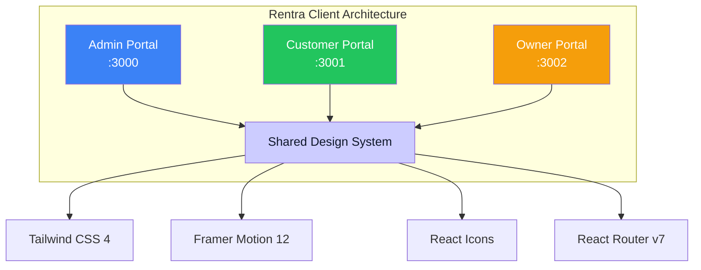

---

## Complete System Architecture

```mermaid
flowchart TB
  subgraph "Client Layer (Browser)"
    direction TB

    subgraph "Admin Portal [:3000]"
      A1[main.jsx] --> A2[App.jsx]
      A2 --> A3[BrowserRouter]
      A3 --> A4[AdminRoutes]
      A4 --> A5[AdminLayout]
      A5 --> A6[AdminSidebar]
      A5 --> A7[AdminNavbar]
      A5 --> A8[Outlet → Pages]
      A8 --> A9[Dashboard]
      A8 --> A10[Users]
      A8 --> A11[Businesses]
      A8 --> A12[Equipment]
      A8 --> A13[Categories]
      A8 --> A14[Bookings]
      A8 --> A15[Profile]

      A9 --> AC[AdminContext]
      A10 --> AC
      A11 --> AC
      A12 --> AC
      A13 --> AC
      A14 --> AC
      A15 --> AC

      AC --> AD[mockData.js]
    end

    subgraph "Customer Portal [:3001]"
      B1[main.jsx] --> B2[App.jsx]
      B2 --> B3[BrowserRouter + Routes]
      B3 --> B4[CustomerLayout]
      B4 --> B5[CustomerSidebar]
      B4 --> B6[CustomerNavbar]
      B4 --> B7[Outlet → Pages]

      B7 --> B8[Dashboard]
      B7 --> B9[BrowseEquipment]
      B7 --> B10[EquipmentDetails]
      B7 --> B11[BookingSummary]
      B7 --> B12[DepositPayment]
      B7 --> B13[PaymentSuccess]
      B7 --> B14[Wishlist]
      B7 --> B15[Bookings]
      B7 --> B16[BookingDetails]
      B7 --> B17[Profile]
      B7 --> B18[Notifications]

      B4 --> CC[CustomerContext]
      CC --> CD[customerMockData.js]
    end

    subgraph "Owner Portal [:3002]"
      C1[main.jsx] --> C2[App.jsx]
      C2 --> C3[BrowserRouter]
      C3 --> C4[AuthProvider]
      C4 --> C5[Routes]

      C5 --> C6[/login → GuestRoute → LoginPage]
      C5 --> C7[/owner/* → ProtectedRoute → OwnerLayout]

      C7 --> C8[OwnerSidebar]
      C7 --> C9[OwnerNavbar]
      C7 --> C10[Outlet → Pages]

      C10 --> C11[Dashboard]
      C10 --> C12[RegisterBusiness]
      C10 --> C13[BusinessStatus]
      C10 --> C14[Equipment]
      C10 --> C15[AddEquipment]
      C10 --> C16[EditEquipment]
      C10 --> C17[Bookings]
      C10 --> C18[Earnings]
      C10 --> C19[Profile]

      C4 --> CO[AuthContext]
      CO --> CP[ownerMockData.js]
    end
  end

  subgraph "Shared Design System"
    DS1[Tailwind CSS 4]
    DS2[Framer Motion 12]
    DS3[React Icons - Feather]
    DS4[CSS Variables]
    DS5[Component Patterns]
  end

  A5 --> DS1
  A5 --> DS2
  A5 --> DS3
  A5 --> DS4
  B4 --> DS1
  B4 --> DS2
  B4 --> DS3
  B4 --> DS4
  C7 --> DS1
  C7 --> DS2
  C7 --> DS3
  C7 --> DS4
```

---

## 🏗 ️ Architecture & Tech Stack

| Layer          | Technology       | Version | Purpose                             |
| -------------- | ---------------- | ------- | ----------------------------------- |
| **Framework**  | React            | 19.2.8  | UI library with concurrent features |
| **Build Tool** | Vite             | 8.2.0   | Lightning-fast dev server & bundler |
| **Styling**    | Tailwind CSS     | 4.3.3   | Utility-first CSS (Vite plugin)     |
| **Animation**  | Framer Motion    | 12.43.0 | Production-ready animations         |
| **Routing**    | React Router DOM | 7.18.2  | Client-side routing                 |
| **Icons**      | React Icons      | 5.7.0   | Feather icon set                    |
| **Linting**    | Oxlint           | 1.75.0  | Fast Rust-based linter (Admin only) |
| **TypeScript** | @types/react     | 19.2.17 | Type definitions (dev)              |

### Shared Dependencies Across All Portals

```json
{
  "dependencies": {
    "@tailwindcss/vite": "^4.3.3",
    "framer-motion": "^12.43.0",
    "react": "^19.2.8",
    "react-dom": "^19.2.8",
    "react-icons": "^5.7.0",
    "react-router-dom": "^7.18.2",
    "tailwindcss": "^4.3.3"
  }
}
```

---

## 🏢 Three-Portal Architecture

Each portal is a **complete, independent React application**:

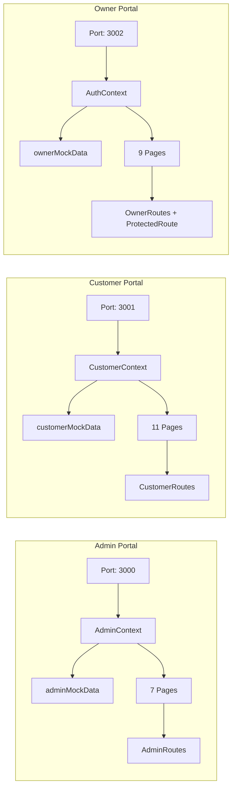

### Portal Comparison Table

| Feature                | Admin Portal     | Customer Portal  | Owner Portal       |
| ---------------------- | ---------------- | ---------------- | ------------------ |
| **Port**               | 3000             | 3001             | 3002               |
| **Auth**               | None (simulated) | None (simulated) | **Login Required** |
| **Pages**              | 7                | 11               | 9                  |
| **Context**            | AdminContext     | CustomerContext  | AuthContext        |
| **Mock Data**          | adminMockData    | customerMockData | ownerMockData      |
| **Protected Routes**   | No               | No               | **Yes**            |
| **Real-time Search**   | � ✅             | � ✅             | � ✅               |
| **Notifications**      | � ✅             | � ✅             | � ✅               |
| **Wishlist**           | No               | � ✅             | No                 |
| **Earnings/Analytics** | No               | No               | � ✅               |

---

## 📁 Directory Structure

```
client/
├── Admin/                    # Admin Portal (Port 3000)
│   ├── src/
│   │   ├── components/
│   │   │   ├── admin/       # Admin-specific components
│   │   │   └── common/      # Shared UI components
│   │   ├── context/         # AdminContext (React Context)
│   │   ├── data/            # mockData.js (admin mock data)
│   │   ├── hooks/           # useAdminData.js
│   │   ├── layouts/         # AdminLayout (Sidebar + Navbar)
│   │   ├── pages/
│   │   │   └── admin/       # 7 admin pages
│   │   ├── routes/          # AdminRoutes.jsx
│   │   ├── services/        # adminService.js (API layer)
│   │   ├── utils/           # adminUtils.js
│   │   ├── App.jsx
│   │   ├── main.jsx
│   │   └── index.css
│   ├── index.html
│   ├── package.json
│   └── vite.config.js
│
├── Customer/                 # Customer Portal (Port 3001)
│   ├── src/
│   │   ├── components/
│   │   │   ├── common/      # Shared UI components
│   │   │   └── customer/    # Customer-specific components
│   │   ├── context/         # CustomerContext (React Context)
│   │   ├── data/            # customerMockData.js
│   │   ├── layouts/         # CustomerLayout
│   │   ├── pages/
│   │   │   └── customer/    # 11 customer pages
│   │   ├── routes/          # CustomerRoutes.jsx
│   │   ├── App.jsx
│   │   ├── main.jsx
│   │   └── index.css
│   ├── index.html
│   ├── package.json
│   └── vite.config.js
│
�└── Owner/                    # Owner Portal (Port 3002)
    ├── src/
    │   ├── components/
    │   │   ├── common/      # Shared UI components
    │   │   └── owner/       # Owner-specific components
    │   ├── context/         # AuthContext (with login)
    │   ├── data/            # ownerMockData.js
    │   ├── layouts/         # OwnerLayout
    │   ├── pages/
    │   │   └── owner/       # 9 owner pages
    │   ├── routes/          # OwnerRoutes.jsx + ProtectedRoute.jsx
    │   ├── App.jsx
    │   ├── main.jsx
    │   └── index.css
    ├── index.html
    ├── package.json
    └── vite.config.js
```

---

## 🗺 ️ Routing & Navigation

### Route Structure Diagram

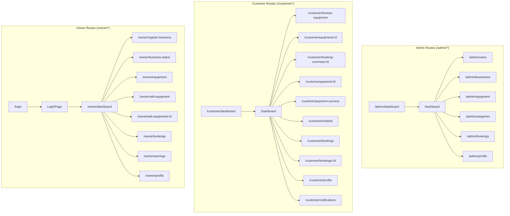

### Routing Implementation Patterns

#### Admin Routes — Nested under Layout

```jsx
// AdminRoutes.jsx
<Routes>
  <Route path="/admin" element={<AdminLayout />}>
    <Route index element={<Navigate to="/admin/dashboard" replace />} />
    <Route path="dashboard" element={<Dashboard />} />
    <Route path="users" element={<Users />} />
    <Route path="businesses" element={<Businesses />} />
    <Route path="equipment" element={<Equipment />} />
    <Route path="categories" element={<Categories />} />
    <Route path="bookings" element={<Bookings />} />
    <Route path="profile" element={<Profile />} />
  </Route>
  <Route path="*" element={<Navigate to="/admin/dashboard" replace />} />
</Routes>
```

#### Customer Routes — Nested under Layout

```jsx
// CustomerRoutes.jsx
<Route path="/customer" element={<CustomerLayout />}>
  <Route index element={<Navigate to="/customer/dashboard" replace />} />
  <Route path="dashboard" element={<Dashboard />} />
  <Route path="browse-equipment" element={<BrowseEquipment />} />
  <Route path="equipment/:id" element={<EquipmentDetails />} />
  <Route path="booking-summary/:id" element={<BookingSummary />} />
  <Route path="payment/:id" element={<DepositPayment />} />
  <Route path="payment-success" element={<PaymentSuccess />} />
  <Route path="wishlist" element={<Wishlist />} />
  <Route path="bookings" element={<Bookings />} />
  <Route path="bookings/:id" element={<BookingDetails />} />
  <Route path="profile" element={<Profile />} />
  <Route path="notifications" element={<Notifications />} />
  <Route path="*" element={<Navigate to="/customer/dashboard" replace />} />
</Route>
```

#### Owner Routes — Protected + Guest Routes

```jsx
// App.jsx (Owner)
<AuthProvider>
  <Routes>
    {/* Guest-only: Login */}
    <Route
      path="/login"
      element={
        <GuestRoute>
          <LoginPage />
        </GuestRoute>
      }
    />

    {/* Protected: Owner Layout */}
    <Route
      path="/owner"
      element={
        <ProtectedRoute>
          <OwnerLayout />
        </ProtectedRoute>
      }
    >
      <Route index element={<Navigate to="/owner/dashboard" replace />} />
      <Route path="dashboard" element={<Dashboard />} />
      <Route path="register-business" element={<RegisterBusiness />} />
      {/* ... more routes */}
    </Route>

    <Route path="/" element={<Navigate to="/login" replace />} />
    <Route path="*" element={<Navigate to="/login" replace />} />
  </Routes>
</AuthProvider>
```

---

## 🧠 State Management

### Context Architecture

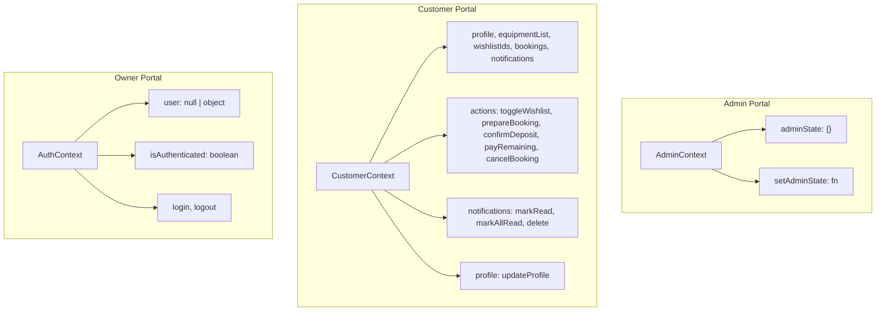

### CustomerContext — Full State API

```javascript
// From CustomerContext.jsx — Complete state surface
const CustomerContextValue = {
  // Data
  profile, // Customer profile object
  equipmentList, // All marketplace equipment
  wishlistIds, // Array of equipment IDs
  wishlistEquipment, // Filtered wishlist items
  bookings, // All customer bookings
  draftBooking, // Pending booking before payment
  notifications, // All notifications
  unreadNotifCount, // Computed unread count
  globalSearch, // Search query string

  // Actions - Wishlist
  toggleWishlist, // (equipmentId) => void
  removeFromWishlist, // (equipmentId) => void
  isInWishlist, // (equipmentId) => boolean

  // Actions - Booking Flow
  prepareBookingSummary, // (bookingData) => bookingObject
  confirmDepositPayment, // (bookingId, paymentMethod) => bookingObject
  payRemainingBalance, // (bookingId, paymentMethod) => void
  cancelBooking, // (bookingId) => void

  // Actions - Notifications
  markNotificationRead, // (notifId) => void
  markAllNotificationsRead, // () => void
  deleteNotification, // (notifId) => void

  // Actions - Profile
  updateProfile, // (updatedData) => void

  // Search
  setGlobalSearch, // (query) => void
};
```

### AuthContext — Owner Authentication

```javascript
// From AuthContext.jsx
const AuthContextValue = {
  user, // { name, email, role, avatar, businessName } | null
  isAuthenticated, // Boolean
  login, // ({ email, password }) => { success, message }
  logout, // () => void
};

// Credentials (hardcoded for demo)
const credentials = {
  owner: {
    email: "owner@rentra.com",
    password: "owner123",
    name: "Alicia Reyes",
    role: "owner",
    businessName: "Titan Heavy Rentals Inc.",
  },
};
```

---

## 🧩 Component Library

### Shared Common Components (All Portals)

| Component        | Location                             | Description                                                                                                  |
| ---------------- | ------------------------------------ | ------------------------------------------------------------------------------------------------------------ |
| **Button**       | `components/common/Button.jsx`       | Animated button with variants (primary, secondary, danger, success, warning, outline) and sizes (sm, md, lg) |
| **Loader**       | `components/common/Loader.jsx`       | Spinner with customizable label                                                                              |
| **SearchBar**    | `components/common/SearchBar.jsx`    | Search input + filter dropdown combo                                                                         |
| **ConfirmModal** | `components/common/ConfirmModal.jsx` | Accessible confirmation dialog                                                                               |
| **EmptyState**   | `components/common/EmptyState.jsx`   | Illustration + action for empty states                                                                       |
| **Modal**        | `components/common/Modal.jsx`        | Base modal (Customer, Owner)                                                                                 |

### Admin-Specific Components

| Component          | Location                              | Description                                               |
| ------------------ | ------------------------------------- | --------------------------------------------------------- |
| **AdminSidebar**   | `components/admin/AdminSidebar.jsx`   | Fixed sidebar with navigation, mobile drawer              |
| **AdminNavbar**    | `components/admin/AdminNavbar.jsx`    | Top bar with real-time search, notifications, user avatar |
| **DataTable**      | `components/admin/DataTable.jsx`      | Generic table wrapper with columns                        |
| **StatsCard**      | `components/admin/StatsCard.jsx`      | Metric card with icon, value, trend                       |
| **StatusBadge**    | `components/admin/StatusBadge.jsx`    | Colored status indicator                                  |
| **ProfileCard**    | `components/admin/ProfileCard.jsx`    | Admin profile display                                     |
| **QuickActions**   | `components/admin/QuickActions.jsx`   | Action button grid                                        |
| **RecentActivity** | `components/admin/RecentActivity.jsx` | Activity feed list                                        |

### Customer-Specific Components

| Component            | Location                                   | Description                                      |
| -------------------- | ------------------------------------------ | ------------------------------------------------ |
| **CustomerSidebar**  | `components/customer/CustomerSidebar.jsx`  | Navigation + promotional "Become Owner" card     |
| **CustomerNavbar**   | `components/customer/CustomerNavbar.jsx`   | Top bar with search, notifications, profile link |
| **BookingCard**      | `components/customer/BookingCard.jsx`      | Booking summary with timeline                    |
| **EquipmentCard**    | `components/customer/EquipmentCard.jsx`    | Equipment preview card                           |
| **NotificationCard** | `components/customer/NotificationCard.jsx` | Notification list item                           |
| **ProfileCard**      | `components/customer/ProfileCard.jsx`      | Customer profile                                 |
| **StatsCard**        | `components/customer/StatsCard.jsx`        | Clickable metric card                            |
| **WishlistCard**     | `components/customer/WishlistCard.jsx`     | Wishlist equipment card                          |

### Owner-Specific Components

| Component         | Location                             | Description                        |
| ----------------- | ------------------------------------ | ---------------------------------- |
| **OwnerSidebar**  | `components/owner/OwnerSidebar.jsx`  | Navigation for owner features      |
| **OwnerNavbar**   | `components/owner/OwnerNavbar.jsx`   | Top bar with search, notifications |
| **BookingCard**   | `components/owner/BookingCard.jsx`   | Booking request with accept/reject |
| **BusinessCard**  | `components/owner/BusinessCard.jsx`  | Business info display              |
| **EarningsCard**  | `components/owner/EarningsCard.jsx`  | Revenue metric card                |
| **EquipmentCard** | `components/owner/EquipmentCard.jsx` | Owner equipment management         |
| **ProfileCard**   | `components/owner/ProfileCard.jsx`   | Owner profile                      |
| **StatsCard**     | `components/owner/StatsCard.jsx`     | Metric card (shared design)        |
| **StatusCard**    | `components/owner/StatusCard.jsx`    | Status indicator card              |

---

## 🎨 Design System

### Color Palette

```css
/* Tailwind CSS 4 - Defined in index.css */
:root {
  /* Primary Brand */
  --brand: #ccccff; /* Primary purple */
  --brand-hover: #b8b8ff; /* Hover state */
  --brand-text: #0f172a; /* Text on brand */

  /* Semantic Colors */
  --success: #22c55e;
  --success-bg: #dcfce7;
  --warning: #f59e0b;
  --warning-bg: #fef3c7;
  --danger: #ef4444;
  --danger-bg: #fee2e2;
  --info: #3b82f6;
  --info-bg: #dbeafe;

  /* Neutrals */
  --bg: #f8fafc; /* Page background */
  --surface: #ffffff; /* Card background */
  --border: #e2e8f0; /* Border color */
  --text-primary: #0f172a; /* Headings */
  --text-secondary: #64748b; /* Body text */
  --text-muted: #94a3b8; /* Labels, captions */
}
```

### Typography Scale

| Element        | Font Family | Weight          | Size                | Line Height |
| -------------- | ----------- | --------------- | ------------------- | ----------- |
| **Display**    | Poppins     | 800 (Extrabold) | 2.5rem / 3rem       | 1.1         |
| **H1**         | Poppins     | 700 (Bold)      | 1.875rem / 2.25rem  | 1.2         |
| **H2**         | Poppins     | 700             | 1.5rem / 1.875rem   | 1.3         |
| **H3**         | Poppins     | 700             | 1.25rem / 1.5rem    | 1.3         |
| **Body Large** | Inter       | 400             | 1rem / 1.5rem       | 1.5         |
| **Body**       | Inter       | 400             | 0.875rem / 1.25rem  | 1.5         |
| **Small**      | Inter       | 400             | 0.75rem / 1rem      | 1.5         |
| **Caption**    | Inter       | 500             | 0.625rem / 0.875rem | 1.4         |
| **Code**       | Monospace   | 400             | 0.75rem             | 1.5         |

### Border Radius Scale

| Token          | Value | Usage                     |
| -------------- | ----- | ------------------------- |
| `--radius-xs`  | 6px   | Badges, pills             |
| `--radius-sm`  | 8px   | Buttons, inputs           |
| `--radius-md`  | 12px  | Cards, modals             |
| `--radius-lg`  | 16px  | Dropdowns, panels         |
| `--radius-xl`  | 20px  | Primary cards, tables     |
| `--radius-2xl` | 28px  | Feature panels (Customer) |

### Shadow System

```css
/* Defined as panel-card in Customer/Owner index.css */
.panel-card {
  border-radius: 28px; /* --radius-2xl */
  border: 1px solid #e2e8f0; /* --border */
  background: white; /* --surface */
  box-shadow: 0 25px 65px -35px rgba(15, 23, 42, 0.12);
}
```

### Spacing Scale (Tailwind Default)

| Step | Value | Rem     |
| ---- | ----- | ------- |
| 1    | 4px   | 0.25rem |
| 2    | 8px   | 0.5rem  |
| 3    | 12px  | 0.75rem |
| 4    | 16px  | 1rem    |
| 5    | 20px  | 1.25rem |
| 6    | 24px  | 1.5rem  |
| 8    | 32px  | 2rem    |
| 10   | 40px  | 2.5rem  |
| 12   | 48px  | 3rem    |
| 16   | 64px  | 4rem    |

---

## 🔄 Data Flow & API Layer

### Data Flow Architecture

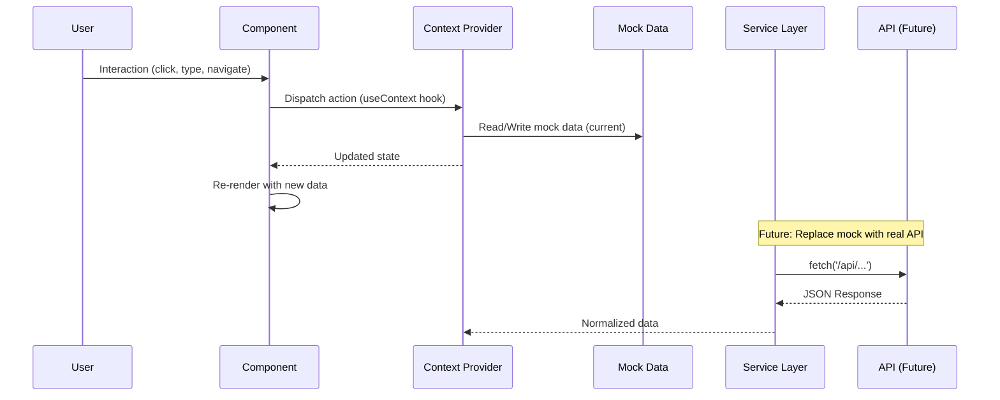

### Service Layer (Admin Only — Ready for API)

```javascript
// adminService.js — Current placeholder
export const fetchAdminDashboard = async () => {
  // TODO: replace with real API call
  return Promise.resolve({ status: "ok" });
};

// Future implementation pattern:
export const fetchAdminDashboard = async () => {
  const response = await fetch("/api/admin/dashboard", {
    headers: { Authorization: `Bearer ${getToken()}` },
  });
  if (!response.ok) throw new Error("Failed to fetch dashboard");
  return response.json();
};
```

### Mock Data Structure

Each portal has its own **domain-specific mock data**:

```
Admin:       mockData.js         → stats, activities, users, businesses, equipment, categories, bookings, adminProfile, notifications
Customer:    customerMockData.js → profile, equipment, bookings, notifications
Owner:       ownerMockData.js    → profile, stats, equipment, bookings, earnings, notifications, businessStatus
```

---

## � ✨ Animation & Motion

### Framer Motion Patterns Used

#### 1. Page Entrance Animation

```jsx
// Standard pattern across all dashboards
<motion.div
  initial={{ opacity: 0, y: 12 }}
  animate={{ opacity: 1, y: 0 }}
  transition={{ duration: 0.3 }}
  className="space-y-8"
>
```

#### 2. Hover Micro-interactions

```jsx
// StatsCard — subtle lift
<motion.div
  whileHover={{ y: -3 }}
  transition={{ type: 'spring', stiffness: 300, damping: 20 }}
>

// Button — press feedback
<motion.button
  whileHover={{ y: -1 }}
  whileTap={{ scale: 0.98 }}
>
```

#### 3. Modal/Drawer Animations

```jsx
// Mobile sidebar drawer
<AnimatePresence>
  {mobileOpen && (
    <motion.div
      initial={{ opacity: 0 }}
      animate={{ opacity: 1 }}
      exit={{ opacity: 0 }}
    />
    <motion.div
      initial={{ x: '-100%' }}
      animate={{ x: 0 }}
      exit={{ x: '-100%' }}
      transition={{ type: 'spring', damping: 25, stiffness: 200 }}
    >
      {sidebarContent}
    </motion.div>
  )}
</AnimatePresence>
```

#### 4. List Item Stagger (Customer Dashboard)

```jsx
// Recommended equipment cards
{equipmentList.slice(0, 4).map((eq) => (
  <motion.div
    key={eq.id}
    whileHover={{ y: -4 }}
    transition={{ duration: 0.2 }}
  >
```

#### 5. Modal Presence (Admin Users Page)

```jsx
<AnimatePresence>
  {selectedUser && (
    <motion.div
      initial={{ opacity: 0, scale: 0.95, y: 10 }}
      animate={{ opacity: 1, scale: 1, y: 0 }}
      exit={{ opacity: 0, scale: 0.95, y: 10 }}
    >
```

### Animation Philosophy

| Principle      | Implementation                                           |
| -------------- | -------------------------------------------------------- |
| **Purposeful** | Every animation signals state change or guides attention |
| **Performant** | Transform/opacity only — no layout thrashing             |
| **Respectful** | Could add`prefers-reduced-motion` guard (future)         |
| **Consistent** | Shared transition configs across portals                 |
| **Delightful** | Spring physics for natural feel (`type: 'spring'`)       |

---

## 🛠 ️ Development Workflow

### Getting Started

```bash
# Install dependencies for all portals
cd client/Admin && npm install
cd ../Customer && npm install
cd ../Owner && npm install

# Or install all at once (from client/)
npm install --prefix Admin --prefix Customer --prefix Owner
```

### Development Commands

| Portal       | Dev Server                | Build           | Preview           | Lint                    |
| ------------ | ------------------------- | --------------- | ----------------- | ----------------------- |
| **Admin**    | `npm run dev` (port 3000) | `npm run build` | `npm run preview` | `npm run lint` (Oxlint) |
| **Customer** | `npm run dev` (port 3001) | `npm run build` | `npm run preview` | —                       |
| **Owner**    | `npm run dev` (port 3002) | `npm run build` | `npm run preview` | —                       |

### Running Multiple Portals

```bash
# Terminal 1 - Admin
739	cd client/Admin && npm run dev

# Terminal 2 - Customer
742	cd client/Customer && npm run dev

# Terminal 3 - Owner
745	cd client/Owner && npm run dev
```

### Vite Configuration (All Portals)

```javascript
// vite.config.js — Identical across portals
import { defineConfig } from "vite";
import react from "@vitejs/plugin-react";
import tailwindcss from "@tailwindcss/vite";

export default defineConfig({
  plugins: [react(), tailwindcss()],
});
```

### Environment Variables

Create `.env.local` in each portal (optional):

```env
VITE_API_BASE_URL=http://localhost:4000/api
VITE_PORTAL_NAME=admin|customer|owner
```

---

## 📦 Build & Deployment

### Production Build

```bash
# Build all portals
cd client/Admin && npm run build
cd ../Customer && npm run build
cd ../Owner && npm run build

# Output: each portal creates a `dist/` folder
```

### Build Output Structure

```
dist/
├── index.html
├── assets/
│   ├── index-[hash].js
│   ├── index-[hash].css
│   └── [images/fonts]
�└── vite.svg
```

### Deployment Targets

| Platform                | Configuration                                       |
| ----------------------- | --------------------------------------------------- |
| **Vercel**              | Auto-detects Vite, set root to`client/Admin` etc.   |
| **Netlify**             | Build:`npm run build`, Publish: `dist`              |
| **AWS S3 + CloudFront** | Upload`dist/`, configure SPA redirect               |
| **Docker**              | Multi-stage build with`nginx` to serve static files |
| **GitHub Pages**        | Set base in`vite.config.js`: `base: '/repo-name/'`  |

### Docker Example (Single Portal)

```dockerfile
# Dockerfile
FROM node:20-alpine AS builder
WORKDIR /app
COPY package*.json ./
RUN npm ci
COPY . .
RUN npm run build

FROM nginx:alpine
COPY --from=builder /app/dist /usr/share/nginx/html
COPY nginx.conf /etc/nginx/conf.d/default.conf
EXPOSE 80
CMD ["nginx", "-g", "daemon off;"]
```

```nginx
# nginx.conf
server {
  listen 80;
  root /usr/share/nginx/html;
  index index.html;

  location / {
    try_files $uri $uri/ /index.html;
  }

  # Cache static assets
  location /assets/ {
    expires 1y;
    add_header Cache-Control "public, immutable";
  }
}
```

---

## 🔮 Future Enhancements

### Planned Features

| Feature                       | Priority | Portal(s)   | Notes                               |
| ----------------------------- | -------- | ----------- | ----------------------------------- |
| **Real API Integration**      | High     | All         | Replace mock data with GraphQL/REST |
| **TypeScript Migration**      | High     | All         | Add strict typing                   |
| **Unit/Integration Tests**    | Medium   | All         | Vitest + React Testing Library      |
| **Storybook**                 | Medium   | All         | Component documentation             |
| **PWA Support**               | Low      | Customer    | Offline booking access              |
| **Real-time Notifications**   | Medium   | All         | WebSocket / Server-Sent Events      |
| **Internationalization**      | Low      | All         | i18n for global marketplace         |
| **Advanced Analytics**        | Medium   | Owner/Admin | Charts, exports                     |
| **Role-based Access (Admin)** | High     | Admin       | Permissions per admin role          |

### Technical Debt

- [ ] Extract shared components to `client/shared/` or npm package
- [ ] Unify `StatsCard` implementation (3 copies)
- [ ] Add `prefers-reduced-motion` support
- [ ] Implement proper error boundaries
- [ ] Add loading skeletons for async data
- [ ] Create design token package

---

## 📚 Quick Reference

### Common Commands

```bash
# Start all dev servers (requires 3 terminals)
cd client/Admin && npm run dev    # → http://localhost:3000
cd client/Customer && npm run dev  # → http://localhost:3001
cd client/Owner && npm run dev     # → http://localhost:3002

# Build for production
cd client/Admin && npm run build
cd client/Customer && npm run build
cd client/Owner && npm run build

# Lint (Admin only)
cd client/Admin && npm run lint
```

### Key Files to Know

| Purpose                      | File                                              |
| ---------------------------- | ------------------------------------------------- |
| **Admin Entry**              | `client/Admin/src/main.jsx`                       |
| **Customer Entry**           | `client/Customer/src/main.jsx`                    |
| **Owner Entry**              | `client/Owner/src/main.jsx`                       |
| **Admin Routes**             | `client/Admin/src/routes/AdminRoutes.jsx`         |
| **Customer Routes**          | `client/Customer/src/routes/CustomerRoutes.jsx`   |
| **Owner Routes**             | `client/Owner/src/routes/OwnerRoutes.jsx`         |
| **Admin Context**            | `client/Admin/src/context/AdminContext.jsx`       |
| **Customer Context**         | `client/Customer/src/context/CustomerContext.jsx` |
| **Owner Auth**               | `client/Owner/src/context/AuthContext.jsx`        |
| **Admin Mock Data**          | `client/Admin/src/data/mockData.js`               |
| **Customer Mock Data**       | `client/Customer/src/data/customerMockData.js`    |
| **Owner Mock Data**          | `client/Owner/src/data/ownerMockData.js`          |
| **Shared Styles (Admin)**    | `client/Admin/src/index.css`                      |
| **Shared Styles (Customer)** | `client/Customer/src/index.css`                   |
| **Shared Styles (Owner)**    | `client/Owner/src/index.css`                      |

---

## 📄 License & Credits

**Rentra** — Heavy Equipment Rental Marketplace
Client-side applications built with ❤ ️ using modern React ecosystem.

### Key Libraries

- [React](https://react.dev/) — UI Framework
- [Vite](https://vite.dev/) — Build Tool
- [Tailwind CSS](https://tailwindcss.com/) — Styling
- [Framer Motion](https://www.framer.com/motion/) — Animation
- [React Router](https://reactrouter.com/) — Routing
- [React Icons](https://react-icons.github.io/react-icons/) — Icons (Feather set)
- [Unsplash](https://unsplash.com/) — Demo images

---

_Documentation generated from codebase analysis — Last updated: 2026-08-08_

---

# Supplementary Visual Documentation

> Supplementary visual documentation for the client-side architecture

## Complete System Architecture

```mermaid
flowchart TB
    subgraph "Client Layer (Browser)"
        direction TB

        subgraph "Admin Portal [:3000]"
            A1[main.jsx] --> A2[App.jsx]
            A2 --> A3[BrowserRouter]
            A3 --> A4[AdminRoutes]
            A4 --> A5[AdminLayout]
            A5 --> A6[AdminSidebar]
            A5 --> A7[AdminNavbar]
            A5 --> A8[Outlet → Pages]
            A8 --> A9[Dashboard]
            A8 --> A10[Users]
            A8 --> A11[Businesses]
            A8 --> A12[Equipment]
            A8 --> A13[Categories]
            A8 --> A14[Bookings]
            A8 --> A15[Profile]

            A9 --> AC[AdminContext]
            A10 --> AC
            A11 --> AC
            A12 --> AC
            A13 --> AC
            A14 --> AC
            A15 --> AC

            AC --> AD[mockData.js]
        end

        subgraph "Customer Portal [:3001]"
            B1[main.jsx] --> B2[App.jsx]
            B2 --> B3[BrowserRouter + Routes]
            B3 --> B4[CustomerLayout]
            B4 --> B5[CustomerSidebar]
            B4 --> B6[CustomerNavbar]
            B4 --> B7[Outlet → Pages]

            B7 --> B8[Dashboard]
            B7 --> B9[BrowseEquipment]
            B7 --> B10[EquipmentDetails]
            B7 --> B11[BookingSummary]
            B7 --> B12[DepositPayment]
            B7 --> B13[PaymentSuccess]
            B7 --> B14[Wishlist]
            B7 --> B15[Bookings]
            B7 --> B16[BookingDetails]
            B7 --> B17[Profile]
            B7 --> B18[Notifications]

            B4 --> CC[CustomerContext]
            CC --> CD[customerMockData.js]
        end

        subgraph "Owner Portal [:3002]"
            C1[main.jsx] --> C2[App.jsx]
            C2 --> C3[BrowserRouter]
            C3 --> C4[AuthProvider]
            C4 --> C5[Routes]

            C5 --> C6[/login → GuestRoute → LoginPage]
            C5 --> C7[/owner/* → ProtectedRoute → OwnerLayout]

            C7 --> C8[OwnerSidebar]
            C7 --> C9[OwnerNavbar]
            C7 --> C10[Outlet → Pages]

            C10 --> C11[Dashboard]
            C10 --> C12[RegisterBusiness]
            C10 --> C13[BusinessStatus]
            C10 --> C14[Equipment]
            C10 --> C15[AddEquipment]
            C10 --> C16[EditEquipment]
            C10 --> C17[Bookings]
            C10 --> C18[Earnings]
            C10 --> C19[Profile]

            C4 --> CO[AuthContext]
            CO --> CP[ownerMockData.js]
        end
    end

    subgraph "Shared Design System"
        DS1[Tailwind CSS 4]
        DS2[Framer Motion 12]
        DS3[React Icons - Feather]
        DS4[CSS Variables]
        DS5[Component Patterns]
    end

    A5 --> DS1
    A5 --> DS2
    A5 --> DS3
    A5 --> DS4
    B4 --> DS1
    B4 --> DS2
    B4 --> DS3
    B4 --> DS4
    C7 --> DS1
    C7 --> DS2
    C7 --> DS3
    C7 --> DS4
```

---

## 🔄 Booking Flow — Customer Portal

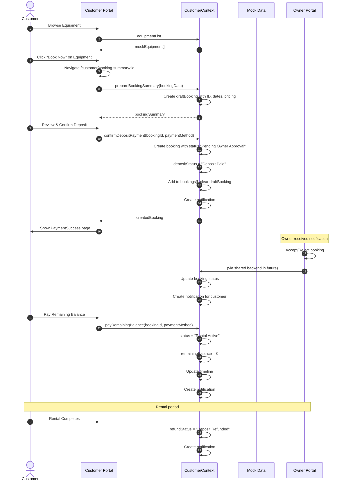

---

## 🔐 Owner Authentication Flow

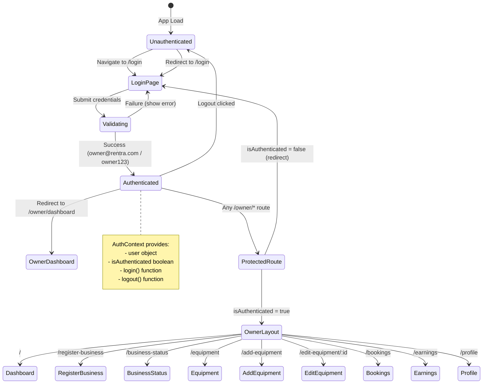

---

## 🧩 Component Composition — Dashboard Pages

### Admin Dashboard Component Tree

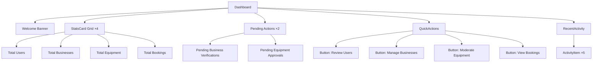

### Customer Dashboard Component Tree

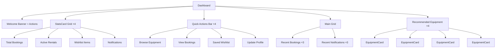

### Owner Dashboard Component Tree

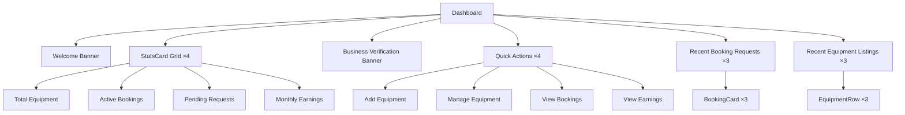

---

## 📱 Responsive Breakpoint Behavior

```mermaid
graph LR
    subgraph "Mobile (< 768px)"
        M1[Hamburger Menu]
        M2[Drawer Sidebar]
        M3[Stacked Cards]
        M4[Hidden Search]
        M5[Condensed Navbar]
    end

    subgraph "Tablet (768px - 1024px)"
        T1[Hamburger Menu]
        T2[Drawer Sidebar]
        T3[2-col Grid]
        T4[Inline Search]
        T5[Full Navbar]
    end

    subgraph "Desktop (> 1024px)"
        D1[Fixed Sidebar]
        D2[Always Visible]
        D3[4-col Grid]
        D4[Full Search Bar]
        D5[Full Navbar + Avatar]
    end

    M1 --> T1 --> D1
    M2 --> T2 --> D2
    M3 --> T3 --> D3
    M4 --> T4 --> D4
    M5 --> T5 --> D5
```

### Breakpoint Implementation (Tailwind)

```css
/* Sidebar */
.hidden.md:block        /* Desktop: visible */
.md:hidden              /* Mobile/Tablet: hidden */

/* Grid Layouts */
grid-cols-1             /* Mobile: 1 column */
sm:grid-cols-2          /* Small: 2 columns */
lg:grid-cols-4          /* Large: 4 columns */

/* Search Bar */
.hidden.lg:block        /* Desktop only */

/* Navbar Text */
.hidden.sm:block        /* Tablet+ */
.hidden.xl:block        /* XL+ */

/* Padding */
p-4.md:p-8              /* Mobile 16px, Desktop 32px */
```

---

## 🎬 Animation Choreography

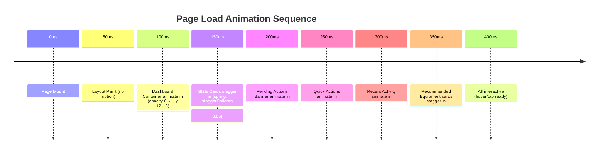

### Framer Motion Variants Used

```javascript
// Page container
const pageVariants = {
  initial: { opacity: 0, y: 12 },
  animate: { opacity: 1, y: 0 },
  transition: { duration: 0.3 },
};

// Staggered children
const containerVariants = {
  animate: {
    transition: { staggerChildren: 0.05 },
  },
};

// Card hover
const cardHover = {
  whileHover: { y: -3 },
  transition: { type: "spring", stiffness: 300, damping: 20 },
};

// Button press
const buttonTap = {
  whileHover: { y: -1 },
  whileTap: { scale: 0.98 },
};

// Modal/drawer
const drawerVariants = {
  initial: { x: "-100%" },
  animate: { x: 0 },
  exit: { x: "-100%" },
  transition: { type: "spring", damping: 25, stiffness: 200 },
};

const backdropVariants = {
  initial: { opacity: 0 },
  animate: { opacity: 1 },
  exit: { opacity: 0 },
};
```

---

## 📊 Data Relationships

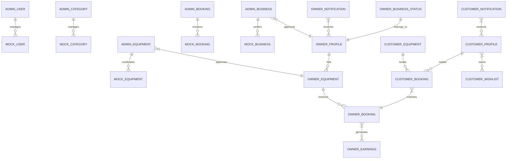

---

## 🔀 State Synchronization (Future)

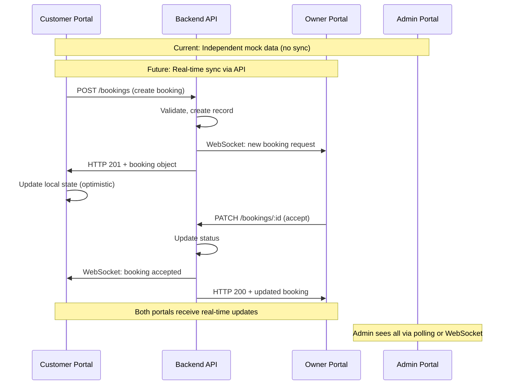

---

## 📦 Bundle Analysis (Estimated)

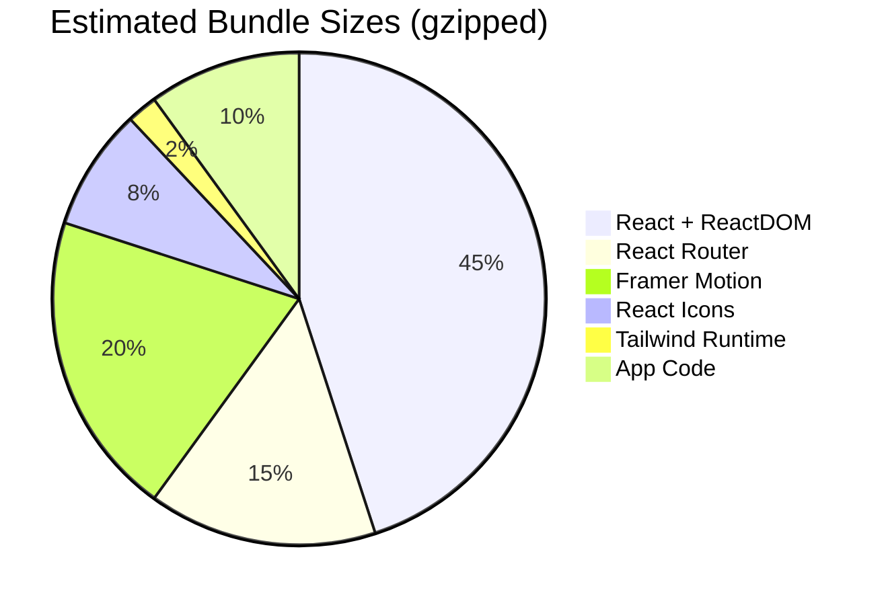

### Optimization Opportunities

| Technique                   | Impact            | Status             |
| --------------------------- | ----------------- | ------------------ |
| Code Splitting (React.lazy) | -30% initial JS   | ⏳ Planned         |
| Tree Shaking Icons          | -50% icon bundle  | � ✅ Auto (ESM)    |
| Dynamic Import Routes       | -40% route chunks | ⏳ Planned         |
| Compression (gzip/brotli)   | -70% transfer     | � ✅ Server config |
| Cache Headers               | Repeat visits ~0  | � ✅ Nginx/Vercel  |
| Preload Critical CSS        | Faster FCP        | ⏳ Planned         |

---

_Visual documentation generated from codebase analysis_
