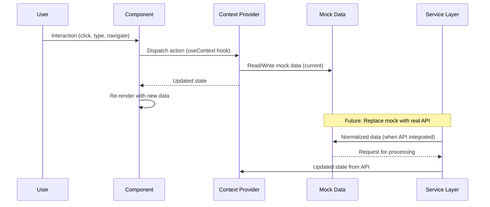
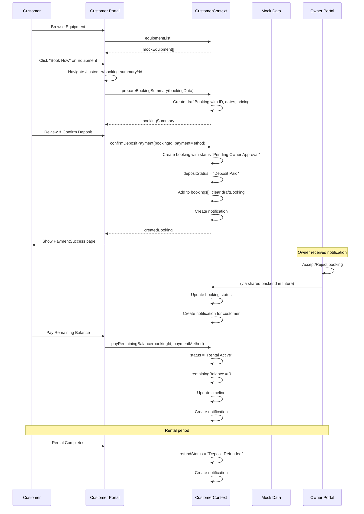

# Rentra — Client-Side Documentation

> **Multi-Portal Heavy Equipment Rental Marketplace** — Built with React 19, Vite 8, Tailwind CSS 4, and Framer Motion 12

---

## Table of Contents

- [Project Overview](#project-overview)
- [Key Features](#key-features)
- [Technology Stack](#technology-stack)
- [System Architecture](#system-architecture)
  - [Three-Portal Design](#three-portal-design)
  - [Data Flow &amp; State Management](#data-flow--state-management)
- [Directory Structure](#directory-structure)
- [Component Library](#component-library)
- [Getting Started](#getting-started)
  - [Prerequisites](#prerequisites)
  - [Installation](#installation)
  - [Running the Applications](#running-the-applications)
- [Development Workflow](#development-workflow)
  - [Available Scripts](#available-scripts)
  - [Environment Variables](#environment-variables)
- [Building for Production](#building-for-production)
- [Deployment Options](#deployment-options)
- [Future Enhancements](#future-enhancements)
- [Contributing](#contributing)
- [License](#license)
- [Acknowledgements](#acknowledgements)

---

## Project Overview

Rentra is a **three-sided marketplace** that connects:

- **Customers** – Individuals or businesses looking to rent heavy machinery, construction equipment, or other business assets.
- **Owners** – Equipment owners who can list their assets, manage incoming booking requests, track earnings, and maintain their inventory.
- **Admins** – Platform operators responsible for verifying users, moderating content, managing disputes, and ensuring smooth marketplace operations.

```mermaid
flowchart LR
    A[Customers] -->|Rent Equipment| B[Owners]
    B[Owners] -->|List Assets| A[Customers]
    A[Customers] -->|Payments/Reviews| C[Admins]
    B[Owners] -->|Compliance/Reports| C[Admins]
    C[Admins] -->|Verification/Moderation| A[Customers]
    C[Admins] -->|Approval/Dispute Resolution| B[Owners]

    classDef marketplace fill:#333,stroke:#3b82f6,stroke-width:2px;
    class A,B,C marketplace;
```



Each portal (Admin, Customer, Owner) is a **standalone Vite + React application** that shares a unified design system and UI kit, but maintains independent routing, state management, and mock‑data layers. This architecture allows each portal to evolve independently while providing a consistent look and feel across the whole platform.

---

## Key Features

- **Responsive UI** – Optimized for mobile, tablet, and desktop experiences using Tailwind CSS breakpoints.
- **Smooth Animations** – Framer Motion powers page transitions, hover effects, modal/drawer animations, and staggered list entrances.
- **Context‑Based State Management** – React Context (useContext) provides scoped state for each portal (AdminContext, CustomerContext, AuthContext).
- **Modular Component Library** – Reusable UI components (Button, Loader, SearchBar, ConfirmModal, EmptyState, Modal) plus portal‑specific widgets (DataTable, StatsCard, BookingCard, EquipmentCard, etc.).
- **Mock Data Layers** – Each portal consumes domain‑specific mock data files, enabling rapid UI development without a backend.
- **Extensible Service Layer** – Placeholder adminService.js illustrates future API integration patterns.
- **Separation of Concerns** – Clear division between layouts, pages, routes, services, utils, and assets.
- **Ready for Production** – Vite‑based builds produce optimized, cache‑friendly static assets suitable for any static‑host (Vercel, Netlify, S3+CloudFront, Docker, etc.).

---

## Technology Stack

| Layer                | Technology       | Version | Purpose                              |
| -------------------- | ---------------- | ------- | ------------------------------------ |
| **Framework**  | React            | 19.2.8  | UI library with concurrent features  |
| **Build Tool** | Vite             | 8.2.0   | Lightning‑fast dev server & bundler |
| **Styling**    | Tailwind CSS     | 4.3.3   | Utility‑first CSS (Vite plugin)     |
| **Animation**  | Framer Motion    | 12.43.0 | Production‑ready animations         |
| **Routing**    | React Router DOM | 7.18.2  | Client‑side routing                 |
| **Icons**      | React Icons      | 5.7.0   | Feather icon set                     |
| **Linting**    | Oxlint           | 1.75.0  | Fast Rust‑based linter (Admin only) |
| **TypeScript** | @types/react     | 19.2.17 | Type definitions (dev‑only)         |

### Shared Dependencies (package.json)

```json
{
  "dependencies": {
    "@tailwindcss/vite": "^4.3.3",
    "framer-motion": "^12.43.0",
    "react": "^19.2.8",
    "react-dom": "^19.2.8",
    "react-icons": "^5.7.0",
    "react-router-dom": "^7.18.2",
    "tailwindcss": "^4.3.3"
  }
}
```

---

## System ArchitecturePortal Comparison

| Feature                      | Admin Portal     | Customer Portal  | Owner Portal             |
| ---------------------------- | ---------------- | ---------------- | ------------------------ |
| **Port**               | 3000             | 3001             | 3002                     |
| **Auth**               | None (simulated) | None (simulated) | **Login Required** |
| **Pages**              | 7                | 11               | 9                        |
| **Context**            | AdminContext     | CustomerContext  | AuthContext              |
| **Mock Data**          | adminMockData    | customerMockData | ownerMockData            |
| **Protected Routes**   | No               | No               | **Yes**            |
| **Real-time Search**   | ✅               | ✅               | ✅                       |
| **Notifications**      | ✅               | ✅               | ✅                       |
| **Wishlist**           | No               | ✅               | No                       |
| **Earnings/Analytics** | No               | No               | ✅                       |

All three portals import the same `index.css` (Tailwind base) and can reuse any component from `components/common/`.

---

## Data Flow & State Management

React Context provides each portal with a custom hook that returns state and action creators. Mock data files enable rapid development without a backend.



### Data Flow Sequence

1. **User Interaction** – User clicks a button, submits a form, or navigates
2. **Component Action** – Component dispatches an action via context hook (e.g., `toggleWishlist(equipmentId)`)
3. **Context Update** – Context reads/writes to mock data file or prepares API call
4. **State Propagation** – Updated state is broadcast to all components subscribed to the context
5. **Re-render** – Affected components re-render with new data
6. **Future API** – Service layer will eventually replace mock data with REST/GraphQL calls

---

## Directory Structure

```
client/
├── Admin/                     # Admin Portal (Port 3000)
│   ├── src/
│   │   ├── components/
│   │   │   ├── admin/          # Admin‑specific components
│   │   │   └── common/         # Shared UI components used by all portals
│   │   ├── context/            # AdminContext (React Context)
│   │   ├── data/               # mockData.js (admin mock data)
│   │   ├── hooks/              # Custom hooks (e.g., useAdminData.js)
│   │   ├── layouts/            # AdminLayout (Sidebar + Navbar)
│   │   ├── pages/
│   │   │   └── admin/          # 7 admin pages (Dashboard, Users, etc.)
│   │   ├── routes/             # AdminRoutes.jsx
│   │   ├── services/           # adminService.js (API‑layer placeholder)
│   │   ├── utils/              # adminUtils.js
│   │   ├── App.jsx
│   │   ├── main.jsx
│   │   └── index.css
│   ├── index.html
│   ├── package.json
│   └── vite.config.js
│
├── Customer/                  # Customer Portal (Port 3001)
│   ├── src/
│   │   ├── components/
│   │   │   ├── common/         # Shared UI components
│   │   │   └── customer/       # Customer‑specific components
│   │   ├── context/            # CustomerContext (React Context)
│   │   ├── data/               # customerMockData.js
│   │   ├── layouts/            # CustomerLayout
│   │   ├── pages/
│   │   │   └── customer/       # 11 customer pages
│   │   ├── routes/             # CustomerRoutes.jsx
│   │   ├── App.jsx
│   │   ├── main.jsx
│   │   └── index.css
│   ├── index.html
│   ├── package.json
│   └── vite.config.js
│
               └── Owner/                     # Owner Portal (Port 3002)
    ├── src/
    │   ├── components/
    │   │   ├── common/         # Shared UI components
    │   │   └── owner/          # Owner‑specific components
    │   ├── context/            # AuthContext (with login)
    │   ├── data/               # ownerMockData.js
    │   ├── layouts/            # OwnerLayout
    │   ├── pages/
    │   │   └── owner/          # 9 owner pages
    │   ├── routes/             # OwnerRoutes.jsx + ProtectedRoute.jsx
    │   ├── App.jsx
    │   ├── main.jsx
    │   └── index.css
    ├── index.html
    ├── package.json
    └── vite.config.js
```

Each portal is a self‑contained Vite project; dependencies are installed per‑portal (or from the root `client/` folder using `--prefix`).

---

## Component Library

### Shared Common Components (All Portals)

| Component              | Location                               | Description                                                                                                  |
| ---------------------- | -------------------------------------- | ------------------------------------------------------------------------------------------------------------ |
| **Button**       | `components/common/Button.jsx`       | Animated button with variants (primary, secondary, danger, success, warning, outline) and sizes (sm, md, lg) |
| **Loader**       | `components/common/Loader.jsx`       | Spinner with customizable label                                                                              |
| **SearchBar**    | `components/common/SearchBar.jsx`    | Search input + filter dropdown combo                                                                         |
| **ConfirmModal** | `components/common/ConfirmModal.jsx` | Accessible confirmation dialog                                                                               |
| **EmptyState**   | `components/common/EmptyState.jsx`   | Illustration + action for empty states                                                                       |
| **Modal**        | `components/common/Modal.jsx`        | Base modal (Customer, Owner)                                                                                 |

### Admin-Specific Components

| Component                | Location                                | Description                                               |
| ------------------------ | --------------------------------------- | --------------------------------------------------------- |
| **AdminSidebar**   | `components/admin/AdminSidebar.jsx`   | Fixed sidebar with navigation, mobile drawer              |
| **AdminNavbar**    | `components/admin/AdminNavbar.jsx`    | Top bar with real-time search, notifications, user avatar |
| **DataTable**      | `components/admin/DataTable.jsx`      | Generic table wrapper with columns                        |
| **StatsCard**      | `components/admin/StatsCard.jsx`      | Metric card with icon, value, trend                       |
| **StatusBadge**    | `components/admin/StatusBadge.jsx`    | Colored status indicator                                  |
| **ProfileCard**    | `components/admin/ProfileCard.jsx`    | Admin profile display                                     |
| **QuickActions**   | `components/admin/QuickActions.jsx`   | Action button grid                                        |
| **RecentActivity** | `components/admin/RecentActivity.jsx` | Activity feed list                                        |

### Customer-Specific Components

| Component                  | Location                                     | Description                                      |
| -------------------------- | -------------------------------------------- | ------------------------------------------------ |
| **CustomerSidebar**  | `components/customer/CustomerSidebar.jsx`  | Navigation + promotional "Become Owner" card     |
| **CustomerNavbar**   | `components/customer/CustomerNavbar.jsx`   | Top bar with search, notifications, profile link |
| **BookingCard**      | `components/customer/BookingCard.jsx`      | Booking summary with timeline                    |
| **EquipmentCard**    | `components/customer/EquipmentCard.jsx`    | Equipment preview card                           |
| **NotificationCard** | `components/customer/NotificationCard.jsx` | Notification list item                           |
| **ProfileCard**      | `components/customer/ProfileCard.jsx`      | Customer profile                                 |
| **StatsCard**        | `components/customer/StatsCard.jsx`        | Clickable metric card                            |
| **WishlistCard**     | `components/customer/WishlistCard.jsx`     | Wishlist equipment card                          |

### Owner-Specific Components

| Component               | Location                               | Description                        |
| ----------------------- | -------------------------------------- | ---------------------------------- |
| **OwnerSidebar**  | `components/owner/OwnerSidebar.jsx`  | Navigation for owner features      |
| **OwnerNavbar**   | `components/owner/OwnerNavbar.jsx`   | Top bar with search, notifications |
| **BookingCard**   | `components/owner/BookingCard.jsx`   | Booking request with accept/reject |
| **BusinessCard**  | `components/owner/BusinessCard.jsx`  | Business info display              |
| **EarningsCard**  | `components/owner/EarningsCard.jsx`  | Revenue metric card                |
| **EquipmentCard** | `components/owner/EquipmentCard.jsx` | Owner equipment management         |
| **ProfileCard**   | `components/owner/ProfileCard.jsx`   | Owner profile                      |
| **StatsCard**     | `components/owner/StatsCard.jsx`     | Metric card (shared design)        |
| **StatusCard**    | `components/owner/StatusCard.jsx`    | Status indicator card              |

---

## Getting Started

### Prerequisites

- **Node.js** ≥ 20.x (recommended)
- **npm** ≥ 10.x (comes with Node 20)
- **Git** (optional, for cloning the repository)

### Installation

1. Clone the repository (if you haven’t already):

   ```bash
   git clone <repository‑url>
   cd Rentra-Internship-Project
   ```
2. Install dependencies for all three portals:

   ```bash
   # Option A: install each portal individually
   cd client/Admin && npm install
   cd ../Customer && npm install
   cd ../Owner && npm install

   # Option B: install all at once from the client/ folder
   cd client
   npm install --prefix Admin --prefix Customer --prefix Owner
   ```

### Running the Applications

Open **three separate terminal windows** (or tabs) and run the dev server for each portal:

- **Admin Portal** (http://localhost:3000)
  ```bash
  cd client/Admin && npm run dev
  ```
- **Customer Portal** (http://localhost:3001)
  ```bash
  cd client/Customer && npm run dev
  ```
- **Owner Portal** (http://localhost:3002)
  ```bash
  cd client/Owner && npm run dev
  ```

The Vite dev server provides hot‑module replacement (HMR), so edits to JSX, CSS, or config update instantly in the browser.

---

## Development Workflow

### Available Scripts (per portal)

| Script              | Description                                                           |
| ------------------- | --------------------------------------------------------------------- |
| `npm run dev`     | Starts the Vite development server (default ports: 3000/3001/3002)    |
| `npm run build`   | Produces a production‑ready bundle in the`dist/` folder            |
| `npm run preview` | Serves the built`dist/` locally for previewing the production build |
| `npm run lint`    | (Admin only) Runs Oxlint to check for code-quality issues             |

### Environment Variables

Create a `.env.local` file inside each portal’s root (optional). Example:

```env
VITE_API_BASE_URL=http://localhost:4000/api
VITE_PORTAL_NAME=admin   # or customer / owner
```

These variables are accessible via `import.meta.env.VITE_*` in the source code.

---

## Technology Adoption Radar

| Technology       | Adoption Level | Maturity | Notes                                           |
| ---------------- | -------------- | -------- | ----------------------------------------------- |
| React 19         | ●●●●●     | High     | Latest concurrent features, excellent ecosystem |
| Vite 8           | ●●●●●     | High     | Lightning-fast HMR, excellent DX                |
| Tailwind CSS 4   | ●●●●○     | High     | Utility-first, JIT compiler, excellent defaults |
| Framer Motion 12 | ●●●●○     | High     | Production-ready animations, spring physics     |
| React Router v7  | ●●●●●     | High     | Data‑loading APIs, nested routing              |
| React Icons      | ●●●●●     | High     | Feather icon set, treeshakable                  |
| Oxlint           | ●●○○○     | Medium   | Fast Rust linter (Admin only)                   |
| Context API      | ●●●●●     | High     | Built‑in state management, no extra deps       |
| Mock Data        | ●●○○○     | Low      | Placeholder for API integration                 |

_● = Adoption level (1-5), ○ = Maturity assessment_

---

## Building for Production

To generate static assets for deployment:

```bash
# Build each portal
cd client/Admin && npm run build
cd ../Customer && npm run build
cd ../Owner && npm run build
```

Each command creates a `dist/` directory containing:

- `index.html`
- `assets/` with hashed JavaScript and CSS chunks
- Optional static assets (images, fonts) copied from the `public/` folder (if added later).

---

## Deployment Options

| Platform                      | Steps                                                                                                                                  |
| ----------------------------- | -------------------------------------------------------------------------------------------------------------------------------------- |
| **Vercel**              | Import the repo, set the root directory to`client/Admin` (repeat for Customer/Owner) or use a monorepo setup with separate projects. |
| **Netlify**             | Build command:`npm run build` (run per portal), Publish directory: `dist`.                                                         |
| **AWS S3 + CloudFront** | Upload the contents of each`dist/` bucket, configure CloudFront for SPA fallback (`/index.html`).                                  |
| **Docker**              | Use a multi‑stage Dockerfile (see below) to build the app and serve with Nginx.                                                       |
| **GitHub Pages**        | Set`base` in `vite.config.js` to `"/<repo-name>/"` and `npm run build`; push the `dist/` folder to the `gh-pages` branch.  |

### Example Dockerfile (single portal)

```dockerfile
# --- Build stage ---
FROM node:20-alpine AS builder
WORKDIR /app
COPY package*.json ./
RUN npm ci
COPY . .
RUN npm run build

# --- Production stage ---
FROM nginx:alpine
COPY --from=builder /app/dist /usr/share/nginx/html
COPY nginx.conf /etc/nginx/conf.d/default.conf
EXPOSE 80
CMD ["nginx", "-g", "daemon off;"]
```

`nginx.conf` (simple SPA config):

```nginx
server {
    listen 80;
    root /usr/share/nginx/html;
    index index.html;

    location / {
        try_files $uri $uri/ /index.html;
    }

    # Cache static assets
    location /assets/ {
        expires 1y;
        add_header Cache-Control "public, immutable";
    }
}
```

---

## Booking Flow (Customer Portal)



---

## Future Enhancements

- **Real API Integration** – Replace mock data with a GraphQL or REST backend; implement authentication (JWT/OAuth) for Owner portal.
- **TypeScript Migration** – Add strict typing across all portals for improved developer experience and fewer runtime errors.
- **Testing Suite** – Unit and integration tests using Vitest + React Testing Library; end‑to‑end tests with Cypress or Playwright.
- **Storybook** – Interactive component documentation and visual regression testing.
- **PWA Support** – Enable offline browsing and installable experience for the Customer portal (service worker, manifest).
- **Real‑time Notifications** – WebSocket or Server‑Sent Events for live updates (new bookings, messages, approvals).
- **Internationalisation (i18n)** – Add locale‑based strings (e.g., `react-i18next`) to support multiple languages.
- **Advanced Analytics** – Charts and exportable reports for Owners and Admins (sales, utilization, revenue).
- **Role‑Based Access Control (Admin)** – Granular permissions (super‑admin, moderator, support) within the Admin portal.
- **Design‑Token Package** – Extract Tailwind CSS variables into a shareable npm package for consistent theming across micro‑frontends.

---

## Contributing

We welcome contributions! Please follow these steps:

1. **Fork** the repository and create a new branch from `main`:
   ```bash
   git checkout -b feature/your-feature-name
   ```
2. Make your changes, adhering to the existing code style (see `.editorconfig` if present, otherwise follow the prevailing conventions).
3. **Test** your changes locally by running the dev servers and/or the production build.
4. Commit with a clear, conventional commit message:
   ```
   feat: add equipment search filter
   fix: resolve typo in customer navbar
   docs: update README with deployment instructions
   ```
5. Push to your fork and open a **Pull Request** against the `main` branch.
6. Ensure the CI checks pass (if any) and address any review feedback.

### Code of Conduct

Please be respectful and constructive in all interactions. Harassment, discrimination, or disruptive behavior will not be tolerated.

---

## License

This project is licensed under the **MIT License** – see the [LICENSE](LICENSE) file for details.

---

## Acknowledgements

- **React** team for the powerful UI library.
- **Vite** for the lightning‑fast build tooling.
- **Tailwind CSS** for the utility‑first styling approach.
- **Framer Motion** for delivering production‑ready animations with minimal code.
- **React Router** for enabling seamless client‑side navigation.
- **React Icons** (Feather set) for the clean, consistent iconography.
- **Oxlint** for helping keep the Admin portal’s codebase tidy.
- The open‑source community whose tools and libraries make projects like Rentra possible.

---

> _Documentation generated from codebase analysis – Last updated: 2026‑08‑08_


