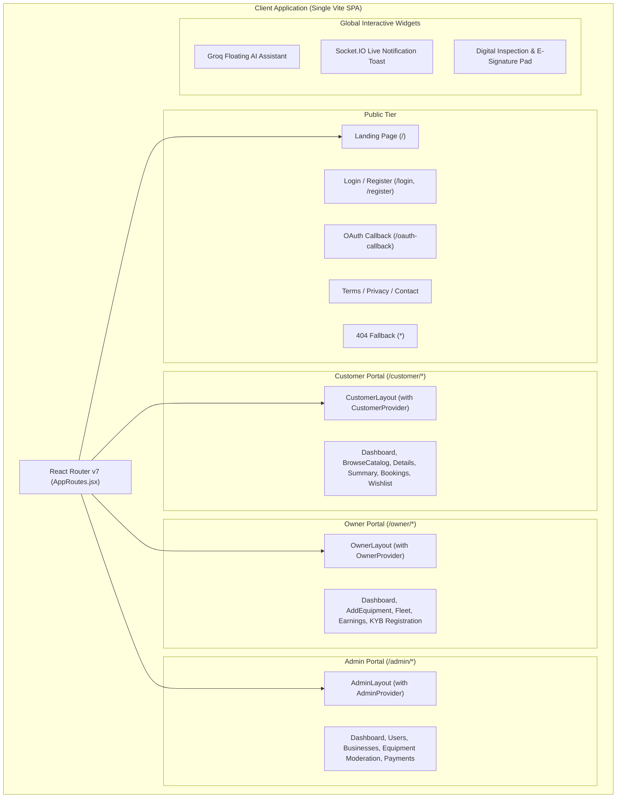
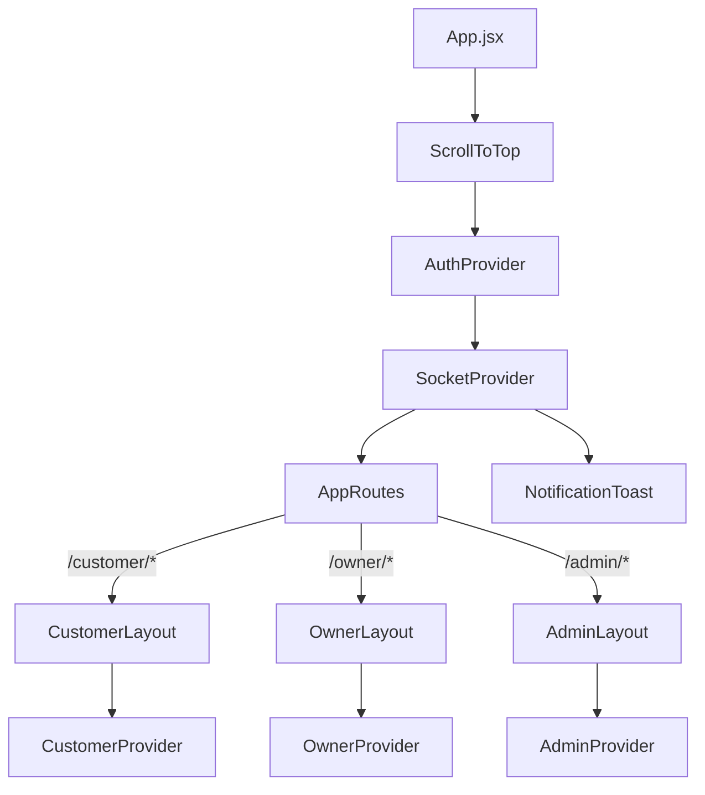

# Rentra — Frontend Client Documentation 💻

> **Enterprise Heavy Equipment & Machinery Rental Marketplace Client**  
> Built with **React 19**, **Vite 8**, **Tailwind CSS 4**, **Framer Motion 12**, **Socket.IO Client**, and **Axios**.

---

## 📋 Table of Contents

- [Overview](#overview)
- [Architecture & Portal Ecosystem](#architecture--portal-ecosystem)
- [State Management & Provider Hierarchy](#state-management--provider-hierarchy)
- [Centralized API Service & Interceptors](#centralized-api-service--interceptors)
- [Real-Time WebSocket Engine](#real-time-websocket-engine)
- [Groq AI Assistant Floating Widget](#groq-ai-assistant-floating-widget)
- [Digital Handover & E-Signature Pad](#digital-handover--e-signature-pad)
- [One-Click WhatsApp Contractor Quote Share](#one-click-whatsapp-contractor-quote-share)
- [Directory & Component Layout](#directory--component-layout)
- [Route Configuration & Access Control](#route-configuration--access-control)
- [Key UX & Polish Features](#key-ux--polish-features)
- [Getting Started & Development](#getting-started--development)
- [Building for Production](#building-for-production)

---

## Overview

The **Rentra Client** is a single-page application (SPA) that delivers a unified yet role-partitioned user experience across three user tiers:

1. **Customers**: Search and filter heavy equipment catalog, calculate deposit and transport costs, place bookings with a 20% advance escrow deposit via Razorpay, track active rentals, and generate PDF invoices.
2. **Equipment Owners**: Register business KYB profiles, list machinery with detailed specs and images via Cloudinary, accept/reject booking requests, manage rental fleets, and review revenue analytics.
3. **Platform Administrators**: Supervise all system activities, perform business KYC approvals, moderate machinery listings, manage category taxonomies, monitor escrow payments, and enforce user access control with instant account banning.

The client communicates seamlessly with the Node.js / Express backend via a centralized Axios service (`src/services/api.js`) and maintains persistent bidirectional real-time communication via Socket.IO.

---

## Architecture & Portal Ecosystem



---

## State Management & Provider Hierarchy

Rentra employs a clean, scoped React Context architecture:

1. **Global Providers** (`src/App.jsx`):
   - `AuthProvider`: Manages user authentication state, JWT storage in `localStorage`, user session profile, and role validation.
   - `SocketProvider`: Manages the real-time WebSocket connection to the backend, binds user rooms, handles reconnects, and enforces instant disconnection if a user is banned.
2. **Scoped Domain Providers** (Embedded in Portal Layouts):
   - `CustomerProvider`: Encapsulates catalog filters, customer bookings, wishlist items, and Razorpay deposit state inside `CustomerLayout.jsx`.
   - `OwnerProvider`: Manages equipment inventory, owner earnings, booking requests, and business verification inside `OwnerLayout.jsx`.
   - `AdminProvider`: Handles platform-wide aggregation feeds, user management, equipment moderation, and payment audits inside `AdminLayout.jsx`.



---

## Centralized API Service & Interceptors

All HTTP REST requests are routed through `src/services/api.js`. This central module provides:

- **JWT Request Interceptor:** Automatically attaches the active JWT Bearer token to all outgoing requests from `localStorage.getItem('token')`.
- **Automatic Header Configuration:** Properly configures `Content-Type` for JSON payloads and `multipart/form-data` for file uploads.
- **Unified Error Handling:** Standardizes error response extraction for clean UI notifications.
- **Direct Domain Methods:**
  - `authAPI`: `login()`, `register()`, `getMe()`, `updateProfile()`
  - `customerAPI`: `getEquipment()`, `getEquipmentById()`, `createBooking()`, `getMyBookings()`, `getWishlist()`, `addToWishlist()`
  - `ownerAPI`: `getMyEquipment()`, `addEquipment()`, `updateEquipment()`, `getOwnerBookings()`, `updateBookingStatus()`, `getEarnings()`, `registerBusiness()`
  - `adminAPI`: `getStats()`, `getUsers()`, `updateUserRole()`, `toggleUserBan()`, `getBusinesses()`, `verifyBusiness()`, `getEquipment()`, `verifyEquipment()`, `getPayments()`
  - `razorpayAPI`: `createOrder()`, `verifyPayment()`
  - `chatAPI`: `sendMessage()` (routes to Groq AI)

---

## Real-Time WebSocket Engine

The frontend integrates **Socket.IO Client** (`socket.io-client` `v4.8`) via `src/context/SocketContext.jsx`.

### Key Capabilities:
- **User Room Binding:** Automatically joins user-specific room `user_<id>` upon authentication.
- **Role Room Binding:** Authenticated admins automatically join `admin_room` to receive instant updates on new business KYB submissions and listing approvals.
- **Push Notification Toasts:** `NotificationToast.jsx` triggers smooth animated banners upon receipt of:
  - Deposit payment confirmation.
  - Owner booking acceptance or rejection.
  - Handover and return milestones.
  - Admin business verification status.
- **Forced Disconnect on Ban:** When an Administrator bans a user, the backend emits `USER_BANNED`, immediately logging out the client and severing socket connectivity.

---

## Groq AI Assistant Floating Widget

Located in `src/components/common/FloatingChatbot.jsx`:
- Available throughout the application for instant user assistance.
- Backed by server-side Groq LPU inference using `openai/gpt-oss-120b` and `llama-3.1-8b-instant`.
- Supports natural language machinery recommendations, calculation of towing requirements, explanations of the 20% escrow deposit structure, and rental terms.
- Features typing indicators, markdown message formatting, conversation history preservation, and expandable drawer design.

---

## Digital Handover & E-Signature Pad

Located in `src/components/common/DigitalInspectionModal.jsx` and `src/components/common/SignaturePad.jsx`:
- **HTML5 Canvas Signature Capture:** Allows customers and owners to digitally sign pre-rental inspection agreements directly on touchscreens or desktops.
- **Inspection Checklist:** Verifies odometer/hour-meter readings, fuel/battery levels, existing damages, and safety equipment.
- **Dynamic PDF Generation:** Exports high-fidelity, printable rental receipts and inspection certificates using `jspdf` and `jspdf-autotable`.

---

## 📲 One-Click WhatsApp Contractor Quote Share

Located in `src/components/common/QuoteShareModal.jsx` and integrated into `EquipmentDetails.jsx` and `BookingSummary.jsx`:
- **Commercial Need Solved:** On real construction sites, site engineers require rapid budget approval from prime contractors or client finance managers before placing binding equipment reservations.
- **Auto-Formatted Markdown Quotation:** Generates clean, executive-formatted quotes utilizing WhatsApp syntax (`*bold*`, section dividers, emojis, duration, operator status, GST 18%, and 20% escrow deposit hold).
- **Direct WhatsApp API Integration:** Automatically dispatches encoded quotes via `https://api.whatsapp.com/send` or `https://wa.me/` for instant sharing on mobile devices and WhatsApp Web.
- **Optional Direct Recipient Input:** Site engineers can type a specific phone number directly, or leave it blank to select from existing WhatsApp contacts, contractor groups, or client chats.
- **Instant Clipboard Copy:** Includes animated `FiCopy` / `FiCheck` controls for pasting quotations into email, Slack, or SMS.

---

## Directory & Component Layout

```text
client/src/
├── assets/                       # Static SVGs, logos, and illustrations
├── components/
│   ├── admin/
│   │   ├── AdminNavbar.jsx       # Header with global search & admin avatar
│   │   ├── AdminSidebar.jsx      # Navigation drawer with responsive mobile menu
│   │   ├── DataTable.jsx         # Generic sorting, filtering table wrapper
│   │   ├── ProfileCard.jsx       # Administrative credentials summary
│   │   ├── QuickActions.jsx      # Rapid approval and export triggers
│   │   ├── RecentActivity.jsx    # Audit trail event feed
│   │   └── StatusBadge.jsx       # Dynamic color-coded status badges
│   ├── common/
│   │   ├── Button.jsx            # Animated button with async spinner state
│   │   ├── ConfirmModal.jsx      # Accessible action confirmation dialog
│   │   ├── DemoRoleSwitcher.jsx  # One-click portal switching for evaluations
│   │   ├── DigitalInspectionModal.jsx # Handover inspection dialog
│   │   ├── EmptyState.jsx        # Illustrated placeholder for empty lists
│   │   ├── FloatingChatbot.jsx   # Groq AI interactive chat assistant
│   │   ├── Loader.jsx            # High-performance CSS loading spinner
│   │   ├── Modal.jsx             # Flexible backdrop modal shell
│   │   ├── NotificationToast.jsx # Real-time Socket.IO notification banner
│   │   ├── QuoteShareModal.jsx   # One-click WhatsApp contractor quote share modal
│   │   ├── ScrollToTop.jsx       # Viewport reset on route navigation
│   │   ├── SearchBar.jsx         # Debounced query & category filter input
│   │   └── SignaturePad.jsx      # HTML5 Canvas digital signature pad
│   ├── customer/
│   │   ├── BookingCard.jsx       # Booking card with timeline and action buttons
│   │   ├── CustomerNavbar.jsx    # Navigation bar with notifications and profile
│   │   ├── CustomerSidebar.jsx   # Customer navigation menu with "Become an Owner"
│   │   ├── EquipmentCard.jsx     # Catalog listing card with badges and pricing
│   │   ├── NotificationCard.jsx  # Notification item
│   │   ├── ProfileCard.jsx       # Customer profile view
│   │   ├── StatsCard.jsx         # Metric card with interactive transitions
│   │   └── WishlistCard.jsx      # Saved equipment card
│   └── owner/
│       ├── BookingCard.jsx       # Incoming booking request with Accept/Reject
│       ├── BusinessCard.jsx      # Company details & KYB status card
│       ├── EarningsCard.jsx      # Revenue analytics metric card
│       ├── EquipmentCard.jsx     # Owner machinery listing with Edit/Delete
│       ├── OwnerNavbar.jsx       # Owner portal top bar
│       ├── OwnerSidebar.jsx      # Fleet management navigation
│       ├── ProfileCard.jsx       # Owner profile summary
│       ├── StatsCard.jsx         # Metric summary card
│       └── StatusCard.jsx        # Operational status indicator
├── context/
│   ├── AdminContext.jsx          # Admin state and management functions
│   ├── AuthContext.jsx           # User authentication and JWT management
│   ├── CustomerContext.jsx       # Customer browse and booking state
│   ├── OwnerContext.jsx          # Fleet and business management state
│   └── SocketContext.jsx         # Real-time WebSocket connection state
├── layouts/
│   ├── AdminLayout.jsx           # Admin portal wrapper with AdminProvider
│   ├── CustomerLayout.jsx        # Customer portal wrapper with CustomerProvider
│   └── OwnerLayout.jsx           # Owner portal wrapper with OwnerProvider
├── pages/
│   ├── admin/
│   │   ├── Bookings.jsx          # System-wide booking manager
│   │   ├── Businesses.jsx        # Business KYB verification dashboard
│   │   ├── Categories.jsx        # Machinery taxonomy management
│   │   ├── Dashboard.jsx         # Operational overview metrics
│   │   ├── Equipment.jsx         # Machinery listing moderation
│   │   ├── Payments.jsx          # Escrow monitoring & refund controls
│   │   ├── Profile.jsx           # Admin security settings
│   │   ├── UserDetails.jsx       # Deep user profile & audit view
│   │   └── Users.jsx             # User directory with ban enforcement
│   ├── customer/
│   │   ├── BookingDetails.jsx    # Live booking status, invoice, inspection
│   │   ├── BookingSummary.jsx    # Pre-checkout summary & 20% deposit breakdown
│   │   ├── Bookings.jsx          # Customer rental history
│   │   ├── BrowseEquipment.jsx   # Searchable machinery catalog
│   │   ├── Dashboard.jsx         # Customer activity hub
│   │   ├── DepositPayment.jsx    # Deposit payment entry
│   │   ├── EquipmentDetails.jsx  # Technical specifications & pricing calculator
│   │   ├── Notifications.jsx     # Customer alerts inbox
│   │   ├── PaymentSuccess.jsx    # Razorpay success receipt
│   │   ├── Profile.jsx           # Account details & security
│   │   └── Wishlist.jsx          # Saved equipment items
│   ├── owner/
│   │   ├── AddEquipment.jsx      # Equipment listing creator with image upload
│   │   ├── Bookings.jsx          # Owner booking requests & approval queue
│   │   ├── BusinessStatus.jsx    # KYB verification tracker
│   │   ├── Dashboard.jsx         # Owner fleet metrics & quick links
│   │   ├── Earnings.jsx          # Revenue breakdown & payout history
│   │   ├── EditEquipment.jsx     # Update machinery listing specs
│   │   ├── Equipment.jsx         # Manage fleet inventory
│   │   ├── Profile.jsx           # Owner profile & business details
│   │   └── RegisterBusiness.jsx  # KYB company registration & document upload
│   └── public/
│       ├── Contact.jsx           # Platform support form
│       ├── Home.jsx              # Alternative landing overview
│       ├── Landing.jsx           # Primary marketing landing page
│       ├── Login.jsx             # Multi-role login with Google OAuth
│       ├── NotFound.jsx          # Global 404 error page
│       ├── OAuthCallback.jsx     # Google OAuth token processing callback
│       ├── Privacy.jsx           # Privacy policy
│       ├── Register.jsx          # User registration
│       └── Terms.jsx             # Rental terms & conditions
├── routes/
│   ├── AdminRoutes.jsx           # Admin portal route declarations
│   ├── AppRoutes.jsx             # Master client routing table
│   ├── CustomerRoutes.jsx        # Customer portal route declarations
│   ├── OwnerRoutes.jsx           # Owner portal route declarations
│   └── ProtectedRoute.jsx        # Role-based access control guard
├── services/
│   ├── adminService.js           # Supplemental admin helpers
│   └── api.js                    # Centralized Axios API service with JWT interceptor
├── App.jsx                       # Root component with providers
├── index.css                     # Tailwind CSS 4 style imports
└── main.jsx                      # Vite entry point with ErrorBoundary
```

---

## Route Configuration & Access Control

Rentra routes are strictly protected by `src/routes/ProtectedRoute.jsx`:

| Route Path | Allowed Roles | Context Provider | Description |
| :--- | :--- | :--- | :--- |
| `/` | Public | None | High-impact marketing landing page |
| `/login`, `/register` | Public | None | User authentication & Google OAuth |
| `/oauth-callback` | Public | None | Captures JWT returned by Google OAuth |
| `/customer/*` | `CUSTOMER`, `OWNER` | `CustomerProvider` | Browse catalog, book machinery, view invoices |
| `/owner/*` | `OWNER` | `OwnerProvider` | Fleet management, booking approvals, earnings |
| `/admin/*` | `ADMIN` | `AdminProvider` | Operations, moderation, KYB approvals, ban users |
| `*` | Public | None | Global 404 Not Found fallback |

---

## Key UX & Polish Features

- **Automatic Scroll Restoration:** `ScrollToTop.jsx` executes on every route change to reset the scroll position to the top of the viewport.
- **Dynamic Document Titles:** Standardized document titles update on route changes for clean browser tab navigation and SEO.
- **Async Loading Spinner State:** The shared `Button.jsx` accepts `isLoading` and `loadingText` props, disabling the button and displaying a spinner during async API operations.
- **Input Field Protection:** Form fields enforce `maxLength` restrictions and regex sanitization to safeguard the database against oversized or malformed payloads.
- **Google OAuth Profile Picture Fix:** Uses `referrerPolicy="no-referrer"` on avatars to prevent Google CDN 403 Forbidden errors.
- **Global 404 Page:** `NotFound.jsx` catches all undefined routes with a clean illustration and return navigation button.

---

## Getting Started & Development

### 1. Prerequisites
- **Node.js**: `v20.x` or higher
- **npm**: `v10.x` or higher

### 2. Installation
```bash
cd client
npm install
```

### 3. Environment Configuration
Create a `.env` or `.env.local` file in the `client/` root:
```env
VITE_API_BASE_URL=http://localhost:3000/api
VITE_SOCKET_URL=http://localhost:3000
VITE_RAZORPAY_KEY_ID=rzp_test_your_key_id
```

### 4. Run Development Server
```bash
npm run dev
```
The application will start at **http://localhost:5173**.

---

## Building for Production

To produce a production-ready, minified static bundle:

```bash
npm run build
```

This generates an optimized static distribution in `client/dist/`.

To preview the production build locally:
```bash
npm run preview
```

---

> *Rentra Client Documentation — Updated 2026*
