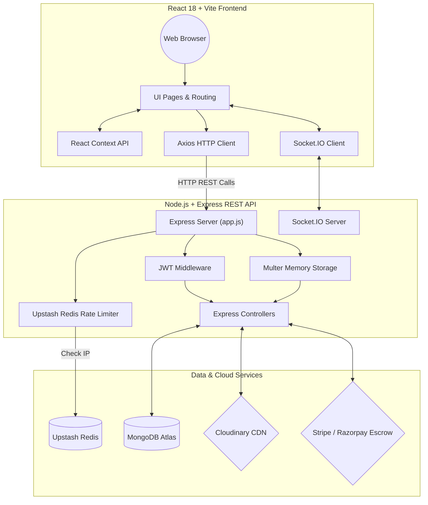
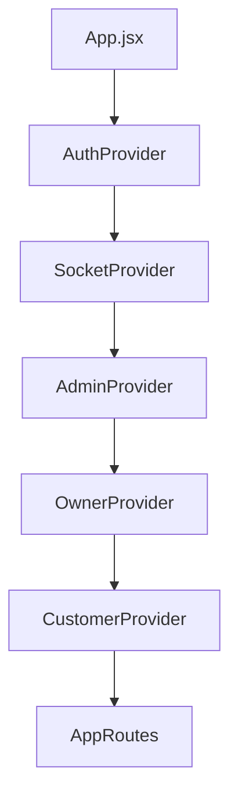
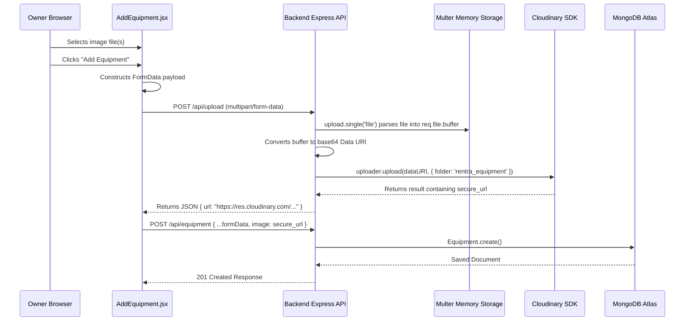
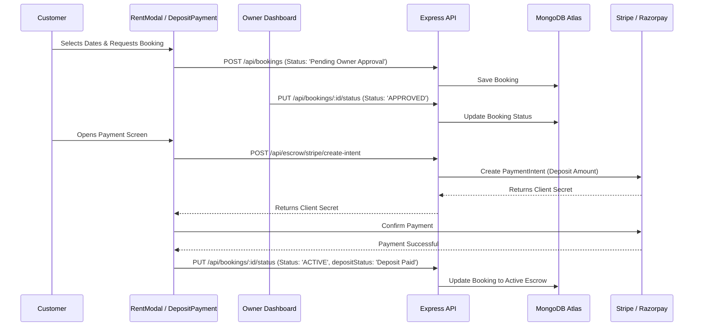
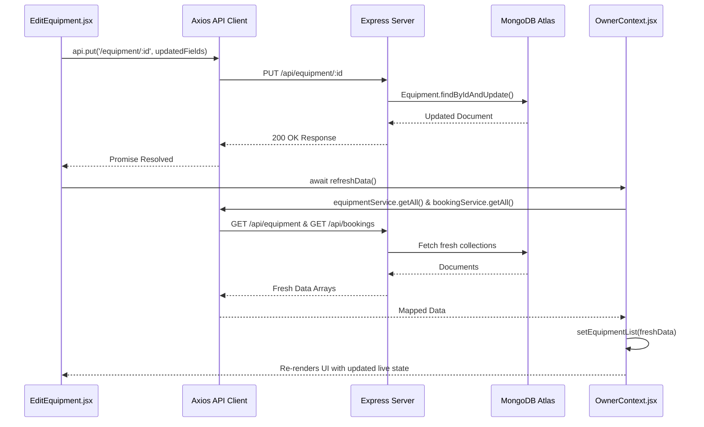

# Rentra Complete Execution & Architecture Flow Guide

A comprehensive, end-to-end technical guide mapping the execution flows, system architecture, data models, state synchronization, and component interactions in the Rentra Heavy Machinery & Equipment Rental Marketplace.

---

## 📋 Table of Contents
1. [System Architecture Overview](#1-system-architecture-overview)
2. [Environment & System Initialization (Basic)](#2-environment--system-initialization-basic)
   - [A. Backend Bootstrapping](#a-backend-bootstrapping)
   - [B. Frontend Bootstrapping & Provider Tree](#b-frontend-bootstrapping--provider-tree)
3. [Authentication & Security Lifecycle (Basic to Intermediate)](#3-authentication--security-lifecycle-basic-to-intermediate)
   - [A. User Registration & Password Hashing](#a-user-registration--password-hashing)
   - [B. JWT Token Generation & Client Storage](#b-jwt-token-generation--client-storage)
   - [C. Axios Interceptors & Bearer Authentication](#c-axios-interceptors--bearer-authentication)
   - [D. Role-Based Access Control (RBAC)](#d-role-based-access-control-rbac)
4. [Core Equipment Management & Payload Sanitization (Intermediate)](#4-core-equipment-management--payload-sanitization-intermediate)
   - [A. Location Address vs. GeoJSON Point Mapping](#a-location-address-vs-geojson-point-mapping)
   - [B. Category Standardization Across Roles](#b-category-standardization-across-roles)
5. [Advanced Workflows & Execution Pipelines](#5-advanced-workflows--execution-pipelines)
   - [A. Cloudinary CDN Image Upload Pipeline (Multer + In-Memory Base64)](#a-cloudinary-cdn-image-upload-pipeline-multer--in-memory-base64)
   - [B. Booking & Escrow Payment Lifecycle (Stripe / Razorpay)](#b-booking--escrow-payment-lifecycle-stripe--razorpay)
   - [C. Real-time Communication (Socket.IO)](#c-real-time-communication-socketio)
   - [D. Owner State & MongoDB Synchronization (`refreshData`)](#d-owner-state--mongodb-synchronization-refreshdata)
   - [E. Admin Live Aggregation, Business Verification & Status Badges](#e-admin-live-aggregation-business-verification--status-badges)
6. [Error Handling & System Resiliency](#6-error-handling--system-resiliency)

---

## 1. System Architecture Overview

Rentra is built as a full-stack MERN (MongoDB, Express, React, Node.js) application with real-time WebSocket capabilities, Cloudinary media processing, and Upstash Redis rate-limiting.



---

## 2. Environment & System Initialization (Basic)

### **A. Backend Bootstrapping**
When the server starts (`npm run dev` or `node server/index.js`), the execution follows this order:

1. **Environment Configuration (`.env`):** Loads `PORT`, `MONGO_URL`, `JWT_SECRET`, `REDIS_URL`, and `CLOUDINARY_*` keys via `dotenv`.
2. **Database Connection (`server/src/config/db.js`):**
   - Connects to MongoDB Atlas using `mongoose.connect()`.
   - Parses Atlas replica sets and custom database names (`rentra_db`).
3. **Middleware Initialization (`app.js`):**
   - `helmet()` for HTTP security headers.
   - `cors()` to allow requests from `http://localhost:5173`.
   - `express.json({ limit: '10mb' })` for parsing JSON payloads.
   - Custom `rateLimiter` backed by Redis to restrict excessive API calls.
4. **Route Mounting (`app.js`):**
   - `/api/auth` -> `auth.routes.js`
   - `/api/equipment` -> `equipment.routes.js`
   - `/api/bookings` -> `booking.routes.js`
   - `/api/escrow` -> `escrow.routes.js`
   - `/api/admin` -> `admin.routes.js`
   - `/api/upload` -> Multer + Cloudinary direct upload endpoint.
5. **HTTP & WebSocket Server Start (`index.js`):**
   - Creates HTTP server and attaches `socket.io` server listening on `PORT` (3000).

---

### **B. Frontend Bootstrapping & Provider Tree**
When the user visits the app in a browser:

1. **Entry Point (`client/index.html`):** Loads Vite script `/src/main.jsx`.
2. **React DOM Mounting (`main.jsx`):** Mounts React onto `#root` wrapped in `<BrowserRouter>`.
3. **Global Context Hierarchy (`App.jsx`):** Context providers wrap the application in a specific nested order to ensure state accessibility across all pages:



- **`AuthProvider`**: Manages current user profile, JWT token in `localStorage`, and login/logout methods.
- **`SocketProvider`**: Establishes live WebSocket connections when authenticated.
- **`AdminProvider`**: Aggregates system-wide users, equipment, bookings, and business profiles for administrative monitoring.
- **`OwnerProvider`**: Synchronizes equipment owned by the logged-in owner and incoming rental requests.
- **`CustomerProvider`**: Manages browse filters, customer active rentals, and wishlist items.

---

## 3. Authentication & Security Lifecycle (Basic to Intermediate)

### **A. User Registration & Password Hashing**
1. User fills out registration form (`Register.jsx`).
2. Client calls `authService.register({ name, email, password, role })`.
3. Backend controller (`auth.controller.js`):
   - Checks if user exists via `User.findOne({ email })`.
   - Hashes password using `bcryptjs` (`bcrypt.hash(password, 10)`).
   - Saves new `User` document in MongoDB.

### **B. JWT Token Generation & Client Storage**
1. On login (`POST /api/auth/login`), backend validates credentials with `bcrypt.compare()`.
2. Generates JSON Web Token (JWT) containing `{ id: user._id, role: user.role }` signed with `JWT_SECRET`.
3. Returns user JSON object and `token` string.
4. Client receives response, stores token in `localStorage.setItem('rentra_token', token)`, and updates `AuthContext` user state.

### **C. Axios Interceptors & Bearer Authentication**
All outgoing API requests automatically attach the stored token:

```javascript
// client/src/services/api.js
api.interceptors.request.use((config) => {
  const token = localStorage.getItem('rentra_token');
  if (token) {
    config.headers.Authorization = `Bearer ${token}`;
  }
  return config;
});
```

### **D. Role-Based Access Control (RBAC)**
Protected backend routes execute `authenticateToken` middleware:
1. Extracts Bearer token from `Authorization` header.
2. Verifies token signature using `jwt.verify(token, JWT_SECRET)`.
3. Attaches decoded payload to `req.user`.
4. Route handlers verify role requirements (e.g., `req.user.role === 'admin'`).

---

## 4. Core Equipment Management & Payload Sanitization (Intermediate)

### **A. Location Address vs. GeoJSON Point Mapping**
MongoDB Equipment documents use two location formats:
1. `locationAddress` (String): Human-readable address (e.g., `"Houston, TX"`).
2. `location` (GeoJSON Subdocument): Point object for spatial querying (`{ type: "Point", coordinates: [-97.74, 30.26] }`).

**Payload Mapping:** When an owner creates or updates equipment (`AddEquipment.jsx` / `EditEquipment.jsx`), the string input is sanitized before sending to avoid breaking MongoDB 2dsphere index validation:

```javascript
// Map form 'location' string to 'locationAddress' property
const { location, ...restData } = formData;
await api.put(`/equipment/${id}`, {
  ...restData,
  locationAddress: location,
  pricePerDay: Number(formData.pricePerDay),
});
```

### **B. Category Standardization Across Roles**
Machinery categories are synchronized between Owner forms (`AddEquipment`, `EditEquipment`) and Customer browse filters (`BrowseEquipment`):
- Categories list: `['Earthmoving', 'Material Handling', 'Road Construction', 'Hauling', 'Lifting Equipment', 'Compaction', 'Construction', 'Agriculture', 'Industrial', 'Logistics', 'Power & Energy', 'Mining']`.

---

## 5. Advanced Workflows & Execution Pipelines

### **A. Cloudinary CDN Image Upload Pipeline (Multer + In-Memory Base64)**
Allows equipment owners to upload raw image files directly without writing temporary files to disk.



---

### **B. Booking & Escrow Payment Lifecycle (Stripe / Razorpay)**
Ensures security deposits are securely held in escrow until rental completion.



---

### **C. Real-time Communication (Socket.IO)**
Provides instantaneous updates when bookings change status or new requests arrive.

1. **Client Connection (`SocketContext.jsx`):**
   - Initializes `io(API_BASE_URL)` upon authentication.
   - Registers user socket ID.
2. **Server Listener (`server/index.js`):**
   - Manages connected sockets.
   - Emits `notification` events when booking status updates occur.
3. **Context Sync (`OwnerContext.jsx` / `CustomerContext.jsx`):**
   - Listens to `socket.on('notification', handleNotification)`.
   - Triggers automated re-fetching of bookings.

---

### **D. Owner State & MongoDB Synchronization (`refreshData`)**
Solves stale state issues by synchronizing React Context state with live MongoDB records immediately following mutations.



---

### **E. Admin Live Aggregation, Business Verification & Status Badges**
1. **Data Aggregation (`AdminContext.jsx`):**
   - Uses `Promise.all` across `adminService.getStats()`, `adminService.getBusinesses()`, `adminService.getUsers()`, and `adminService.getBookings()`.
   - Populates relational references (e.g., `ownerId` -> `name`, `email`, `phone`).
2. **Business Profile Verification:**
   - Admin reviews submitted documents (e.g., business licenses).
   - Executes `PUT /api/admin/businesses/:id/verify` to switch status between `Pending`, `Approved`, or `Rejected`.
3. **Dynamic Status Badges (`StatusBadge.jsx`):**
   - Normalizes backend status strings (e.g., `ACTIVE`, `APPROVED`, `Pending Owner Approval`, `CANCELLED`) case-insensitively.
   - Renders color-coded UI badges (Emerald for Active/Approved, Amber for Pending, Rose for Rejected/Blocked, Slate for Cancelled).

---

## 6. Error Handling & System Resiliency

1. **Backend Error Middleware (`errorMiddleware.js`):**
   - Catches unhandled controller errors.
   - Formats error responses to `{ error: message, details: ... }`.
2. **Frontend UI State Separation:**
   - Forms (such as `EditEquipment.jsx`) maintain distinct `message` (success banner) and `error` (error banner) state hooks to prevent error text from rendering inside success styling.
3. **Database Fallbacks:**
   - Mongoose schemas provide fallback defaults for missing image URLs, location coordinates, and rating values.
4. **Rate Limiting:**
   - Upstash Redis tracks request rates per IP address to safeguard against Denial of Service (DoS) attempts.
