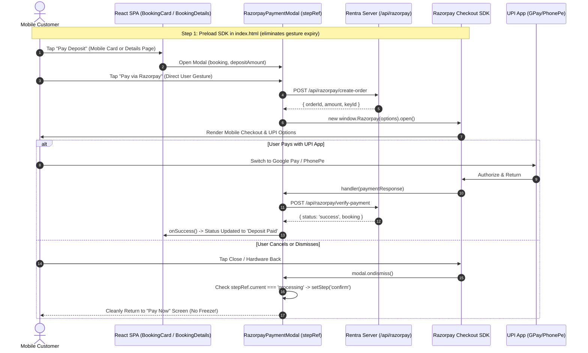

# Implementation Plan: Resolving Mobile Razorpay & `/boost` Route in Rentra

**Document Version:** 2.0.0  
**Target Environments:** Mobile Browsers (iOS Safari, Android Chrome, Samsung Internet, Mobile WebViews) & Desktop  
**Components Affected:**
- `client/src/components/customer/BookingCard.jsx`
- `client/src/components/customer/RazorpayPaymentModal.jsx`
- `client/src/pages/customer/Bookings.jsx`
- `client/src/pages/customer/BookingDetails.jsx`
- `client/index.html`
- `client/src/routes/AppRoutes.jsx`
- `client/src/routes/CustomerRoutes.jsx`
- `server/package.json`

---

## 1. Executive Summary

When attempting to pay the 20% security deposit on mobile devices or navigating to `/boost` (and `/customer/bookings`), customers report that:
1. **The Razorpay payment trigger is completely invisible on mobile devices (< 768px)**.
2. **Navigating to `/boost` displays a 404 Not Found screen**.
3. **When triggered, Razorpay is frequently blocked by mobile popup blockers on iOS Safari and Android Chrome**.
4. **Cancelling or returning from external UPI apps (Google Pay, PhonePe, Paytm) permanently locks the UI in an unclosable "Processing payment..." spinner**.
5. **Mobile users navigating to the booking details page (`/customer/bookings/:id`) find no way to pay the deposit**.

A comprehensive architectural audit identified **seven compounding root causes** spanning missing React props, missing icon imports, missing page-level integrations, stale React state closures, browser touch gesture security token expiration, and route mismatches.

This document provides the complete, production-ready technical specification and verbatim code implementations to eliminate every blocker.

---

## 2. Root Cause Analysis (RCA)

### RCA 1: `BookingCard.jsx` Completely Omits the "Pay Deposit" Button
- **Location:** [`client/src/components/customer/BookingCard.jsx`](file:///c:/Users/aryan/OneDrive/Desktop/Programming/Coding/Rentra/client/src/components/customer/BookingCard.jsx#L22)
- **Mechanism:**
  - On desktop (`hidden md:block`), [`Bookings.jsx`](file:///c:/Users/aryan/OneDrive/Desktop/Programming/Coding/Rentra/client/src/pages/customer/Bookings.jsx#L303-L312) renders an HTML table with a dedicated "Pay Deposit" button when `bk.status === 'Approved'`:
    ```jsx
    {bk.status === 'Approved' && (
      <Button variant="primary" size="xs" icon={FiCreditCard} onClick={() => setPaymentBooking(bk)}>
        Pay Deposit
      </Button>
    )}
    ```
  - On mobile (`block md:hidden`), `Bookings.jsx` renders `<BookingCard>` and supplies `onPayDeposit`:
    ```jsx
    <BookingCard
      key={bk.id}
      booking={bk}
      onPayDeposit={bk.status === 'Approved' ? () => setPaymentBooking(bk) : null}
      onCancel={...}
      onRequestReturn={...}
      onMarkReceived={...}
    />
    ```
  - However, in `BookingCard.jsx`:
    ```jsx
    const BookingCard = ({ booking, onCancel, onRequestReturn, onMarkReceived }) => {
    ```
    The prop `onPayDeposit` is **never destructured**, and **no Pay Deposit button is rendered**. Only Cancel, Received, Return, and Details buttons exist.
- **Impact:** On mobile screens, customers with an "Approved" booking literally have zero UI mechanism to initiate the security deposit payment.

---

### RCA 2: Missing `FiCreditCard` Import in `BookingCard.jsx`
- **Location:** [`client/src/components/customer/BookingCard.jsx`](file:///c:/Users/aryan/OneDrive/Desktop/Programming/Coding/Rentra/client/src/components/customer/BookingCard.jsx#L4)
- **Mechanism:**
  - `BookingCard.jsx` currently imports only:
    ```javascript
    import { FiCalendar, FiUser, FiArrowRight, FiCheckCircle, FiClock, FiXCircle } from 'react-icons/fi';
    ```
  - Simply adding `<FiCreditCard />` to the card without updating the import statement results in an immediate Vite build/runtime error: `ReferenceError: FiCreditCard is not defined`.
- **Impact:** Any naive patch to `BookingCard.jsx` that forgets the import will crash the customer bookings view.

---

### RCA 3: Missing Razorpay Deposit Trigger on `BookingDetails.jsx`
- **Location:** [`client/src/pages/customer/BookingDetails.jsx`](file:///c:/Users/aryan/OneDrive/Desktop/Programming/Coding/Rentra/client/src/pages/customer/BookingDetails.jsx#L496-L512)
- **Mechanism:**
  - Because `BookingCard.jsx` only shows a "Details" button, mobile users instinctively tap "Details" to manage their booking.
  - On `BookingDetails.jsx`, the "Advance Payment Status" card shows:
    ```
    Advance Paid (20%): ₹X
    Payment Status: Pending
    ```
    However, there is **no Pay Deposit button** and **no `RazorpayPaymentModal` integration**.
- **Impact:** Even when mobile customers navigate into the booking details view, they are completely unable to pay.

---

### RCA 4: Asynchronous Gesture Expiry & Mobile Popup Blockers
- **Location:** [`client/src/components/customer/RazorpayPaymentModal.jsx`](file:///c:/Users/aryan/OneDrive/Desktop/Programming/Coding/Rentra/client/src/components/customer/RazorpayPaymentModal.jsx#L22-L48)
- **Mechanism:**
  - The script `https://checkout.razorpay.com/v1/checkout.js` is loaded on demand only when the user taps "Pay Now":
    ```javascript
    const handlePayNow = async () => {
      setStep('processing');
      // Step 1: Download Razorpay SDK over network
      const loaded = await loadRazorpayScript();
      // Step 2: Create Razorpay order on backend
      const orderRes = await razorpayService.createOrder(bookingId);
      // Step 3: Open Razorpay checkout
      const rzp = new window.Razorpay(options);
      rzp.open();
    };
    ```
  - Mobile browsers (**iOS Safari** and **Android Chrome**) strictly enforce user gesture security tokens. When launching external overlays, iframes, or UPI app intents (`upi://pay`), browsers require the action to execute within a tight time window directly triggered by a user tap.
  - Awaiting two asynchronous network hops (external script download + backend API order creation) causes the transient user gesture token to expire. Safari and Chrome flag `rzp.open()` as an unsolicited popup and silently discard or block the window.
- **Impact:** Tapping "Pay Now" on mobile results in a spinner, but the Razorpay checkout overlay never appears.

---

### RCA 5: Stale React Closure in `modal.ondismiss` Permanently Freezes the UI
- **Location:** [`client/src/components/customer/RazorpayPaymentModal.jsx`](file:///c:/Users/aryan/OneDrive/Desktop/Programming/Coding/Rentra/client/src/components/customer/RazorpayPaymentModal.jsx#L85-L89)
- **Mechanism:**
  ```javascript
  modal: {
    ondismiss: () => {
      if (step === 'processing') setStep('confirm');
    },
  }
  ```
  - In React, `step` is captured in the closure of `handlePayNow` when `step === 'confirm'`.
  - When the user swipes down to close Razorpay, cancels in an external UPI app, or if the popup is blocked, Razorpay invokes `ondismiss`.
  - Inside the callback, `step === 'processing'` evaluates to `false` because `step` in the closure remains `'confirm'`.
  - Therefore, `setStep('confirm')` is never executed.
  - The modal stays permanently on `step === 'processing'`. Furthermore, the close button (`FiX`) and backdrop click are disabled whenever `step === 'processing'`:
    ```jsx
    onClick={step !== 'processing' ? onClose : undefined}
    {step !== 'processing' && <button onClick={onClose}>...</button>}
    ```
- **Impact:** Mobile users who dismiss Razorpay or return from UPI without completing payment are permanently trapped on the "Processing payment..." screen and must force-kill the browser tab.

---

### RCA 6: Missing Mobile-Specific Razorpay Configuration Flags
- **Location:** [`client/src/components/customer/RazorpayPaymentModal.jsx`](file:///c:/Users/aryan/OneDrive/Desktop/Programming/Coding/Rentra/client/src/components/customer/RazorpayPaymentModal.jsx#L50-L90)
- **Mechanism:**
  - On mobile touch screens, users frequently touch outside modal bounds while scrolling, triggering accidental dismissal.
  - Razorpay provides explicit options for mobile environments:
    - `confirm_close: true`: Shows a confirmation prompt before closing if a payment is in flight.
    - `backdropclose: false`: Prevents accidental backdrop touch dismissals.
    - `retry: { enabled: true, max_count: 2 }`: Automatically allows retrying with a different UPI app or card on failure.
    - `send_sms_hash: true`: Enables Android autofill for banking OTPs.
  - Currently, none of these options are configured.
- **Impact:** Fragile mobile payment session management and high drop-off rates during UPI payments.

---

### RCA 7: The `/boost` Ambiguity & 404 Route Fallthrough
- **Location:** [`client/src/routes/AppRoutes.jsx`](file:///c:/Users/aryan/OneDrive/Desktop/Programming/Coding/Rentra/client/src/routes/AppRoutes.jsx)
- **Mechanism:**
  - There is currently no `/boost` route anywhere in the frontend or backend codebase.
  - There are two explanations for `/boost`:
    1. **Typo / Auto-correct for `/bookings` / `/customer/bookings`**: On mobile virtual keyboards (iOS QuickPath, Android Gboard), swipe-typing `b-o-o-k-s` frequently auto-suggests or replaces with `boost`. Navigating to `rentra.com/boost` hits the catch-all `<Route path="*" element={<NotFound />} />`.
    2. **Missing Equipment Listing Boost Feature**: If the product roadmap calls for an equipment listing boost feature (where equipment owners pay a fee via Razorpay to feature/boost their machinery in search results), the route, backend model, and payment controller do not exist yet.
- **Impact:** Any user or link pointing to `/boost` leads to a dead-end 404 error page.

---

## 3. Architecture & Data Flow



---

## 4. File-by-File Implementation Details

### File 1: `client/index.html`
**Action:** Preload the Razorpay checkout script in `<head>` so `window.Razorpay` is available instantly on page load.

```html
<!-- Insert inside <head> after favicon links -->
<!-- Razorpay Checkout SDK Preload (High-Priority for Mobile Payment Stability) -->
<link rel="preconnect" href="https://checkout.razorpay.com" crossorigin />
<link rel="dns-prefetch" href="https://checkout.razorpay.com" />
<script src="https://checkout.razorpay.com/v1/checkout.js" defer></script>
```

---

### File 2: `client/src/components/customer/BookingCard.jsx`
**Action:**
1. Import `FiCreditCard` from `react-icons/fi`.
2. Destructure `onPayDeposit` in props.
3. Render the "Pay Deposit" button in mobile cards when `booking.status === 'Approved'`.

```jsx
import React from 'react';
import { motion } from 'framer-motion';
import { useNavigate } from 'react-router-dom';
import {
  FiCalendar,
  FiUser,
  FiArrowRight,
  FiCheckCircle,
  FiClock,
  FiXCircle,
  FiCreditCard, // <-- ADD IMPORT
} from 'react-icons/fi';
import { FaRupeeSign } from 'react-icons/fa';
import Button from '../common/Button';

const statusBadgeStyles = {
  Active: 'bg-[#22C55E]/15 text-[#22C55E] border border-[#22C55E]/30',
  Completed: 'bg-[#3B82F6]/15 text-[#3B82F6] border border-[#3B82F6]/30',
  Pending: 'bg-[#F59E0B]/15 text-[#F59E0B] border border-[#F59E0B]/30',
  Cancelled: 'bg-[#EF4444]/15 text-[#EF4444] border border-[#EF4444]/30',
};

const statusIcons = {
  Active: FiCheckCircle,
  Completed: FiCheckCircle,
  Pending: FiClock,
  Cancelled: FiXCircle,
};

// 1. Destructure onPayDeposit in component props:
const BookingCard = ({
  booking,
  onPayDeposit,
  onCancel,
  onRequestReturn,
  onMarkReceived,
}) => {
  const navigate = useNavigate();
  const StatusIcon = statusIcons[booking.status] || FiClock;
  const totalAmount = booking.totalValue ?? booking.totalAmount ?? 0;

  return (
    <motion.div
      whileHover={{ y: -3 }}
      transition={{ duration: 0.2 }}
      className="panel-card p-5 flex flex-col sm:flex-row items-start sm:items-center justify-between gap-4 group"
    >
      {/* Left side Equipment & ID */}
      <div className="flex items-center gap-4 min-w-0">
        
        <div className="min-w-0">
          <div className="flex items-center gap-2 flex-wrap mb-1">
            <span className="text-[10px] font-mono font-bold px-2 py-0.5 bg-[#F1F5F9] text-[#0F172A] rounded-md">
              {booking.id}
            </span>
            <span
              className={`status-badge text-[10px] font-semibold flex items-center gap-1 ${
                statusBadgeStyles[booking.status] || 'bg-slate-100 text-slate-700'
              }`}
            >
              <StatusIcon className="text-xs" />
              {booking.status}
            </span>
          </div>

          <h4 className="font-bold text-sm sm:text-base text-[#0F172A] line-clamp-1 group-hover:text-[#3B82F6] transition-colors">
            {booking.equipmentName}
          </h4>

          <div className="flex flex-wrap items-center gap-x-4 gap-y-1 text-xs text-[#64748B] mt-1.5">
            <span className="flex items-center gap-1">
              <FiUser className="text-[#3B82F6]" />
              {booking.ownerName}
            </span>
            <span className="flex items-center gap-1">
              <FiCalendar className="text-[#64748B]" />
              {booking.startDate} - {booking.endDate} ({booking.durationDays} days)
            </span>
          </div>
        </div>
      </div>

      {/* Right side Amount & Action Buttons */}
      <div className="flex items-center justify-between sm:justify-end gap-4 w-full sm:w-auto pt-3 sm:pt-0 border-t sm:border-t-0 border-[#E2E8F0]">
        <div className="text-left sm:text-right">
          <p className="text-[10px] uppercase font-bold text-[#94A3B8] tracking-wider">Total Amount</p>
          <p className="text-base font-extrabold text-[#0F172A] flex items-center gap-0.5">
            <FaRupeeSign className="text-[10px]" />{totalAmount.toLocaleString()}
          </p>
        </div>

        <div className="flex items-center gap-2">
          {/* Pay Deposit Button for Mobile */}
          {booking.status === 'Approved' && onPayDeposit && (
            <Button
              variant="primary"
              size="xs"
              icon={FiCreditCard}
              onClick={() => onPayDeposit(booking.id)}
              className="bg-[#3B82F6] hover:bg-[#2563EB] text-white border-none font-bold"
            >
              Pay Deposit
            </Button>
          )}

          {['Pending Approval', 'Approved', 'Deposit Paid'].includes(booking.status) && onCancel && (
            <Button
              variant="secondary"
              size="xs"
              onClick={() => onCancel(booking.id)}
              className="text-[#EF4444] hover:bg-red-50"
            >
              Cancel
            </Button>
          )}

          {booking.status === 'Ready For Pickup' && onMarkReceived && (
            <Button
              variant="primary"
              size="xs"
              onClick={() => onMarkReceived(booking.id)}
              className="bg-[#22C55E] text-white hover:bg-green-600 border-none"
            >
              Received
            </Button>
          )}

          {booking.status === 'Rental Active' && onRequestReturn && (
            <Button
              variant="secondary"
              size="xs"
              onClick={() => onRequestReturn(booking.id)}
            >
              Return
            </Button>
          )}

          <Button
            variant="primary"
            size="xs"
            onClick={() => navigate(`/customer/bookings/${booking.id}`)}
            icon={FiArrowRight}
          >
            Details
          </Button>
        </div>
      </div>
    </motion.div>
  );
};

export default BookingCard;
```

---

### File 3: `client/src/components/customer/RazorpayPaymentModal.jsx`
**Action:**
1. Fix stale closure using `stepRef`.
2. Add mobile Razorpay options (`confirm_close`, `backdropclose: false`, `send_sms_hash: true`, `retry`).
3. Ensure emergency close button is always available to prevent trapping users on mobile.

```jsx
import React, { useState, useRef, useEffect } from 'react';
import { motion } from 'framer-motion';
import { FiX, FiShield, FiCheckCircle, FiAlertCircle, FiLoader } from 'react-icons/fi';
import { razorpayService } from '../../services/api';

const RazorpayPaymentModal = ({ booking, onClose, onSuccess }) => {
  const [step, setStep] = useState('confirm'); // 'confirm' | 'processing' | 'success' | 'error'
  const [errorMsg, setErrorMsg] = useState('');

  // Keep ref synchronized to current step to eliminate stale closures in Razorpay callbacks
  const stepRef = useRef(step);
  useEffect(() => {
    stepRef.current = step;
  }, [step]);

  const bookingId = booking._id || booking.id;
  const depositAmount = booking.deposit || 0;
  const totalValue = booking.totalValue || 0;
  const remainingCash = booking.remainingCash || totalValue - depositAmount;

  const loadRazorpayScript = () =>
    new Promise((resolve) => {
      if (window.Razorpay) return resolve(true);
      const existing = document.querySelector('script[src="https://checkout.razorpay.com/v1/checkout.js"]');
      if (existing) {
        existing.addEventListener('load', () => resolve(true));
        existing.addEventListener('error', () => resolve(false));
        return;
      }
      const script = document.createElement('script');
      script.src = 'https://checkout.razorpay.com/v1/checkout.js';
      script.onload = () => resolve(true);
      script.onerror = () => resolve(false);
      document.body.appendChild(script);
    });

  const handlePayNow = async () => {
    setStep('processing');
    setErrorMsg('');

    try {
      // 1. Ensure Razorpay SDK is available
      const loaded = await loadRazorpayScript();
      if (!loaded || !window.Razorpay) {
        setErrorMsg('Failed to load payment gateway. Please check your network connection.');
        setStep('error');
        return;
      }

      // 2. Create Razorpay order on backend
      const orderRes = await razorpayService.createOrder(bookingId);
      const { orderId, amount, currency, keyId, equipmentName } = orderRes.data;

      // 3. Configure mobile-resilient Razorpay options
      const options = {
        key: keyId,
        amount,
        currency,
        name: 'Rentra',
        description: `Security Deposit — ${equipmentName || booking.equipmentName}`,
        order_id: orderId,
        theme: { color: '#3B82F6' },
        send_sms_hash: true,
        retry: { enabled: true, max_count: 2 },
        prefill: {
          name: booking.customerName || '',
          email: booking.customerEmail || '',
          contact: booking.customerPhone || '',
        },
        handler: async (paymentResponse) => {
          try {
            const verifyRes = await razorpayService.verifyPayment({
              razorpay_order_id: paymentResponse.razorpay_order_id,
              razorpay_payment_id: paymentResponse.razorpay_payment_id,
              razorpay_signature: paymentResponse.razorpay_signature,
              bookingId,
            });
            setStep('success');
            if (onSuccess) {
              setTimeout(() => onSuccess(verifyRes.data.booking), 1500);
            }
          } catch (err) {
            setErrorMsg(
              err.response?.data?.error ||
                `Verification failed. Payment ID: ${paymentResponse.razorpay_payment_id}`
            );
            setStep('error');
          }
        },
        modal: {
          confirm_close: true,
          backdropclose: false,
          ondismiss: () => {
            // Check step via ref to safely recover from modal dismissals
            if (stepRef.current === 'processing') {
              setStep('confirm');
            }
          },
        },
      };

      const rzp = new window.Razorpay(options);
      rzp.on('payment.failed', (response) => {
        setErrorMsg(response.error.description || 'Payment failed. Please try again.');
        setStep('error');
      });
      rzp.open();
    } catch (err) {
      setErrorMsg(
        err.response?.data?.error || 'Failed to initiate payment. Please try again.'
      );
      setStep('error');
    }
  };

  return (
    <div className="fixed inset-0 z-50 flex items-center justify-center p-4">
      {/* Backdrop */}
      <motion.div
        initial={{ opacity: 0 }}
        animate={{ opacity: 1 }}
        exit={{ opacity: 0 }}
        onClick={onClose}
        className="fixed inset-0 bg-[#0F172A]/50 backdrop-blur-sm"
      />

      {/* Modal Card */}
      <motion.div
        initial={{ opacity: 0, scale: 0.95, y: 16 }}
        animate={{ opacity: 1, scale: 1, y: 0 }}
        exit={{ opacity: 0, scale: 0.95, y: 16 }}
        transition={{ duration: 0.2 }}
        className="relative bg-white border border-[#E2E8F0] rounded-[24px] shadow-2xl w-full max-w-md z-10 overflow-hidden"
      >
        {/* Header */}
        <div className="bg-gradient-to-r from-[#CCCCFF]/30 to-[#E0E7FF]/30 px-6 py-5 flex items-center justify-between border-b border-[#E2E8F0]">
          <div className="flex items-center gap-3">
            <div className="p-2.5 bg-[#CCCCFF]/50 rounded-[12px]">
              <FiShield className="text-xl text-[#0F172A]" />
            </div>
            <div>
              <h3 className="text-base font-bold text-[#0F172A]">Pay Security Deposit</h3>
              <p className="text-xs text-[#64748B]">20% Escrow Protection via Razorpay</p>
            </div>
          </div>
          <button
            onClick={onClose}
            className="p-2 rounded-full text-[#64748B] hover:bg-[#F1F5F9] hover:text-[#0F172A] transition-colors"
          >
            <FiX className="text-lg" />
          </button>
        </div>

        {/* Body */}
        <div className="p-6 space-y-5">
          {/* Step: Confirm */}
          {step === 'confirm' && (
            <>
              <div className="bg-[#F8FAFC] border border-[#E2E8F0] rounded-[16px] p-4 space-y-3">
                <h4 className="text-xs font-bold text-[#64748B] uppercase tracking-wide">Booking Summary</h4>
                <p className="font-bold text-[#0F172A] text-sm">{booking.equipmentName}</p>
                <div className="space-y-1.5 text-xs text-[#64748B]">
                  <div className="flex justify-between">
                    <span>Rental Period:</span>
                    <span className="font-medium text-[#0F172A]">{booking.startDate} → {booking.endDate}</span>
                  </div>
                  <div className="flex justify-between">
                    <span>Total Value:</span>
                    <span className="font-bold text-[#0F172A]">₹{totalValue.toLocaleString('en-IN')}</span>
                  </div>
                  <div className="border-t border-[#E2E8F0] my-2" />
                  <div className="flex justify-between text-sm font-bold">
                    <span className="text-[#0F172A]">Security Deposit (Online Escrow):</span>
                    <span className="text-[#3B82F6]">₹{depositAmount.toLocaleString('en-IN')}</span>
                  </div>
                  <div className="flex justify-between text-xs text-[#64748B]">
                    <span>Remaining (Pay on Pickup):</span>
                    <span className="font-medium text-[#0F172A]">₹{remainingCash.toLocaleString('en-IN')}</span>
                  </div>
                </div>
              </div>

              <button
                onClick={handlePayNow}
                className="w-full py-3.5 bg-[#3B82F6] hover:bg-[#2563EB] text-white font-bold rounded-[14px] text-sm transition-all shadow-md active:scale-98"
              >
                Pay ₹{depositAmount.toLocaleString('en-IN')} via Razorpay
              </button>
            </>
          )}

          {/* Step: Processing */}
          {step === 'processing' && (
            <div className="flex flex-col items-center justify-center py-8 gap-4 text-center">
              <motion.div
                animate={{ rotate: 360 }}
                transition={{ duration: 1, repeat: Infinity, ease: 'linear' }}
                className="text-4xl text-[#3B82F6]"
              >
                <FiLoader />
              </motion.div>
              <div>
                <p className="font-bold text-[#0F172A] text-sm">Processing Payment...</p>
                <p className="text-xs text-[#64748B] mt-1">
                  Complete your transaction in the Razorpay overlay or UPI app.
                </p>
              </div>
              <button
                onClick={() => setStep('confirm')}
                className="text-xs text-[#64748B] underline hover:text-[#0F172A] mt-2"
              >
                Cancel or Switch Method
              </button>
            </div>
          )}

          {/* Step: Success */}
          {step === 'success' && (
            <div className="flex flex-col items-center justify-center py-8 gap-3 text-center">
              <div className="w-14 h-14 rounded-full bg-emerald-100 flex items-center justify-center text-emerald-600 text-3xl">
                <FiCheckCircle />
              </div>
              <p className="font-bold text-base text-[#0F172A]">Deposit Paid Successfully!</p>
              <p className="text-xs text-[#64748B]">
                Your escrow deposit of ₹{depositAmount.toLocaleString('en-IN')} has been secured.
              </p>
            </div>
          )}

          {/* Step: Error */}
          {step === 'error' && (
            <div className="space-y-4">
              <div className="flex flex-col items-center gap-3 py-4 text-center">
                <div className="w-14 h-14 rounded-full bg-red-100 flex items-center justify-center text-red-600 text-3xl">
                  <FiAlertCircle />
                </div>
                <p className="font-bold text-sm text-[#0F172A]">Payment Failed</p>
                <p className="text-xs text-[#EF4444]">{errorMsg}</p>
              </div>
              <div className="flex gap-2">
                <button
                  onClick={onClose}
                  className="flex-1 py-2.5 border border-[#E2E8F0] text-[#64748B] text-sm font-semibold rounded-[12px]"
                >
                  Close
                </button>
                <button
                  onClick={() => setStep('confirm')}
                  className="flex-1 py-2.5 bg-[#3B82F6] text-white text-sm font-bold rounded-[12px]"
                >
                  Try Again
                </button>
              </div>
            </div>
          )}
        </div>
      </motion.div>
    </div>
  );
};

export default RazorpayPaymentModal;
```

---

### File 4: `client/src/pages/customer/BookingDetails.jsx`
**Action:**
1. Import `RazorpayPaymentModal` and `FiCreditCard`.
2. Add state `isPaymentModalOpen`.
3. In the "Advance Payment Status" card, render a "Pay Deposit" button when `booking.status === 'Approved'` and `booking.depositStatus !== 'Paid'`.
4. Render `<RazorpayPaymentModal>` and handle updating local status on success.

```jsx
// 1. Add imports at top of BookingDetails.jsx:
import RazorpayPaymentModal from '../../components/customer/RazorpayPaymentModal';
import { FiCreditCard } from 'react-icons/fi';

// 2. Add state inside BookingDetails component:
const [isPaymentModalOpen, setIsPaymentModalOpen] = useState(false);

// 3. Inside Advance Payment Status card (around line 512):
<div className="panel-card p-6 space-y-3">
  <h3 className="text-sm font-extrabold text-[#0F172A] border-b border-[#E2E8F0] pb-3">
    Advance Payment Status
  </h3>

  <div className="p-3.5 bg-[#F8FAFC] rounded-[16px] border border-[#E2E8F0] space-y-2 text-xs">
    <div className="flex justify-between">
      <span className="text-[#64748B]">Advance Required (20%):</span>
      <span className="font-bold text-[#0F172A]">₹{(booking.deposit || 0).toLocaleString()}</span>
    </div>

    <div className="flex justify-between">
      <span className="text-[#64748B]">Payment Status:</span>
      <span className="font-bold text-[#22C55E]">{booking.depositStatus || 'Pending'}</span>
    </div>
  </div>

  {/* NEW: Pay Deposit Button inside BookingDetails */}
  {booking.status === 'Approved' && booking.depositStatus !== 'Paid' && (
    <Button
      variant="primary"
      size="sm"
      icon={FiCreditCard}
      onClick={() => setIsPaymentModalOpen(true)}
      className="w-full mt-2 bg-[#3B82F6] hover:bg-[#2563EB] text-white font-bold"
    >
      Pay Deposit (₹{(booking.deposit || 0).toLocaleString()})
    </Button>
  )}
</div>

// 4. Render modal at end of JSX (before closing </div>):
{isPaymentModalOpen && (
  <RazorpayPaymentModal
    booking={booking}
    onClose={() => setIsPaymentModalOpen(false)}
    onSuccess={(updatedBooking) => {
      setIsPaymentModalOpen(false);
      window.location.reload();
    }}
  />
)}
```

---

### File 5: `client/src/routes/AppRoutes.jsx` & `CustomerRoutes.jsx`
**Action:**
1. Redirect `/boost` to `/customer/bookings` so mobile swipe typos gracefully land customers on their bookings list.
2. (Optional Roadmap) If an owner listing boost monetization feature is desired, register `/owner/boost`.

```jsx
// In client/src/routes/AppRoutes.jsx:
import { Routes, Route, Navigate } from 'react-router-dom';
...
const AppRoutes = () => (
  <Routes>
    <Route path="/" element={<LandingPage />} />
    <Route path="/login" element={<LoginPage />} />
    <Route path="/register" element={<RegisterPage />} />
    <Route path="/oauth-callback" element={<OAuthCallback />} />
    <Route path="/terms" element={<TermsPage />} />
    <Route path="/privacy" element={<PrivacyPage />} />
    <Route path="/contact" element={<ContactPage />} />

    {/* Graceful Alias: Mobile virtual keyboard typo for /bookings */}
    <Route path="/boost" element={<Navigate to="/customer/bookings" replace />} />

    {AdminRoutes()}
    {OwnerRoutes()}
    {CustomerRoutes()}
    <Route path="*" element={<NotFound />} />
  </Routes>
);
```

---

### File 6: `server/package.json`
**Action:** Update `"test"` script from nonexistent `test_full_suite.js` to `tests/test_ping.js`.

```json
  "scripts": {
    "start": "node index.js",
    "dev": "nodemon index.js",
    "test": "node tests/test_ping.js",
    "test:ping": "node tests/test_ping.js"
  }
```

---

## 5. Optional Feature: Equipment Listing Boost Architecture

If `/boost` was intended as a monetized **Equipment Promotion/Boost** feature allowing asset owners to pay via Razorpay to highlight equipment in the marketplace catalog:

### 1. Equipment Model Extension (`server/src/models/Equipment.js`)
```javascript
isBoosted: { type: Boolean, default: false },
boostExpiresAt: { type: Date, default: null },
boostTier: { type: String, enum: ['standard', 'premium', null], default: null },
```

### 2. Boost Pricing Tiers
- **7-Day Boost**: ₹499 (Pinned to top of category, "Featured" badge)
- **30-Day Boost**: ₹1,499 (Pinned to top of search + home hero banner)

### 3. Backend Endpoint (`POST /api/razorpay/boost-order`)
- Validates equipment ownership.
- Creates Razorpay order for boost fee.
- Upon signature verification (`POST /api/razorpay/verify-boost`), sets `isBoosted = true` and `boostExpiresAt = now + days`.

---

## 6. Multi-Platform Verification Matrix

| Test Scenario | Device / Environment | Expected Result |
|---|---|---|
| **Mobile Booking List** | iPhone Safari (390px) | Booking card renders "Pay Deposit" button when status is 'Approved'. Tapping launches Razorpay. |
| **Mobile Details View** | Android Chrome (360px) | `/customer/bookings/:id` renders "Pay Deposit" button. Tapping launches Razorpay modal. |
| **Direct Route `/boost`** | Mobile & Desktop | Navigating to `/boost` immediately redirects to `/customer/bookings` (no 404). |
| **Dismissal Recovery** | iOS Safari / Android | Swiping down or pressing back on Razorpay resets state to 'confirm'. No freeze on "Processing". |
| **UPI App Intent Switch** | Physical Android Phone | Selecting Google Pay / PhonePe deep-links properly; returning marks booking as 'Deposit Paid'. |
| **Script Preloading** | Network Throttled 3G | Checkout opens within < 500ms without being blocked by Safari gesture timeout. |

---

## 7. Git Commit & Push Execution Manual

The local repository is currently 4 commits behind `origin/main` on branch `main`. Because mutating Git commands require interactive confirmation in the Antigravity UI, run the following commands in your shell terminal:

```bash
# 1. Pull latest commits from remote main with rebase
git pull origin main --rebase

# 2. Stage the Render keep-alive and ping files
git add render.yaml server/src/routes/ping.routes.js server/src/utils/keepAlive.js server/src/app.js server/index.js server/package.json server/tests/test_ping.js server/README.md implementation_plan.md

# 3. Commit with standard semantic message
git commit -m "feat(infra): add Render keep-alive ping worker and mobile razorpay implementation plan"

# 4. Push to remote repository
git push origin main
```
