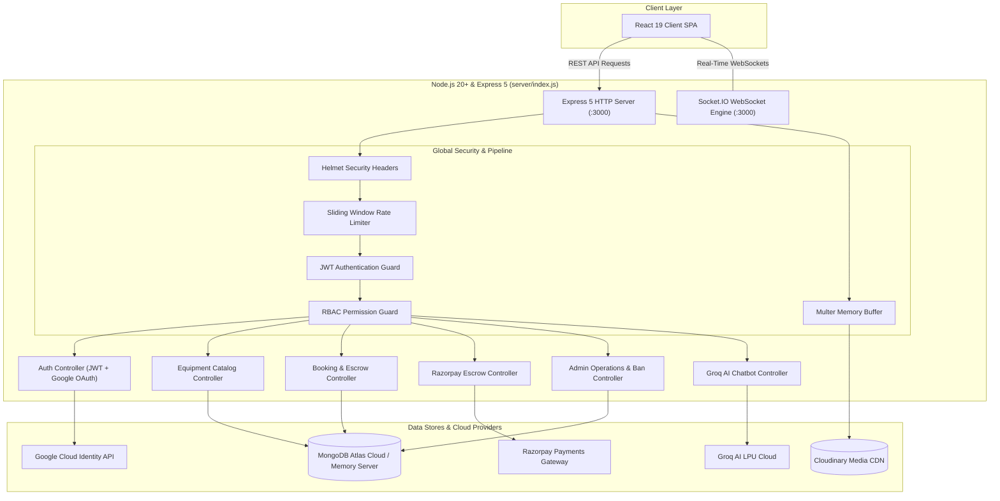
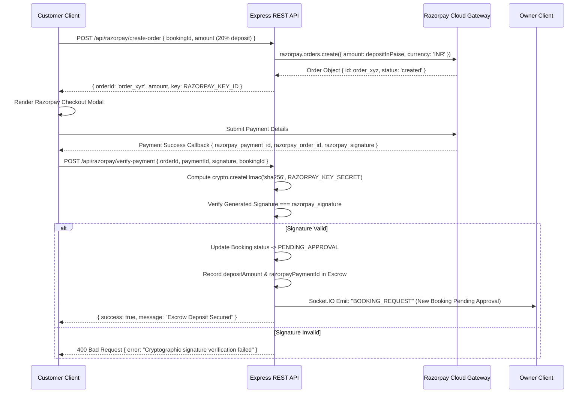

# Rentra — Backend REST API & Real-Time Engine ⚙️

> **Enterprise Node.js & Express API Gateway for Heavy Equipment Rental**  
> Technology Stack: **Node.js 20+**, **Express 5**, **MongoDB Atlas & Mongoose 9**, **Socket.IO 4**, **Razorpay Escrow**, **Groq AI (openai/gpt-oss-120b)**, **Cloudinary CDN**, and **Passport Google OAuth 2.0**.

---

## 📋 Table of Contents

- [System Architecture](#system-architecture)
- [Key Features & Recent Enhancements](#key-features--recent-enhancements)
- [Database Models & Indexing Architecture](#database-models--indexing-architecture)
- [Razorpay Escrow & Payment Lifecycle](#razorpay-escrow--payment-lifecycle)
- [Groq AI Chatbot Controller](#groq-ai-chatbot-controller)
- [Socket.IO Real-Time Notification Engine](#socketio-real-time-notification-engine)
- [Security, RBAC & Ban Enforcement](#security-rbac--ban-enforcement)
- [Complete Directory Layout](#complete-directory-layout)
- [REST API Endpoint Specifications](#rest-api-endpoint-specifications)
- [Environment Configuration & Quick Start](#environment-configuration--quick-start)

---

## System Architecture

The Rentra backend is organized as a high-performance, modular MVC REST API paired with a stateful WebSocket engine.



---

## Key Features & Recent Enhancements

### 1. Dual Database Strategy
- **MongoDB Atlas Cloud:** Production-ready clustering with replica set support and custom database name scoping (`MONGO_DB_NAME`).
- **Zero-Friction Evaluation Fallback:** If `MONGO_URL` is omitted, the server automatically boots an in-memory database server (`mongodb-memory-server`), enabling instant evaluation, demo presentations, and automated testing with zero database setup required.

### 2. High-Performance Indexing & Query Safety
- **Full-Text Catalog Search:** Indexes `{ title: 'text', category: 'text' }` on the `Equipment` collection for fast full-text matching.
- **Compound Query Indexing:** Indexes `{ status: 1, dailyRate: 1 }` for high-speed catalog filtering and sort performance.
- **Document Query Limiting:** All catalog and collection queries enforce `.limit(100)` constraints to prevent unbound MongoDB fetches and memory exhaustion.
- **Validation Constraints:** Equipment daily rates and pricing are strictly protected against negative numbers at the schema level.

### 3. Instant Session Termination on Ban
- When an Administrator flags an account as banned, the backend:
  1. Sets `isBanned: true` in the database.
  2. The JWT authentication middleware immediately denies further requests.
  3. The WebSocket server instantly disconnects all active socket connections belonging to that user ID.

### 4. Groq AI Chatbot Assistant
- The `/api/chat` route proxies requests to **Groq Cloud** using high-throughput LPU inference with `openai/gpt-oss-120b` (and automatic fallback to `llama-3.1-8b-instant` and `groq/compound`).
- The system prompt enforces domain boundaries: machinery recommendations, rental policies, towing weight rules, and escrow terms. Filters reasoning `<think>` tags before delivering clean responses to the client.

### 5. Media Pipeline via Cloudinary
- Accepts image uploads through Multer in-memory storage.
- Encodes files into base64 Data URIs and uploads directly to Cloudinary (`rentra_equipment` folder), returning secure HTTPS CDN URLs.

---

## Database Models & Indexing Architecture

### 1. User Model (`src/models/user.model.js`)
- **Fields:** `name`, `email` (lowercased, trimmed, unique index), `password` (bcrypt hashed), `role` (`CUSTOMER`, `OWNER`, `ADMIN`), `googleId`, `avatar`, `phone`, `isBanned`, `isVerified`.
- **Pre-Save Hook:** Automatically hashes plain passwords using `bcryptjs` with salt rounds = 10.

### 2. Business Model (`src/models/business.model.js`)
- **Fields:** `ownerId` (ref `User`), `companyName`, `registrationNumber`, `taxId`, `address`, `documents` (array of Cloudinary URLs), `status` (`PENDING`, `VERIFIED`, `REJECTED`), `rejectionReason`.

### 3. Equipment Model (`src/models/equipment.model.js`)
- **Fields:** `ownerId` (ref `User`), `businessId` (ref `Business`), `title`, `category`, `dailyRate` (min: 0), `description`, `specifications`, `location` (GeoJSON Point `[longitude, latitude]`), `images` (array of Cloudinary URLs), `status` (`AVAILABLE`, `RENTED`, `MAINTENANCE`), `isApproved` (Boolean).
- **Indexes:**
  ```javascript
  equipmentSchema.index({ title: 'text', category: 'text' });
  equipmentSchema.index({ status: 1, dailyRate: 1 });
  equipmentSchema.index({ location: '2dsphere' });
  ```

### 4. Booking Model (`src/models/booking.model.js`)
- **Fields:** `equipmentId` (ref `Equipment`), `customerId` (ref `User`), `ownerId` (ref `User`), `startDate`, `endDate`, `durationDays`, `rentalSubtotal`, `depositAmount` (mandatory 20%), `platformFee`, `totalAmount`, `status` (`PENDING_DEPOSIT`, `PENDING_APPROVAL`, `APPROVED`, `ACTIVE`, `RETURNED_INSPECTED`, `COMPLETED`, `CANCELLED`, `DISPUTED`), `razorpayOrderId`, `razorpayPaymentId`, `digitalSignature`, `inspectionDetails`.

### 5. Notification Model (`src/models/notification.model.js`)
- **Fields:** `userId` (ref `User`), `title`, `message`, `type` (`BOOKING`, `PAYMENT`, `SYSTEM`, `KYC`), `readStatus` (Boolean), `metadata`.

---

## Razorpay Escrow & Payment Lifecycle



---

## Groq AI Chatbot Controller

- **Endpoint:** `POST /api/chat`
- **Controller:** `src/controllers/chat.controller.js`
- **Engine:** Groq High-Performance Inference Cloud
- **Candidate Models:**
  1. `openai/gpt-oss-120b` (Primary)
  2. `openai/gpt-oss-20b`
  3. `groq/compound-mini`
  4. `groq/compound`
  5. `llama-3.1-8b-instant` (Fallback)
- **Features:** Automatic system prompt injection (`src/utils/chatbotPrompt.js`), conversation history preservation, `<think>` token filtering for reasoning models, and automatic model failover.

---

## Socket.IO Real-Time Notification Engine

The WebSocket engine is initialized in `src/config/socket.js` and attached to the HTTP server in `index.js`.

### Supported Events:

| Event Name | Direction | Payload | Description |
| :--- | :--- | :--- | :--- |
| `connection` | Client → Server | Token / Handshake | Authenticates socket connection |
| `join_room` | Client → Server | `{ userId }` | Joins user-specific room `user_<id>` |
| `BOOKING_STATUS_CHANGED` | Server → Client | `{ bookingId, newStatus }` | Broadcast to customer and owner |
| `NEW_NOTIFICATION` | Server → Client | `{ title, message, type }` | Delivers real-time push notification |
| `USER_BANNED` | Server → Client | `{ userId, reason }` | Forces client logout and terminates socket |

---

## Security, RBAC & Ban Enforcement

1. **Helmet Headers:** Secures HTTP response headers against clickjacking, MIME sniffing, and XSS attacks.
2. **CORS Whitelisting:** Restricts API consumption to trusted origins (`http://localhost:5173`, `http://localhost:5174`).
3. **Sliding Rate Limiter:** Protects against denial-of-service and brute-force authentication attacks.
4. **JWT Authentication Guard (`auth.middleware.js`):** Validates Bearer tokens, inspects database user records, and immediately halts requests if `user.isBanned === true`.
5. **Role-Based Access Control (`rbac.middleware.js`):** Enforces strict privilege trees:
   - `ADMIN` → System-wide operations, KYC verification, ban management.
   - `OWNER` → Fleet listings, booking responses, earnings inspection.
   - `CUSTOMER` → Catalog browsing, booking creation, rental management.
6. **Unhandled Route Protection:** `app.use('/api', (req, res) => res.status(404)...)` prevents dangling client connections on undefined endpoints.

---

## Complete Directory Layout

```text
server/
├── index.js                      # HTTP & Socket.IO server bootstrapper
├── package.json                  # Dependencies & scripts
├── .env.example                  # Environment configuration template
├── src/
│   ├── app.js                    # Express 5 application setup, middlewares, routes
│   ├── config/
│   │   ├── db.js                 # MongoDB Atlas connection & in-memory fallback
│   │   ├── passport.js           # Passport Google OAuth 2.0 strategy
│   │   └── socket.js             # Socket.IO event emitter and room manager
│   ├── controllers/
│   │   ├── admin.controller.js   # Analytics, user ban, KYB moderation
│   │   ├── auth.controller.js    # Login, register, Google OAuth callback
│   │   ├── booking.controller.js # Booking creation & 9-stage state machine
│   │   ├── business.controller.js# Owner KYB profile & document management
│   │   ├── category.controller.js# Machinery category management
│   │   ├── chat.controller.js    # Groq AI assistant endpoint
│   │   ├── equipment.controller.js# Equipment listings, text search, queries
│   │   ├── notification.controller.js# Notification inbox & read receipts
│   │   └── razorpay.controller.js# Escrow order generation & signature verify
│   ├── middleware/
│   │   ├── auth.middleware.js    # JWT verification & ban status checker
│   │   ├── errorMiddleware.js    # Centralized Express error handler
│   │   ├── rateLimiter.js        # IP-based sliding window rate limiter
│   │   ├── rbac.middleware.js    # Role-based access control guard
│   │   └── upload.middleware.js  # Multer memory storage pipeline
│   ├── models/
│   │   ├── booking.model.js      # Booking lifecycle schema
│   │   ├── business.model.js     # Owner business KYB schema
│   │   ├── category.model.js     # Equipment category taxonomy schema
│   │   ├── equipment.model.js    # Indexed machinery catalog schema
│   │   ├── notification.model.js # System & push notification schema
│   │   └── user.model.js         # User account schema with bcrypt hooks
│   ├── routes/
│   │   ├── admin.routes.js       # /api/admin endpoints
│   │   ├── auth.routes.js        # /api/auth endpoints
│   │   ├── booking.routes.js     # /api/bookings endpoints
│   │   ├── business.routes.js    # /api/business endpoints
│   │   ├── category.routes.js    # /api/categories endpoints
│   │   ├── chat.routes.js        # /api/chat Groq AI assistant endpoints
│   │   ├── equipment.routes.js   # /api/equipment endpoints
│   │   ├── notification.routes.js# /api/notifications endpoints
│   │   └── razorpay.routes.js    # /api/razorpay escrow endpoints
│   └── utils/
│       ├── chatbotPrompt.js      # Groq AI system prompt & instructions
│       ├── seedCategories.js     # Machinery category seeder
│       └── seedData.js           # Comprehensive sample marketplace dataset
```

---

## REST API Endpoint Specifications

### Authentication (`/api/auth`)
- `POST /api/auth/register` — Register a new account (`name`, `email`, `password`, `role`).
- `POST /api/auth/login` — Authenticate credentials and receive a JWT Bearer token.
- `GET /api/auth/me` — Retrieve the current authenticated user profile.
- `PUT /api/auth/profile` — Update user profile information.
- `GET /api/auth/google` — Initiate Google OAuth 2.0 authentication.
- `GET /api/auth/google/callback` — Google OAuth redirect callback.

### Equipment Catalog (`/api/equipment`)
- `GET /api/equipment` — Query machinery catalog (supports full-text `search`, `category`, `minPrice`, `maxPrice`, `.limit(100)`).
- `GET /api/equipment/:id` — Fetch detailed specifications for an asset.
- `POST /api/equipment` — List new equipment (Protected: `OWNER`).
- `PUT /api/equipment/:id` — Update equipment details (Protected: `OWNER`).
- `DELETE /api/equipment/:id` — Remove an equipment listing (Protected: `OWNER`).

### Bookings & Escrow (`/api/bookings`)
- `POST /api/bookings` — Create a new rental booking request.
- `GET /api/bookings/my-bookings` — Retrieve all bookings for the logged-in user.
- `GET /api/bookings/owner` — Retrieve incoming booking requests for equipment owners.
- `GET /api/bookings/:id` — Fetch single booking details and timeline.
- `PATCH /api/bookings/:id/status` — Transition booking state (`APPROVED`, `ACTIVE`, `COMPLETED`, `CANCELLED`).
- `POST /api/bookings/:id/inspection` — Record pre/post digital handover inspection.

### Razorpay Escrow (`/api/razorpay`)
- `POST /api/razorpay/create-order` — Generate Razorpay Order for 20% advance deposit.
- `POST /api/razorpay/verify` — Verify cryptographic HMAC-SHA256 signature and lock deposit in escrow.

### AI Assistant (`/api/chat`)
- `POST /api/chat` — Send conversation context to Groq AI (`openai/gpt-oss-120b`).

### Administration (`/api/admin`)
- `GET /api/admin/stats` — High-level platform statistics (users, revenue, rentals).
- `GET /api/admin/users` — System user directory.
- `PATCH /api/admin/users/:id/role` — Update a user's role.
- `PATCH /api/admin/users/:id/ban` — Toggle user ban and sever active WebSocket session.
- `GET /api/admin/businesses` — Pending and verified KYB business registrations.
- `PATCH /api/admin/businesses/:id/verify` — Approve or reject business KYB.
- `GET /api/admin/equipment` — Equipment listings pending moderation.
- `PATCH /api/admin/equipment/:id/verify` — Approve or reject equipment listing.
- `GET /api/admin/payments` — Escrow and payout transaction audit log.

### Media Upload (`/api/upload`)
- `POST /api/upload` — Multipart image upload to Cloudinary (Protected).

---

## Environment Configuration & Quick Start

### 1. Installation
```bash
cd server
npm install
```

### 2. Configure Environment (`server/.env`)
```env
PORT=3000
NODE_ENV=development
JWT_SECRET=rentra_super_secret_jwt_key_2026

# Database
# Leave blank to automatically use local in-memory database
MONGO_URL=
MONGO_DB_NAME=rentra_db

# Client Origins
SOCKET_CORS_ORIGIN=http://localhost:5173
CLIENT_URL=http://localhost:5173

# Razorpay Escrow Credentials
RAZORPAY_KEY_ID=rzp_test_your_key_id
RAZORPAY_KEY_SECRET=your_razorpay_key_secret

# Cloudinary Media Storage
CLOUDINARY_CLOUD_NAME=rentra-assets
CLOUDINARY_API_KEY=your_cloudinary_api_key
CLOUDINARY_API_SECRET=your_cloudinary_api_secret

# Groq AI Assistant (https://console.groq.com/keys)
GROQ_API_KEY=gsk_your_groq_api_key
GROQ_MODEL=openai/gpt-oss-120b

# Google OAuth 2.0 Credentials (Optional)
GOOGLE_CLIENT_ID=your_google_client_id
GOOGLE_CLIENT_SECRET=your_google_client_secret
```

### 3. Run Development Server
```bash
npm run dev
```

- Server running at: **http://localhost:3000**
- Health Check endpoint: **http://localhost:3000/**

---

> *Rentra Backend API Documentation — Updated 2026*
